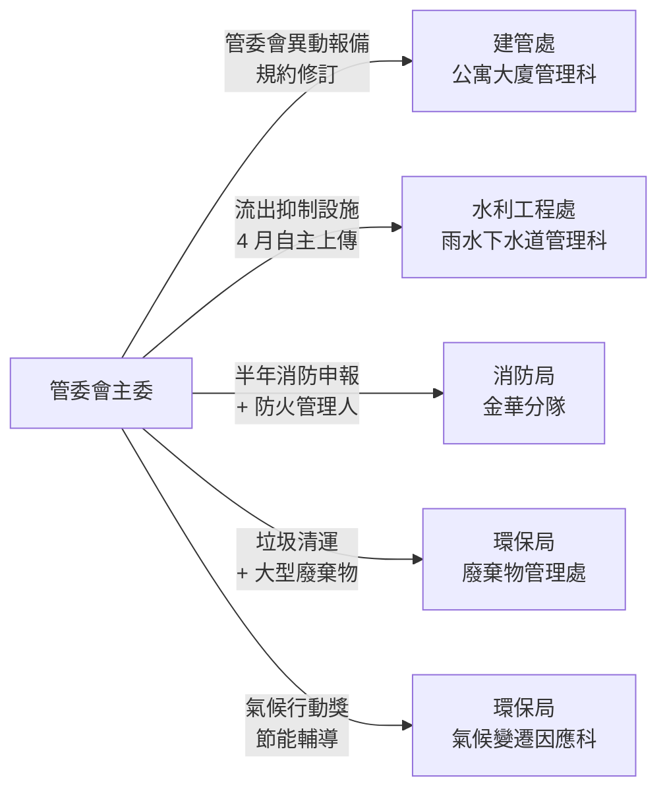
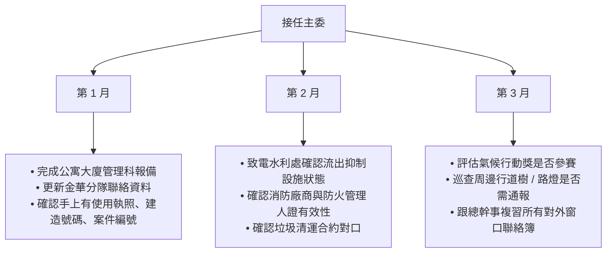

# 前言

當主委後你會發現，社區不是孤島——一年內會跟 7-10 個臺北市政府單位產生實際互動。**每個單位有不同的法源、不同的承辦科、不同的線上系統、不同的時程規律**。

這份文件是把「主委會碰到的所有政府對口」一次列清楚，讓你不必每次都從 1999 撥起，**而是直接找到對的科、對的承辦窗口**。

**跟其他文件的關係**：

- 《公寓大廈建築實務・寫給主委》（`/admin/chair-primer/`）：**對內系統地圖**——大樓的七大子系統
- 《主委對外窗口地圖》（本文件）：**對外窗口地圖**——跟政府單位的對接
- 《總幹事手冊》（`/admin/handbook/`）：執行層 SOP

兩張地圖（對內 + 對外）合起來，覆蓋主委 90% 的決策視野。

## 怎麼使用這份文件

- **第一次當主委**：先讀 Part I「互動頻率分級」全覽，知道每年大概會接觸哪些單位
- **遇到具體議題**：跳 Part II 找對應單位的詳細頁
- **撰寫公文 / 申報前**：對照 Part III 的格式與時程
- **第一次當主委 1-3 個月內**：依 Part IV 的「初任主委自主對口熟悉清單」走一遍

---

# Part I：互動頻率分級

## 高頻單位（每年法定義務或主動互動）

以下是**每年至少一次必然會接觸**的單位——換主委時務必確認你的接班人知道：

| # | 局處 · 科 | 主要議題 | 頻率 |
|---|---|---|---|
| 1 | 工務局・建管處・**公寓大廈管理科** | 管委會 / 主委 / 財委異動報備、規約變更、法規諮詢 | 換屆必報 + 不定期 |
| 2 | 工務局・**水利工程處・雨水下水道管理科** | 流出抑制設施年度自主上傳 | 每年 4 月 |
| 3 | **消防局・各分隊**（閱大安：金華分隊）| 半年消防安全自主檢查申報、防火管理人證、消防演練 | 每半年 + 換人時 |
| 4 | **環保局・廢棄物管理處** | 垃圾清運合約、回收政策、大型廢棄物 | 持續性 |
| 5 | **環保局・氣候變遷因應科** | 氣候行動獎、節能減碳輔導 | 年度報名 + 持續 |

## 中頻單位（特定議題觸發）

| 局處 · 科 | 議題 | 觸發時機 |
|---|---|---|
| 工務局・建管處・**建築管理科** | 建照、使照變更、外牆 10 年安全申報 | 建物 15 年以上每 10 年 |
| 工務局・建管處・**違建科 / 違建拆除大隊** | 違建檢舉、住戶違規搭建處理 | 發現時 |
| 工務局・建管處・**使用管理科** | 公共安全申報、建築物變更使用 | 部分大樓必申報 |
| **工務局・建管處（綠建築輔導窗口）** | 綠建築標章補助、智慧建築標章申請 | 主動申請 |
| **環保局・環境檢查科** | 噪音 / 空污 / 水污檢舉處理 | 糾紛或舉發時 |
| **環保局・環境衛生科** | 病媒蚊調查、飲用水水質檢驗通報 | 半年水塔清洗 + 不定期 |
| **環保局・污水管理科** | 化糞池清理通報、污水下水道接管 | 視社區設置 |
| **警察局・轄區分局**（閱大安：大安分局）| 治安、住戶糾紛、街友處理、集會遊行 | 發生時 |
| 警察局・**交通警察大隊** | 周邊臨停、社區門前車輛干擾 | 持續性 |
| **衛生局・疾病管制科** | 登革熱、傳染病社區動員 | 疫情時 |
| **衛生局・食品藥物管理科** | 飲用水水質、社區內食安爭議 | 不定期 |
| **社會局・老人福利科** | 獨居長者關懷、敬老活動補助 | 配合關懷名冊 |
| **公園路燈工程管理處** | 周邊行道樹修剪、路燈、相鄰公園 | 視位置 |
| **新建工程處** | 周邊道路工程、排水改善協調 | 政府主導施工時 |
| **大地工程處** | 邊坡、擋土牆（若位於坡地）| 視位置 |

## 偶發單位（特殊情境）

| 局處 · 科 | 議題 |
|---|---|
| **都市發展局・都市更新處** | 都更整合、危老重建輔導（閱大安若推都更會接觸） |
| **法務局・法律諮詢中心** | 重大法律爭議諮詢 |
| **勞動局・勞動條件科** | 物業派駐人員勞動條件爭議 |
| **文化局・社區營造科** | 社區營造計畫補助、藝文活動 |
| **教育局・終身教育科** | 鄰里學苑、社區大學合作 |
| **民政局・區公所**（大安區公所） | 一般行政文件、鄰里動員 |
| **財政局・地方稅務局** | 房屋稅、地價稅相關（多為住戶層級） |
| 工務局・**停車管理工程處** | 路邊停車、社區出入車道協調 |

## 中央層級（少直接互動，但是法源所在）

| 單位 | 議題 |
|---|---|
| **內政部・國土管理署**（前營建署） | 《公寓大廈管理條例》母法；綠建築標章評定 |
| **經濟部・能源署** | 太陽能光電補助、節能設備補助 |
| **內政部・消防署** | 《消防法》母法、防火管理人證書認證 |
| **環境部** | 各環保法規母法（中央到地方執行）|

---

# Part II：各單位詳細頁

> ⚠️ 以下聯絡資訊請以該單位官方網站為準。**特定承辦人姓名與電話會隨人事異動變化**，遇異動以該單位公告為準。

## §1. 工務局・建管處・公寓大廈管理科

**核心功能**：管委會的「法定戶政事務所」——所有管委會運作的法定報備都走這裡。

| 項目 | 內容 |
|---|---|
| 全名 | 臺北市建築管理工程處・公寓大廈管理科 |
| 聯絡 | 1999 轉建管處 → 公寓大廈管理科；或建管處官方總機 |
| 線上 | 臺北市公寓大廈管理服務系統（線上報備平台）|
| 法源 | 《公寓大廈管理條例》、《臺北市公寓大廈管理自治條例》|

**主委需要對接的事項**：

- **管委會成立 / 改組報備**：每屆改組後 30 日內報備
- **委員 / 主委 / 財委異動報備**：變動後 30 日內
- **規約 / 規約附件修訂報備**：區權會通過後 30 日內
- **法規諮詢**：對條文不確定時可去電諮詢

**準備文件**：

- 區權人會議紀錄（含簽到單）
- 規約全文（含當次修訂條文）
- 委員 / 主委 / 財委名冊（含身分證影本）
- 公寓大廈報備表（線上系統填寫）

**閱大安實例**：

- 每屆改組（第一、二、三、四、五屆）皆已完成報備
- 規約修訂後均需重新報備

---

## §2. 工務局・水利工程處・雨水下水道管理科

**核心功能**：管雨水下水道相關設施，包括社區的「**流出抑制設施**」。

| 項目 | 內容 |
|---|---|
| 全名 | 臺北市政府工務局水利工程處・雨水下水道管理科 |
| 地址 | 110204 臺北市信義區市府路 1 號 7 樓西南區 |
| 電話 | (02) 2720-8889 或 1999 轉 8191 |
| 信箱 | da_hsj@gov.taipei |
| 線上 | **臺北市排水案件管理平台** https://heochk.gov.taipei/DrainWater/Default |
| 法源 | 《臺北市雨水下水道相關設施與用戶排水設備審查暨查驗及檢查要點》、《臺北市下水道管理自治條例》|

**主委需要對接的事項**：

- **流出抑制設施年度自主上傳**：每年 4 月，平台只接受圖檔（平面圖 + 現況照片），不收 PDF
- **接受抽檢**：每年部分社區由「**社團法人台北市水利技師公會**」現場抽檢
- **罰則**：經通知限期改善屆期未改善，1-5 萬罰鍰按次連續

**閱大安專屬識別**：

- 案件編號：**OF1100624001**
- 建造號碼：**104 建字第 0086**

**準備文件**：

- 維護設施平面圖（建商交付的圖說中找；PDF 要轉 PNG/JPG）
- 流出抑制設施 6 區現況照片（《總幹事手冊》§1.11.6 詳細清單）

**完整 SOP**：見《總幹事手冊》§1.11 流出抑制設施（雨水緩衝池）

---

## §3. 消防局・各分隊（閱大安：金華分隊）

**核心功能**：消防安全的法定窗口——半年申報、防火管理人證、火災現場應變。

| 項目 | 內容 |
|---|---|
| 全名 | 臺北市政府消防局・**金華分隊**（閱大安轄區）|
| 聯絡 | 1999 轉消防局；金華分隊直撥電話請以消防局官網為準 |
| 法源 | 《消防法》、《各類場所消防安全設備設置標準》|

**主委需要對接的事項**：

- **半年消防安全自主檢查申報**：每年 3 月底 + 9 月底前
- **防火管理人證書登記**：總幹事 / 主委兼任時需報備有效證書
- **管委會主委變更通知**：換屆時更新分隊聯絡資料
- **消防安全設備設置標準變更**：法規修訂時依規定更新

**準備文件**：

- 消防安全自主檢查報告書（通常委由消防廠商代執行）
- 防火管理人證書影本
- 防火管理計畫書（更新時）

**閱大安實例**：

- 防火管理人通常由總幹事擔任（需持證），每年換證前要追蹤
- 換總幹事 / 換屆時更新資料給金華分隊（《總幹事手冊》§5.1.3）

---

## §4. 環保局・廢棄物管理處

**核心功能**：垃圾清運政策、回收、廚餘、大型廢棄物。

| 項目 | 內容 |
|---|---|
| 全名 | 臺北市政府環境保護局・廢棄物管理處 |
| 聯絡 | 1999 轉環保局廢棄物管理處 |
| 線上 | 臺北市環保局官網 → 廢棄物管理 |

**主委需要對接的事項**：

- **垃圾清運廠商合約**：環保局清運 vs 民營廠商合約之選擇（部分社區走民營）
- **大型廢棄物**：住戶預約環保局清運或自付民營
- **資源回收政策異動**：環保局定期調整分類規則時跟進
- **違規回收檢舉處理**：若發現有人來社區搶垃圾、亂回收

**閱大安實例**：

- 因大型壓縮車無法進入巷弄，改 3.5 噸貨車民營清運（《總幹事手冊》§5）

---

## §5. 環保局・氣候變遷因應科

**核心功能**：氣候行動獎、節能減碳輔導與補助。

| 項目 | 內容 |
|---|---|
| 全名 | 臺北市政府環境保護局・氣候變遷因應科 |
| 聯絡 | 1999 轉環保局氣候變遷因應科 |
| 線上 | 「臺北市氣候行動獎」官網（年度公告報名）|

**主委需要對接的事項**：

- **年度氣候行動獎報名**：通常上半年公告報名期
- **節能設備補助**：太陽能、節能燈具、空調汰換
- **碳盤查輔導**：社區可申請納入輔導對象
- **獎金核發**：得獎社區獎金匯款流程

**閱大安實例**：

- 2025 年參賽獲銀獎（10 萬獎金）
- 持續追蹤 KPI（節電、節水、回收、關懷次數），按 requirement 一條一條準備
- 詳見《總幹事手冊》§6.4 氣候行動獎脈絡

---

## §6. 工務局・建管處・建築管理科

**核心功能**：建照、使照、外牆安全申報。

| 項目 | 內容 |
|---|---|
| 全名 | 臺北市建築管理工程處・建築管理科 |
| 聯絡 | 1999 轉建管處建築管理科 |
| 法源 | 《建築法》、《建築技術規則》|

**主委需要對接的事項**：

- **外牆 10 年安全申報**：建物 15 年以上強制；申報前需請建築師或土木技師現場勘查
- **建物使用變更**：若公共空間用途有重大變更
- **使用執照補發**：使照遺失時補辦

**閱大安實例**：

- 建造號碼：104 建字第 0086（流出抑制設施公文上載明）
- 5-7 樓外牆磁磚膨拱觀察中（《主委建築入門》Ch 4）

---

## §7. 工務局・建管處・違建科 / 違建拆除大隊

**核心功能**：違章建築檢舉與處理。

**主委需要對接的事項**：

- **違建檢舉**：住戶頂樓加蓋、陽台外推、招牌違規等
- **拆除執行協調**：政府執行拆除時的協調
- **舊違建查報**：建管處主動查報時的回應

**主委判斷原則**：

- 違建處理通常涉及住戶利益衝突——管委會應**依規約執行**，不偏袒任一方
- 政府查報後若有改善期，管委會應協助溝通而非阻擋

---

## §8. 警察局・大安分局

**核心功能**：治安、糾紛、街友、集會遊行。

| 項目 | 內容 |
|---|---|
| 全名 | 臺北市政府警察局・大安分局 |
| 聯絡 | 110（緊急）；非緊急以分局公告為準 |
| 派出所 | 視社區位置而定（閱大安在大安分局轄區內某派出所）|

**主委需要對接的事項**：

- **治安事件**：偷竊、住戶受害
- **糾紛調解**：戶間衝突、停車糾紛、噪音
- **街友處理**：依《總幹事手冊》§2.3 三級制處置原則
- **集會遊行通報**：若社區規劃公開活動

**閱大安實例**：

- 騎樓街友議題處理（《總幹事手冊》§2.3）

---

## §9. 環保局・環境檢查科

**核心功能**：噪音、空污、水污舉發處理。

**主委需要對接的事項**：

- **住戶間噪音糾紛**：先勸導後檢舉
- **施工噪音檢舉**：周邊工地超時施工
- **水污 / 空污舉發**：周邊店家或工地排放

---

## §10. 環保局・環境衛生科

**核心功能**：病媒蚊、飲用水水質。

**主委需要對接的事項**：

- **病媒蚊巡查**：環保局定期巡查 + 社區自主消毒
- **飲用水水質**：水塔清洗合格通報、突發水質異常

**法規**：

- 水塔清洗依《飲用水管理條例》每半年一次
- 病媒蚊調查依《傳染病防治法》

---

## §11. 衛生局・疾病管制科

**核心功能**：傳染病社區動員（登革熱、流感、COVID-19）。

**主委需要對接的事項**：

- **疫情期間社區公告**：政府傳達 + 社區擴散
- **病媒蚊孳生源清除**：屋頂積水、地下室積水
- **隔離 / 疫調配合**：若有確診案例

---

## §12. 社會局・老人福利科

**核心功能**：獨居長者關懷、敬老活動。

**主委需要對接的事項**：

- **獨居長者通報**：社區內獨居 65 歲以上長者
- **關懷服務銜接**：政府的關懷專線、訪視服務
- **高溫關懷**：呼應氣候行動獎要求

**閱大安實例**：

- 流入閱大安關懷名冊的獨居長者，主委可協助銜接社會局資源
- 高溫關懷自動提醒系統（《總幹事手冊》§2.4）

---

## §13. 都市發展局・都市更新處

**核心功能**：都更整合、危老重建輔導。

**主委需要對接的事項**：

- **都更可行性評估**：諮詢都更輔導服務
- **整合協調**：多名住戶意見整合
- **危老重建**：30 年以上老屋簡化重建程序

**閱大安主委的另一頂帽子**：

- 文泰同時是台資大樓都更案利害關係人，跟都更處的互動屬另一個身分
- 兩個身分需嚴格分開——閱大安管委會與台資大樓都更案無關聯

---

## §14. 公園路燈工程管理處

**核心功能**：周邊行道樹、路燈、相鄰公園。

**主委需要對接的事項**：

- **周邊行道樹修剪**：影響社區採光、招牌、安全時申請
- **路燈報修**：社區門前路燈異常
- **相鄰公園維護**：若社區緊鄰公園

---

## §15. 工務局・新建工程處

**核心功能**：道路工程、排水改善。

**主委需要對接的事項**：

- **周邊道路施工協調**：施工期間影響出入時
- **排水溝改善**：社區門前排水問題
- **路面修補**：道路破損通報

---

# Part III：主委對外溝通的通則

## §1. 公文 / 申請文件的撰寫原則

- **主旨明確**：第一句話講清楚「**為什麼寫這份公文**」
- **依據完整**：引用法源（《XX 條例》第 X 條）
- **附件齊備**：列清楚有什麼附件，避免承辦反覆要件
- **聯絡資訊清楚**：管委會聯絡人姓名 + 電話 + 信箱

## §2. 走 1999 還是直撥承辦？

| 情境 | 建議 |
|---|---|
| 第一次接觸某單位 | **走 1999**——客服可幫你找對科 |
| 後續追蹤同一案件 | **直撥承辦人**——已有窗口 |
| 跨單位協調 | **公文書面 + 影本副本給相關單位** |
| 緊急狀況（火災 / 治安 / 急救）| **110 / 119 / 112**，不要走 1999 |

## §3. 重要時程節點（一張表）

| 月份 | 議題 | 對接單位 |
|---|---|---|
| 1-2 月 | 上年度總結、規約檢視 | 公寓大廈管理科（若有修訂報備）|
| **3 月底前** | **上半年消防安全自主檢查申報** | **消防局・金華分隊** |
| **4 月** | **流出抑制設施年度自主上傳** | **水利工程處・雨水下水道管理科** |
| 5-6 月 | 防汛期前準備 | （內部，無對外）|
| 7-8 月 | 颱風季 | 必要時對接警消 |
| **9 月底前** | **下半年消防安全自主檢查申報** | **消防局・金華分隊** |
| 10-11 月 | 年度合約檢視、氣候行動獎報名 | 環保局氣候變遷科 |
| 12 月 | 區權人會議準備 | 公寓大廈管理科（若有報備事項）|

## §4. 換屆 / 換主委時的對外連絡更新清單

接任後第一個月內，**主動通知以下單位「現任主委已變更」**：

- ☐ 建管處公寓大廈管理科（**法定 30 日內報備**）
- ☐ 消防局金華分隊（更新緊急聯絡人）
- ☐ 環保局廢棄物管理處（更新清運合約對口）
- ☐ 環保局氣候變遷因應科（若參與氣候行動獎）
- ☐ 大安分局轄區派出所（更新治安通報聯絡人）

---

# Part IV：初任主委自主對口熟悉清單

接任後**前 3 個月內**，建議主動執行：

**核心觀念**：

- **每個對口至少打過一次招呼**——下次有事才不會手足無措
- **建立社區自己的「對外通訊錄」**——存在 Google Drive，每屆主委更新
- **公文 / 申報原件電子化**——掃描存檔，紙本歸還區權會檔案室

---

# Part V：閱大安歷年實際互動紀錄（待累積）

> 每屆主委卸任前，建議將任內所有對外互動的「**意外事件**」（不是例行報備）記錄在這裡，作為機構記憶。

| 年份 | 屆別 | 對接單位 | 議題 | 結果 / 教訓 |
|---|---|---|---|---|
| 2025 | 第四屆 | 環保局氣候變遷科 | 氣候行動獎報名 | 獲銀獎、獎金 10 萬 |
| 2026-05 | 第四屆 | 水利處雨水下水道管理科 | 流出抑制設施首次自主上傳（被催才知道）| 教訓：往後每年 4 月初主動執行不要拖 |
| _待補_ | _待補_ | _待補_ | _待補_ | _待補_ |

---

# 附錄

## A. 共用聯絡資源

- **臺北市 1999 市民熱線**：任何單位找不到時的起點
- **臺北市政府網站**：https://www.gov.taipei
- **全國法規資料庫**：https://law.moj.gov.tw （查任何法規原文）

## B. 與其他文件的關係

- **本文件**（chair-gov-map）：對外窗口地圖
- **《公寓大廈建築實務・寫給主委》**（`/admin/chair-primer/`）：對內系統地圖
- **《總幹事手冊》**（`/admin/handbook/`）：執行 SOP

## C. 版本歷史

| 版本 | 日期 | 修訂者 | 主要變更 |
|---|---|---|---|
| 0.1 | 2026-05-20 | 文泰（第四屆主委）| 初版骨架，含 5 個高頻 + 8 個中頻單位詳細頁 |
