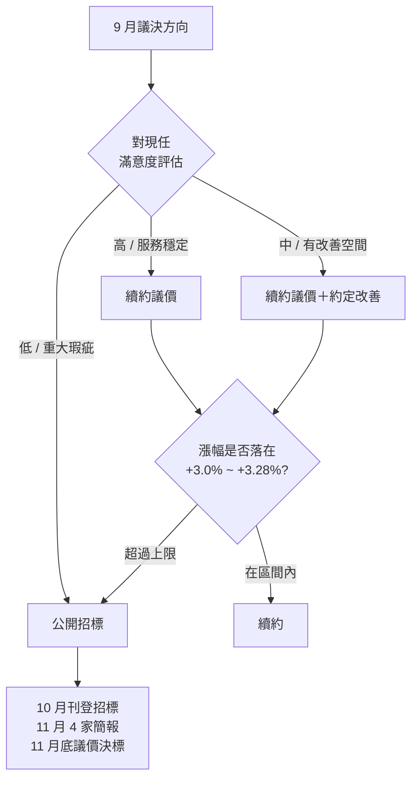

# 前言

這份備忘的存在理由很單純：**有些事不適合寫進總幹事 Wiki**。

總幹事是物業公司派駐人員，與管委會的關係本質上是「委託 → 受託」，雖然合作，但**利益不完全一致**——譬如議價時，管委會的上限數字若被總幹事知道，會直接回報雇主，下次談判對社區不利。

所以採取「兩本 Wiki」結構：

- **總幹事 Wiki**（`/admin/pm-wiki/`）：對外、執行導向、流程清楚；給每年可能輪替的物業員工
- **主委交接備忘**（本頁）：對內、策略與數字底線、新舊主委之間傳承

> **不要把主委備忘給總幹事看**。如果要在會議上引用本頁內容，請事先抽出該段、單獨給管委會委員。

---

# 第一章：AGM 主席教戰

## 1. 會議當天主席自己的節奏（總幹事不需要知道的細節）

時間軸（給總幹事知道）與 AGM Tool 操作（總幹事輔助）寫在 [總幹事 Wiki §4.2.4](/admin/pm-wiki/#4-2-4-會議當天時間軸以第五屆-2026-05-16-為例)。下面是**主席自己**該記住的事：

| 階段 | 主席自己的動作 | 為什麼不告訴總幹事 |
|---|---|---|
| 13:00–14:00 報到 | **不要講話**、不主動麥克風開場；和到場區權人寒暄即可，畫面停在簡報封面 | 開場時間沒到就講話會讓後到區權人覺得「會議已開始」造成混亂；這是主席的場控節奏 |
| 14:00 切換 | 等簽到比例**確定過半**才宣告會議成立；不要因為「差幾戶」就先宣告（事後變數風險） | 主席判斷成立時機的彈性，不需要寫成 SOP |
| 議程進行中 | 對異議發言，原則是「**讓他講完**」而不是「打斷糾正」；事後再以主席權力收斂 | 場控修養 |
| 重大爭議票 | 若預感會輸但**提案合理**，主席可主動建議「改下次會議再議」 — 避免議案被否決後再提案的程序複雜 | 議事策略 |

## 2. 第五屆 AGM 排雷出來的主席說話技巧

這些是 5/9-5/16 簡報籌備期間文泰自己反覆校準的：

### 2.1 對住戶說話的修辭策略

| 場景 | 不要說 | 改說 |
|---|---|---|
| 報告財務虧損月 | 「我們本期虧損 -16,367 元」 | 「本期帳面虧損 1.6 萬，但業主權益淨增 6.5 萬／月，社區資產持續累積中」 |
| 預算編列說明 | 「明年預計結餘 32 萬」 | 「明年保守預估結餘 32 萬／年；若實際好過預估，會是正面驚喜」 |
| 費率調整議案 | 「我們需要漲費」 | 「邀請住戶提前意見交流；本次區權會不進行議決」 |
| 換廠商考量 | 「現任物業表現不如預期」 | 「管委會評估中，將於 9 月議決方向」 |

### 2.2 為什麼不在簡報上寫議價內幕

第五屆首次區權會準備期間，我（Claude）曾建議在物業預算頁加註「下次漲幅由於……」這類分析，被文泰駁回。理由：

> 「物業人員在場開會。寫太細等於替廠商背書某種拆分邏輯，或暗示『下次可以再漲』。最簡單：**只報數字、不講未來空間**。」

**原則**：對外露出的所有財務分析，若有未來談判價值，**一律折成已成事實的客觀數字**呈現，不揭露推論邏輯。

---

# 第二章：物業／保全議價內部備忘

## 1. 歷年參考價格（不對外）

| 年度 | 月費（含稅）| 廠商 | 漲幅 | 月內物業／保全拆分（估） |
|---|---|---|---|---|
| 112 | $273,000 | 新美齊 | — | 物業 111,300 / 保全 161,700 |
| 113 | $286,650 | 新美齊（續約）| +5.00% | 物業 114,450 / 保全 172,200 |
| 114 | $305,000 | **潤泰**（換約）| +6.40% | 物業 116,000 / 保全 189,000 |
| 115 | $315,000 | 潤泰（續約）| +3.28% | 物業 126,000 / 保全 189,000 |

**112-113 拆分依據**：用戶提供禮賓未稅 154,000 / 164,000，× 1.05 = 161,700 / 172,200（含稅）；總價扣禮賓 = 物業類。新美齊禮賓人員未取得保全執照，故合約上是單一公寓大廈管理合約（不分物業／保全），是後驗推算。

**漲幅掛物業端 vs 保全端**：實務上廠商說「我要漲 X 元」，雙方不在意掛哪端，總價對得上就好。不要在敘事上臆測「下次潤泰會掛哪端」、「禮賓 → 保全是升級感」這類論述——住戶不關心、寫了反而像在替潤泰背書。

## 2. 物業歷史評價（給下任主委的背景）

- **新美齊**（113 年前）：服務適度但**橫向經驗分享不足、財報無一致性、無稽核機制**，造成社區管理隨總幹事更迭而變動
- **潤泰**（114 年起）：取代新美齊。115 年招標 16 家投標、4 家簡報（上大、中菱、潤泰、喬信）後決定續約

## 3. 續約 vs 換廠商決策框架

每年 9 月議決方向時的判斷流程：

### 3.1 漲幅 range 邏輯（憑歷史累積，未來可調整）

- 基本工資年調 +4%（人力服務成本下限）
- 物業必須吸收部分 → 住戶可接受的承擔範圍 **+3.0% ~ +3.28%**
- **上限 +3.28% 取自 2026 結果**，不接受更高（否則暗示「下次可以再漲」）
- 大宗合約佔總支出 81.6%，所以對這條 range 比較嚴格

### 3.2「沒有物業公司願意簽複數年」

基本工資年年調 4%，人事成本不可能不漲，故每年必經議價。**不要強求 2 年期合約**。

### 3.3 換廠商隱性成本

- 新總幹事 1–3 個月磨合期
- 文件交接、密碼移轉、廠商通訊錄重建
- 住戶對新面孔的信任重建

故除非現任有重大瑕疵，「服務延續性」優於「廠商比價」。

## 4. 議價技巧（不對總幹事說）

- **漲幅追問結構**：物業費調漲必須追問漲價結構（人員薪資、保險級距、公司獎金、耗材增加），並計算對社區月結餘的衝擊
- **「以服務延續性為理由要求維持原價」**：歷年三菱電梯都接受這個說法（如 115 年議價維持 $12,870 / 月、續約 2 年至 117/11）
- **若漲幅超過社區結餘**：通盤研擬「社區管理費調整方案」，提交下次區權會表決
- **合約終止條款**：若廠商有未完成之承諾（如執照申請），務必加入「未於指定日期完成 X 即可終止合約」的條款

---

# 附錄：維護日誌

- **2026-05-17 v1** — 拆分主委備忘獨立成頁。從總幹事 Wiki抽出：歷年月費表、物業歷史評價、續約決策框架、議價技巧、AGM 主席節奏、對住戶說話的修辭策略。建立兩本手冊互連結構。
