# 前言

這份文件不在你正常的「主委交接資料夾」內，因為它不是 SOP，也不是廠商清單，更不是法規彙編。它是一份**寫給「純管理背景、沒有建築工程專業」主委的整體觀地圖**——讓你在當主委的幾年內，至少能從「瞎子摸象」進步到「眼中有大樓」。

## 為什麼會有這份文件

文泰擔任閱大安第三屆、第四屆主任委員時，反覆碰到同一種挫折——每遇到一個新議題（外牆磁磚膨拱、流出抑制設施年度自主檢查、UPS 電池放電、頂樓綠美化⋯⋯），都要從零開始學該領域，學完處理完，下次又是另一個全新的議題。**兩任做完，知識仍像散落的拼圖**，沒有一張總圖把它們組起來。

問題出在哪？管委會主委這個位置**通常由住戶輪流擔任**，多數人的本業跟建築、土木、機電、消防都無關。建築專業科系有完整的訓練體系，從靜力學、構造、設備、法規一路學上來；但管委會主委沒有訓練體系——你被選上的那天，就要直接面對「**這棟你住了幾年的大樓，從地下四樓到頂樓的所有系統，現在都歸你管**」。

這份文件就是嘗試把那張總圖**事先畫給下一任主委**。讀完之後，你不會變成工程師，但你會：

- 看到一棟大樓時，能拆解成幾個明確的「子系統」，而不是混在一起的鋼筋水泥
- 廠商來提案保養／更換／改造時，能用基本框架判斷他在說什麼、缺什麼、合不合理
- 看到任何一個議題（譬如收到流出抑制設施公文），能立刻定位「這屬於哪個子系統、跟其他子系統怎麼連動」
- 知道**自己不懂什麼**——這比假裝懂重要得多

## 怎麼使用這份文件

- **第一次當主委**：建議從頭讀到尾，2-4 小時。讀完不必記住細節，**先建立 mental model**
- **遇到具體議題**：直接跳對應章節（Ch 4-10 各管一個系統）
- **跟廠商開會前**：掃一下該系統的「§X.末末 不必懂但要會問」清單
- **跨任交接時**：把這份文件直接交給下任主委，比口述快十倍

文件刻意寫得**淺**——讓你能在通勤、午休、洗澡前一段段啃完。**寫得深的東西在《閱大安總幹事手冊》**（`/admin/handbook/`），那邊有具體 SOP、廠商電話、合約附註，是「執行層」的文件。本份是「**決策層**」的文件。

> 兩份文件的差異：總幹事手冊回答「**怎麼做**」，本份回答「**這是什麼、誰在管、什麼時候我該介入**」。

## 文件結構

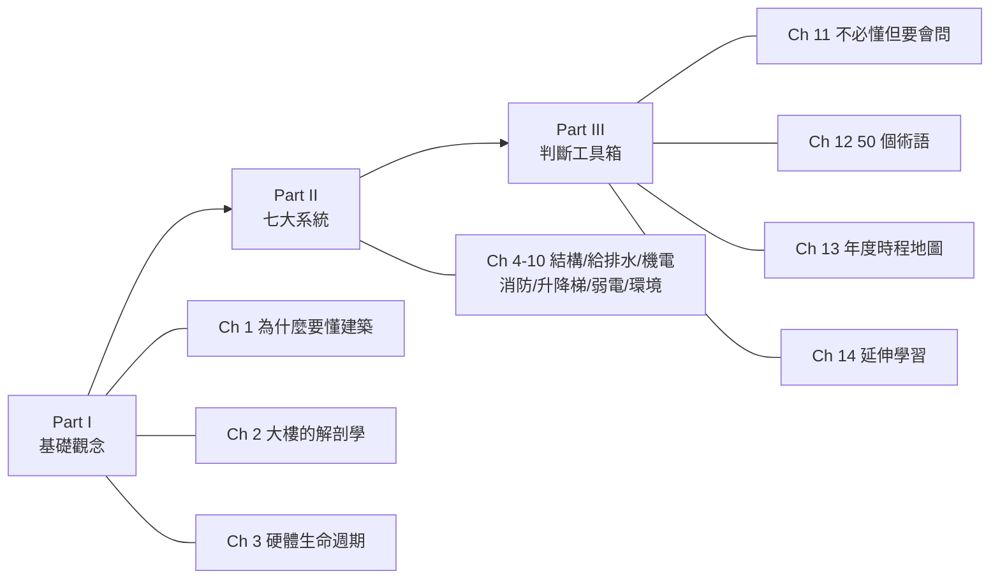

---

# Part I：基礎觀念

# 第一章：為什麼主委需要懂建築？

## 1.1 主委不是工程師，但也不該是局外人

當主委的第一個月，你大概會遇到至少一次這樣的場景：保全跑進管理中心說「某戶報修，廁所天花板漏水」、總幹事打電話問你「機電廠商來估價說避雷針需要重做，要不要簽？」、住戶 LINE 群裡有人問「為什麼這個月公共電費比上個月貴 40%？」

這些問題的共同點是——**沒有一題的答案是「常識」**。它們都需要對大樓的某個子系統有基本理解，才能判斷「這個說法合不合理、要不要進一步追問、要不要簽字」。

如果你選擇「我不懂工程，全部聽廠商建議」——

- 廠商少報項目，你不會發現
- 廠商超報項目，你會花冤枉錢
- 兩個廠商各說各話，你沒辦法仲裁
- 出事時你不知道該找誰
- 法律責任最後仍歸你（主委的法定責任）

如果你選擇「我要自己學到能跟廠商辯論的程度」——

- 你會花掉所有業餘時間
- 兩年任期結束你還沒學完
- 下任主委又從零開始

這份文件的定位**正好在中間**：你不必到能設計／施工的程度，但需要到能**判斷誰可信、誰在拗、什麼是必要、什麼是過度**的程度。

**主委的能力光譜**（你應該落在中間）：

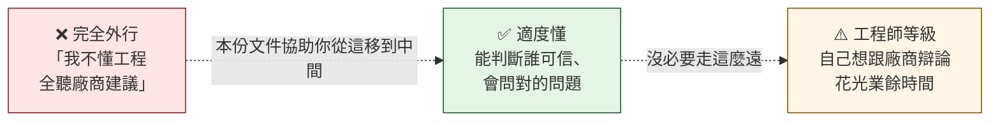

## 1.2 三個主委必須建立的 mental model

### 1.2.1 你是 decision maker，不是 executor

很多新任主委會掉進的陷阱：以為「主委 = 大管家 + 大廠商談判員」，所以開始每件事都自己跑——自己叫廠商、自己估價、自己監工。

這是錯的角色定位。

主委的真正工作是：

- **設定方向**：這個議題要不要處理？什麼時候處理？預算上限多少？
- **判斷品質**：廠商提案合理嗎？保全反映的問題是否真實？財務報告是否誠實？
- **整合資源**：跨議題的優先順序、跨年度的資金規劃、跨任的傳承
- **代表社區**：對外（廠商、政府單位、保險）、對內（住戶大會、區權人會議）

**執行層**（叫廠商、現場監工、紀錄、追蹤進度）**是總幹事的工作**。如果你發現自己天天在做執行層的事，要麼是總幹事不到位（要換人或加強訓練），要麼是你自己越級了。

> 這份文件假設你知道執行層歸總幹事——你看完不必能自己修水管，但要能判斷總幹事或廠商給你的選項哪個合理。

### 1.2.2 廣度比深度重要

當主委的兩年內，你會碰到的子系統至少 7 個（見 Ch 2）。每個系統都有自己的法規、廠商生態、保養週期、常見故障。**全部都學到精通是不可能的**。

策略：**每個系統知道「足夠的廣度」就好**——

- 它是什麼（一句話解釋給沒當過主委的朋友聽）
- 閱大安採什麼配置（哪個廠商、哪份合約、哪份法規）
- 它最常壞在哪裡（最容易出狀況的零件 / 環節）
- 出狀況時找誰修（廠商分工）
- 法定保養 / 檢查的頻率（避免漏掉）

**深度留到「真正出事的那個系統」再補**。譬如外牆磁磚開始膨拱，你才花一週讀外牆飾材；流出抑制設施收到公文，你才花一天讀雨水下水道規範。這份文件的每一章都先給你廣度，再給你「出事時去哪深挖」的指引。

### 1.2.3 不必懂但要會問

主委最重要的技能不是「自己懂」，而是「**問出讓懂的人不好唬弄你的問題**」。

譬如廠商說「外牆全部要重做，估價 200 萬」——

- 不會問的主委：簽 or 不簽
- 會問的主委：
  - 「為什麼是全部？哪幾面比較嚴重？」
  - 「除了重做還有其他選項嗎？局部修復？」
  - 「200 萬包含哪些？拆除、施工、廢棄物清運分別多少？」
  - 「能不能拿到 2-3 家比價？」
  - 「如果不做，多久內會出什麼後果？」
  - 「有沒有保固？保多久？保固什麼條件下失效？」

**會問問題的主委，廠商會自然把你當「懂行的人」對待**，報價、態度、配合度都會不一樣。本份文件 Ch 11 會專門列「不必懂但要會問」的模式。

## 1.3 學習的「事件驅動」原則

別嘗試讀完這份文件就把所有東西記住。讀第一遍**目的只是建立 mental model**——你知道「有這麼一座圖書館，書架編號 1-14」。

實際遇到事件時再去抽對應的書架翻：

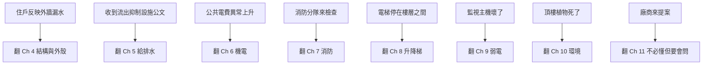

**事件驅動 + 文件查閱的學習方式，對純管理背景的人最有效率**。你不需要像建築系學生那樣循序漸進地建立完整知識；你只需要「碰到問題時知道去哪查、查到的東西看得懂」。

## 1.4 給接任主委的一句話

> 這份文件是文泰當完兩任主委後，**留給未來自己（or 接任者）的禮物**——希望你不要再像我一樣花兩年瞎子摸象。

---

# 第二章：一棟大樓的解剖學──七大子系統地圖

## 2.1 大樓不是一個整體，是七個系統的疊加

你住的那棟大樓，外觀看起來是「一棟」，但實際上是 **7 個獨立子系統互相疊加**。任何主委議題，都可以歸類到其中 1-2 個子系統。

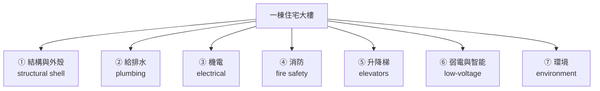

每個子系統有不同的：

- **物理範圍**（結構是骨架、機電是血管、消防是免疫系統⋯⋯）
- **法規依據**（公寓大廈管理條例、建築法、消防法⋯⋯）
- **廠商生態**（結構廠商、機電廠商、消防廠商⋯⋯互不相同）
- **保養週期**（結構 30+ 年、機電 15-25 年、弱電 5-10 年）
- **壞掉時的後果**（結構壞 → 安全；機電壞 → 停電；消防壞 → 命；弱電壞 → 不便）

## 2.2 七大系統各自掌管什麼

### ① 結構與外殼（Ch 4）

**一句話**：把整棟樓「立起來、撐住、與外界隔開」的部分。

- 結構：地基、樑柱、樓板、剪力牆（看不見但承重）
- 外殼：外牆、屋頂、地下室連續壁
- 主要敵人：地震、雨水、時間（老化、變形、裂縫）
- 故障特徵：**慢**——裂縫慢慢出現、磁磚慢慢膨拱、防水慢慢失效
- 修一次貴：外牆全面修可能 50-300 萬

### ② 給排水（Ch 5）

**一句話**：水的三條路——進來（自來水）、出去（汙水）、繞道（雨水）。

- 給水：總管 → 揚水馬達 → 屋頂水塔 → 各戶
- 汙水：各戶 → 集污管 → 化糞池或污水處理 → 市政污水下水道
- 雨水：屋頂集水 → 雨水管 → 雨水池（流出抑制）→ 市政雨水下水道
- 主要敵人：阻塞、漏水、馬達燒毀、化糞池滿溢
- 故障特徵：**急**——漏水會在幾小時內擴大
- 修一次普通：幾千到幾萬；揚水馬達整組換 10-30 萬

### ③ 機電（Ch 6）

**一句話**：把外面市電引進來、分送到大樓每個角落的電力骨架。

- 受電：台電進線 → 變壓器 → 配電盤
- 配電：各層配電 → 共用部分 + 各戶
- 公共設施負載：電梯、揚水馬達、空調、照明、緊急電源
- 主要敵人：負載超量、漏電、避雷失效、UPS 電池老化
- 故障特徵：**突發**——可能很久沒事，一壞就跳脫整棟
- 修一次：小（換 breaker 幾千）到大（變壓器數十萬）

### ④ 消防（Ch 7）

**一句話**：火災時「告訴大家、自動滅火、讓人逃出去」的保命系統。

- 偵測：煙感、熱感、瓦斯探測
- 滅火：撒水、消防栓、滅火器、滅火毯
- 區劃：防火門、防火區劃牆
- 逃生：緊急照明、避難方向指示、緊急廣播
- 主要敵人：法規不熟、設備老化未保養、防火管理人懸缺
- 故障特徵：**平時沒事，出事就要命**——絕對不能僥倖
- 修一次：分定期申報（每年）+ 設備更新（不一定）

### ⑤ 升降梯（Ch 8）

**一句話**：垂直交通工具，法規嚴格管的設備。

- 結構：機坑、機房、機箱、纜繩、配重、安全裝置
- 法規：每年勘檢 + 每月保養
- 主要敵人：故障停在樓層之間、老化纜繩、控制系統故障
- 故障特徵：**頻繁**——電梯是大樓最容易故障的設備之一
- 修一次：保養月費約 5-10 千；大修整修可能上百萬

### ⑥ 弱電與智能（Ch 9）

**一句話**：「不致命但會讓你日子過不下去」的電子神經系統。

- 監視：CCTV 攝影機 + 錄影主機 + 儲存
- 門禁：大門、樓層門禁、社區卡片
- 對講：大門對講、樓層對講
- 網路：對外路由、WiFi、光纖
- 智能管理：物管系統、線上繳費、社區 APP
- 主要敵人：老化、廠商整併、技術更新太快
- 故障特徵：**煩躁**——壞了不會死人但住戶會抱怨
- 修一次：小（換攝影機千元）到大（系統升級數十萬）

### ⑦ 環境（Ch 10）

**一句話**：讓大樓不只是「能住」，而是「住得舒服」的軟體層。

- 綠化：屋頂、中庭、騎樓盆栽
- 廢棄物：垃圾、回收、廚餘、大型廢棄物
- 清潔：公共空間日常清潔、外牆高壓清洗、地坪保養
- 蟲鼠：預防、消滅、後續監測
- 主要敵人：人為（住戶習慣）、季節（梅雨蟲蚊、颱風落葉）
- 故障特徵：**漸進**——失修不會立即出事但會慢慢降質感
- 修一次：日常清潔月費；外牆高壓清洗 8-15 萬/次

## 2.3 子系統的「壽命表」

主委需要知道的「常識」——不同子系統有不同的時間尺度。下圖把七大系統的設計壽命壓縮在 50 年時間軸上看：

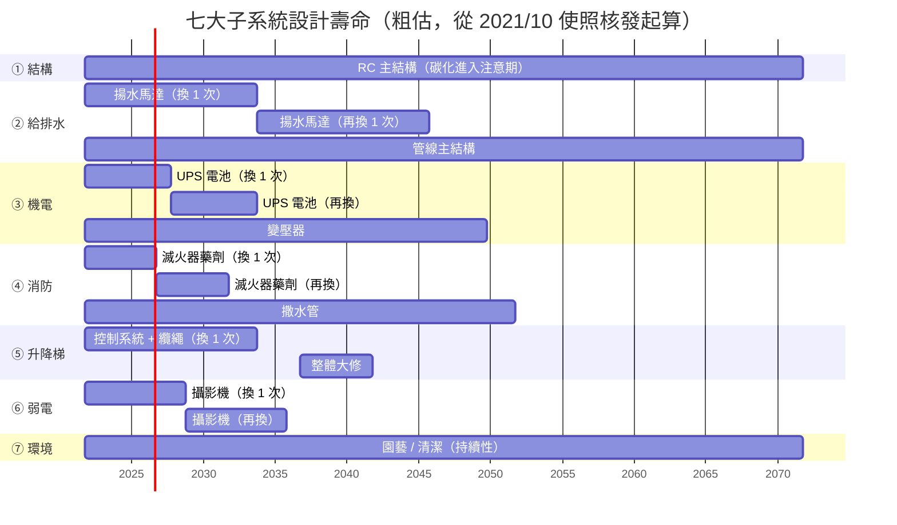

**從這張圖你能看出**：

- **2026-2028 年**：UPS 電池要換、攝影機要換——多個小型支出疊加
- **2033 年左右**：揚水馬達 + 升降梯系統開始進入更新期——**這年要編大筆預算**
- **2050+ 年**：結構碳化進入注意期、整體翻修期啟動

| 子系統 | 主要設備壽命 | 大型翻修週期 | 主委需注意 |
|---|---|---|---|
| ① 結構 | 50-70 年（混凝土結構正常老化）| 不會「換」，但會大型補強 | 20 年以上的大樓要關注外牆與防水 |
| ② 給排水 | 揚水馬達 10-15 年；管線 30-50 年 | 揚水馬達整組換是大筆 | 馬達是消耗品，要編預算 |
| ③ 機電 | 變壓器 25-30 年；UPS 電池 5-7 年；配電盤 20-25 年 | 變壓器更換是百萬等級 | UPS 電池常被忽略 |
| ④ 消防 | 偵測器 10 年；撒水管 30 年；滅火器 5 年（藥劑）| 偵測器整批換 | 每年消防安全申報 |
| ⑤ 升降梯 | 機箱 20-25 年；纜繩 7-10 年；控制系統 10-15 年 | 整體大修 15-20 年 | 法定每年勘檢 |
| ⑥ 弱電 | 攝影機 5-7 年；錄影主機 5-10 年；門禁系統 7-10 年 | 整批升級 7-10 年 | 廠商整併要追蹤 |
| ⑦ 環境 | 各類設備 5-15 年 | 視設備 | 季節性管理為主 |

**這張表的用法**：你接手社區時，先盤點每個系統「目前處於壽命的哪一階段」。20 年的大樓跟 5 年的大樓，主委該擔心的事完全不同。

## 2.4 系統之間會互相影響

子系統不是 silo，會牽動彼此。下圖把常見的跨系統連動畫出來：

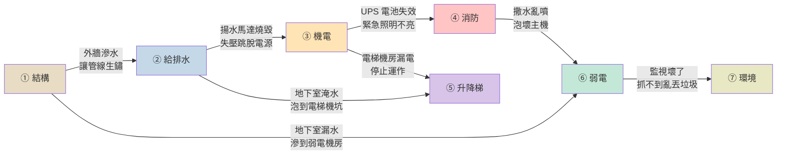

**主委的決策常常跨多個子系統**。一個議題可能在 Ch X 開始，卻牽連 Ch Y 跟 Ch Z。譬如：

- 地下室淹水（看似 ② 給排水）→ 泡壞 ⑤ 升降梯 + ⑥ 弱電
- 外牆磁磚膨拱（看似 ① 結構）→ 砸到行人變成 ⑦ 環境（治安、保險）議題
- 流出抑制設施沒上傳（看似 ② 給排水）→ 罰鍰是 ④ 行政議題

讀完這份文件後你會更容易看出這種跨系統影響。

## 2.5 閱大安的七大系統現況快照（2026 年 5 月）

給接任主委的「現況一覽」（隨時間需更新）：

| 子系統 | 主要廠商／合約 | 目前狀況 |
|---|---|---|
| ① 結構 | 無年度合約；按需發包 | 5-7 樓磁磚膨拱觀察中；連續壁截水溝可用，有 22 個濕孔 |
| ② 給排水 | 揚水：太古華電合約內；水塔清洗：另發包 | 揚水馬達運作正常；流出抑制設施 115 年首次自主檢查 |
| ③ 機電 | 太古華電（月保養） | 整體穩定；UPS 半年放電一次 |
| ④ 消防 | 消防廠商（年保養）；金華分隊轄區 | 防火管理人由總幹事兼任，需保持有效 |
| ⑤ 升降梯 | 三菱（年勘檢 + 月保養） | 第四屆有電梯包板修復案，整體良好 |
| ⑥ 弱電 | 多個廠商分散：監視、門禁、網路各別 | Wi-Fi 升級評估完，目前維持現有 |
| ⑦ 環境 | 清潔（駐衛）+ 園藝（潤泰）+ 垃圾清運（3.5 噸貨車）| 第四屆完成垃圾清運模式改革（5.1 節）|

> 接任主委第一個月，建議**逐個系統跟總幹事走一遍現場**——你會驚訝地發現自己已經知道很多名詞，但從沒實際看過實物。

## 2.6 給主委的「不必懂但要會問」清單（系統層級）

每年至少問總幹事一次：

- ☐ 七大系統各自的合約到期日是哪天？
- ☐ 哪個系統的設備最接近壽命終點？編了預算嗎？
- ☐ 過去 12 個月，每個系統發生過幾次故障？分別由誰修？
- ☐ 哪個系統的法定保養 / 申報今年快到了？
- ☐ 哪個系統因為廠商整併或退場，需要找新廠商？

---

# 第三章：公寓大廈的硬體生命週期──主委站在哪個階段

## 3.1 大樓有自己的人生階段

主委通常在大樓「**長期維護期**」接手，但要看懂手上的議題，需要理解前面幾個階段留下的遺產。

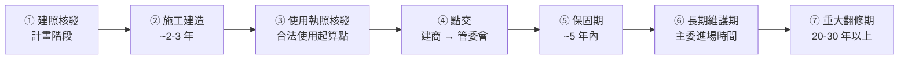

## 3.2 各階段對主委的意義

### ① 建照核發

- 政府核准「可以蓋這棟樓」
- 留下的遺產：**建築許可圖說**（包括結構、機電、消防、給排水的全套圖紙）
- 主委該知道：這套圖紙是社區的「DNA」，所有後續維護都要對照原圖
- 閱大安：建造號碼「**104 建字第 0086**」（流出抑制設施公文上載明）

### ② 施工建造

- 蓋的階段，2-3 年
- 留下的遺產：施工過程中的變更、現場修正、未盡完美的工法
- 主委該知道：原始圖紙跟實際施工**可能不一致**——譬如圖上有 30 個排水孔，現場可能只通了 22 個（閱大安連續壁截水溝就是這個情況）

### ③ 使用執照核發（俗稱「使照」）

- 政府確認「這棟樓蓋好了、可以住人」
- 通常在這之後 1-3 個月才正式交屋
- 留下的遺產：**使用執照本身**是後續所有法定保養申報的依據；上面記載建築用途、防火避難設計分類等
- 主委該知道：使照是社區最重要的文件之一，丟了補辦很麻煩。應該掃描電子檔放雲端

### ④ 點交

- 建商把公共設施正式移交給管委會
- 留下的遺產：**點交清冊**——所有公共設施的清單、規格、廠商、保固期
- 主委該知道：點交清冊是「保固期是否能行使」的關鍵證據。**閱大安歷任主委都應該確認手上有完整點交清冊**
- 如果沒有？跟建商要回來、或者去建管處調

### ⑤ 保固期（俗稱「保固」）

- 法定保固通常 5 年，部分項目 1-2 年
- 保固期內出問題，**建商有義務免費修復**——這是用了會節省大量公基金的權利
- 主委該知道：
  - 保固期是不是還在？哪些項目還在保固內？
  - 過去保固有沒有被行使？建商是否還聯絡得上？
  - 接近保固末期時，要不要主動對所有設施做一次體檢，把問題在保固內處理完？

> ⚠️ **保固期是最容易被新手主委忽略的權益**。閱大安現在已過大部分保固，但你接手後一定要確認手上是否還有任何剩餘保固項目。

### ⑥ 長期維護期

- **主委進場的階段**——保固已過或大部分已過，所有維護成本由公基金 + 管理費負擔
- 留下的遺產：歷屆主委的決策、合約、檔案、債務、賸餘款項
- 主委該知道：你接手的不是一張白紙——是一份「**已經有歷史、有債務、有承諾、有遺憾**」的清單

### ⑦ 重大翻修期

- 通常 20-30 年後出現的階段——多個子系統同時逼近壽命終點
- 留下的遺產：**未來主委將面對**的大型決策（外牆全面重做、機電變壓器更換、升降梯整體更新等）
- 主委該知道：
  - 若公基金累積不足，重大翻修期會出現「住戶不願加錢」vs「設備非修不可」的衝突
  - **長期維護期間是否每年都有足額編列折舊／提撥**，會決定重大翻修期能不能撐過去

## 3.3 閱大安現在站在哪裡

精確時間軸：

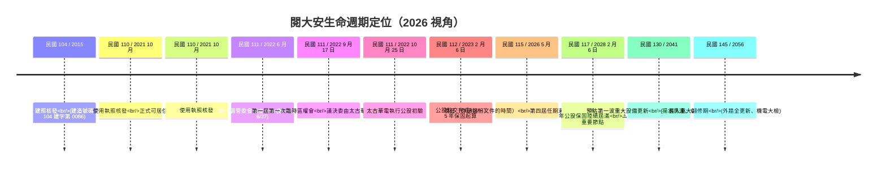

**位置判讀**：

| 維度 | 目前狀態 |
|---|---|
| 大樓**生理年齡** | 約 5 歲（使照後）/ 11 歲（建照後）|
| 管委會**運作年資** | 4 年（第一屆至第四屆）|
| **保固期狀態** | 公設 5 年保固於 **2028 年 2 月 6 日**屆滿（公設點交完成日 2023-02-06 起算 5 年）|
| **長期維護期** | 剛進入早期，多數設備接近設計壽命的 1/3 |
| **重大翻修期** | 距離 20 年大型翻修期還有 **15+ 年** |

**⚠️ 重要節點：2028 年 2 月 6 日公設保固屆滿**

公設於 **2023 年 2 月 6 日點交完成**（第二屆第一次區權會紀錄載明），5 年保固自此起算到 **2028 年 2 月 6 日屆滿**。距今天還有約 21 個月。

**建議排程**：

- **2027 年 6 月前**：啟動全棟保固體檢的籌備（找驗收顧問、整理點交清冊）
- **2027 年 8-10 月**：執行體檢、列出問題清單
- **2027 年 11 月至 2028 年 1 月**：跟建商書面溝通、要求保固內修繕
- **2028 年 2 月 5 日前**：所有保固項目要簽收結案

詳細操作見 §3.4 保固期管理實務。

**這個階段的主委該專心做的事**：

1. **保固期最後盤點**（2026 年 9 月前必做）——逐項清點點交清冊內所有設施，主動測試 + 發掘問題，把建商還能負責的問題在保固內處理完
2. **建立紀律的年度保養**——每個系統的法定申報、合約年度檢查都不能漏
3. **編列預算建立提撥**——為未來的重大翻修提早存錢，不要等到非修不可才募
4. **遺產文件化**——把歷史決策、設施清冊、廠商關係寫進手冊（這份文件 + 總幹事手冊就是在做這件事）

## 3.4 保固期管理實務

保固期是社區用過幾百萬公基金都換不回來的「**建商付帳期**」——能行使的就行使、能逼出來修的就逼出來修。但保固也是**最容易被新手主委忽略 / 被建商規避**的權益。

### 3.4.1 保固起算點：全部從公設點交日算

公寓大廈的公設保固一律從「**公設點交日**」起算——不是使照、不是交屋。這是因為點交前公設還在建商手上，管委會根本沒立場代表全體區權人主張保固。

**閱大安公設保固實際起算**：

| 事件 | 日期 |
|---|---|
| 使用執照核發 | 民國 110 年（2021）10 月 |
| 第一屆管委會成立 | 民國 111 年（2022）6 月 27 日（第一次會議）|
| 第一屆第一次臨時區權會議決委辦點交 | 民國 111 年（2022）9 月 17 日（70 票同意太古華電辦理） |
| 太古華電執行公設初驗 | 民國 111 年（2022）10 月 25 日 |
| **公設點交完成（保固起算日）** | **民國 112 年（2023）2 月 6 日** |

> 📌 這份起算日是查證自會議紀錄的事實。**住戶端**買賣契約裡寫的個別保固起算（每戶交屋日）可能不同——若涉及住戶戶內瑕疵爭議要回去看個別契約，但**公設爭議一律以 2023-02-06 為基準**。

### 3.4.2 保固期長短：不是一律 5 年

不同項目有不同保固期，**主結構長、外殼中、設備短**——但**全部從 2023-02-06 公設點交日起算**。

| 項目類別 | 保固年限 | 閱大安屆滿日 | 目前狀態 |
|---|---|---|---|
| **主要結構**（樑、柱、樓板、剪力牆）| **15 年** | 2038-02-06 | ✓ 還剩約 12 年 |
| **外殼**（外牆、屋頂、防水層）| **5 年** | **2028-02-06** | ⚠️ 還剩約 21 個月 |
| **機電設備**（泵、馬達、UPS）| **1 年**（依設備合約） | 2024-02-06 | ❌ **已過** |
| **電梯** | **1-2 年**（廠商保固） | 2024-2025 | ❌ **已過** |
| **消防設備** | **1-2 年** | 2024-2025 | ❌ **已過** |
| **弱電設備**（監視、門禁）| **1-3 年** | 2024-2026 | ⚠️ 大部分**已過**或將過 |
| **裝修飾材**（地坪、油漆）| **1 年** | 2024-02-06 | ❌ **已過** |

**閱大安主委該認知**：

- **多數設備保固已屆滿**——機電、電梯、消防、裝修飾材都已過，**這些項目今後出狀況都是公基金自付**
- **剩下能行使保固的主要是「**外殼**」**（剩 21 個月）跟「**主要結構**」（剩 12 年）
- **接下來 21 個月內最重要的事**：把所有跟外殼有關的問題（漏水、裂縫、磁磚膨拱、地下室滲水）逼建商在 2028/02 前修完
- **主結構雖然還有 12 年**，但這類問題實務上很少純粹「建商瑕疵」——多半是地震或地質——所以**外殼這 21 個月才是真戰場**

### 3.4.3 接近保固末期的「全棟體檢」

**最高槓桿動作**：在保固屆滿前 3-6 個月，主動做一次全棟設施體檢。

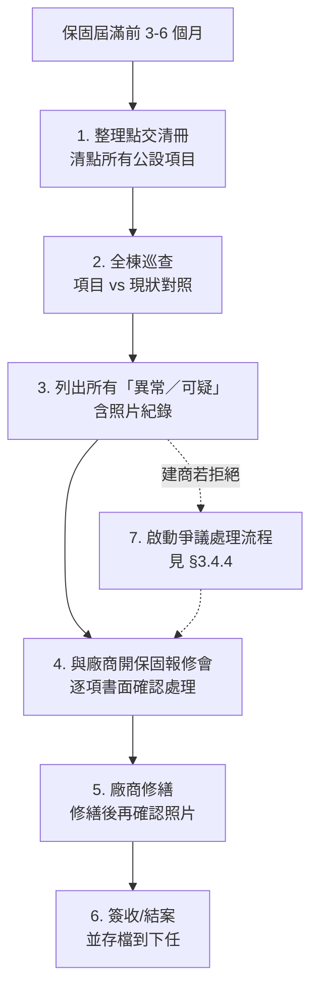

**體檢項目至少涵蓋**（也就是後面 Ch 4-10 七大系統的全部）：

- ☐ 外牆磁磚、防水、裂縫
- ☐ 屋頂防水、植栽影響、排水
- ☐ 地下室連續壁滲水、機房漏水
- ☐ 給水（總管、揚水馬達、水塔）
- ☐ 排水（地下集水井、化糞池、雨水池/流出抑制）
- ☐ 機電（變壓器、配電盤、UPS、避雷）
- ☐ 消防（偵測器、撒水管、防火門、緊急照明）
- ☐ 升降梯（運作、安全裝置、平層）
- ☐ 弱電（監視、門禁、對講、網路）
- ☐ 公共空間（地坪、天花、照明、扶手）

**結果分三類**：

1. **建商可立即修**（屬保固範圍、雙方無爭議）→ 直接報修，**完工後拍照存證**
2. **建商主張不屬保固**（爭議）→ 進入 §3.4.4 爭議處理
3. **建商不否認但拖延**（最常見）→ **書面催告 + 限期改善**，把溝通紀錄全部存檔

### 3.4.4 ⚠️ 地震與保固爭議：閱大安特有議題

**2024 年 4 月 3 日花蓮 7.2 地震**讓閱大安的保固爭議多了一個複雜變項——很多漏水點建商有充分動機解釋成「地震造成」推卸保固責任。**這是接下來 1 年內主委會反覆遇到的議題**。

#### 建商常見的推託話術

- 「這是 0403 地震造成的，不在保固範圍」
- 「結構在地震中受力，連續壁出現新裂縫不算施工瑕疵」
- 「您看這個漏水是地震後才出現的，跟我們的施工無關」

#### 法律與實務的落差：舉證責任不利管委會

**法律原則**是「**誰主張誰舉證**」（民事訴訟法第 277 條）：

- 管委會主張「**這在保固範圍內、建商要修**」 → **管委會要舉證**屬保固
- 建商主張「**地震造成、不在保固**」 → **建商要舉證**確實地震造成

但**實務上**這個對稱完全失衡：

| | 建商 | 管委會 |
|---|---|---|
| 訴訟資源 | ✓ 有專業法務 | ✗ 委員都是住戶兼職 |
| 主動權 | ✗ 被動（等管委會 demand） | ✓ 主動（要去要求修） |
| 時間壓力 | ✗ 拖到保固結束就贏 | ✓ 有保固到期日 |
| 證據掌握 | ✓ 原始施工資料、圖說 | ✗ 多半要自己累積 |
| 動機 | 不會「沒事自找麻煩」  | 找問題、要建商修 |

**所以實務上不要相信「建商要舉證」的法律理論**——你要把自己當成原告，**主動累積足夠強的證據才能逼出修繕**。建商沒有任何動機在地震前先去拍照記錄缺失幫你佐證。

#### 主委的實務反制流程

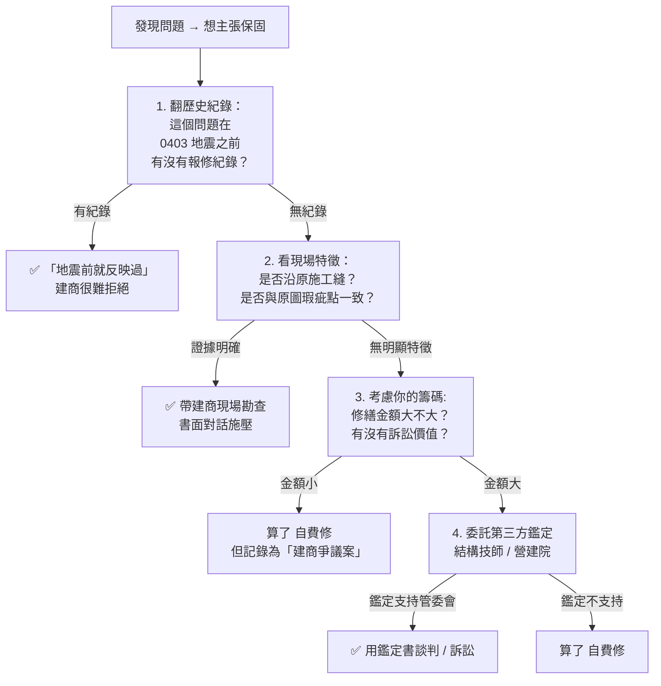

**關鍵領悟**：**你無法靠「法律理論」逼建商修，只能靠「證據強度 + 拖到對方覺得不修更麻煩」**。

#### 五個你必須建立的證據庫

**從接任那天開始**累積（不是等地震後才補）：

| 證據 | 為什麼重要 | 怎麼累積 |
|---|---|---|
| **1. 點交清冊 + 點交照片** | 「點交時就是這樣」是最強反駁 | 第一屆已有，**接任主委第一週內找出歸檔** |
| **2. 點交以來的所有報修紀錄** | 「2022 年 5 月就反映過」直接打死「地震後才出現」 | 總幹事手上應有；建立 Google Sheet 集中管理 |
| **3. 地震前的全棟照片** | 「地震前 vs 後」對照組 | 每年年度巡查時拍 |
| **4. 地震當下的立即紀錄** | 「地震造成的損害是這些、不包含 X」 | 大地震後 24 小時內拍 + 寫書面紀錄 |
| **5. 跟建商所有書面溝通** | 訴訟時的事實基礎 | 一律 email 或公文，不接受口頭 |

**沒有這五份證據時的悲慘現實**：你會發現自己沒辦法用任何方式逼建商修——他不必證明「地震造成」，只要說「不在保固範圍」就把球踢回給你。這時候你能做的只有：

1. 自費修
2. 訴訟（但缺證據贏面小、訴訟費高、時間長）
3. 列入「**未解爭議**」傳給下任主委

#### 跟建商溝通的紀律

- **一律書面**：口頭模糊保證沒用，所有溝通走 email 或正式公文
- **保留證據**：所有現場勘查請廠商與管委會代表共同到場，雙方簽認
- **時間軸**：限期改善若建商不回應，記錄催告日期與後續
- **不放棄**：保固爭議可能拖很長，**主委任期內辦不完就傳給下任**——所以文件化特別重要

#### 訴求管道（建商不配合時）

| 管道 | 適用 | 成本 |
|---|---|---|
| **公寓大廈管理科** | 諮詢與一般協調 | 免費 |
| **建管處消費爭議調處** | 房屋買賣相關糾紛 | 免費 |
| **行政院消費者保護處** | 集體性消費爭議 | 免費 |
| **直轄市建築爭議調處委員會** | 較大型工程爭議 | 部分收費 |
| **民事訴訟** | 訴訟前最後手段，金額大時才考慮 | 高（律師費 + 訴訟費）|
| **建商總公司客訴管道** | 建商較大企業時，總部 vs 案場有差異 | 免費 |

### 3.4.5 ⚠️ 當你沒有足夠證據時：五個務實「降低損失」策略

**先承認現實**：閱大安 0403 地震後出現的多數新漏水／裂縫，**就算原本在保固期內，實務上也很難逼建商修**。原因：

- 建商有充分動機把所有問題推給地震
- 你**事前不可能**對每面牆都拍照留底（這不是接任主委的失職，是現實限制）
- 訴訟成本（律師費 20-100 萬 + 時程 2-5 年 + 贏面不確定）通常大於修繕成本本身
- 個案單獨談判時，建商總是占上風

但 **「會輸」不等於 「該擺爛」**。以下五個策略能顯著**降低損失**、**集中籌碼到能贏的少數仗**：

#### 策略 1：把所有爭議「集中打包」談判，**不要單一案件單獨談**

每個漏水點都跟建商各別爭執時，建商每次都用同一招（「地震造成」）就把你打發。但若你**累積到 10-30 個案件一次打包**：

- 「**這 25 個漏水點全都是地震造成？怎麼可能這麼巧？**」
- 建商若全部拒絕，**輿論壓力 + 訴訟難度**對他都不利
- 你的籌碼 = 案件數量 + 修繕總金額（這時候才會引起建商真正注意）

**操作**：

- 建立「**爭議案件清單**」Google Sheet——每件記錄發現日、狀況、廠商初步意見、暫不修
- 累積 **6-12 個月**或 **10+ 個案件**後一次性 demand
- 給建商 30 天回應期，書面正式公文

#### 策略 2：要求「**分擔修繕費用**」而非「**全責保固**」

給建商一個下台階——「我承認可能有地震因素，但你也應該承擔部分」：

- 第一次提案：建商負擔 70% / 管委會 30%
- 建商通常會還價到 50/50 或 40/60
- **最終達成 30-50% 分攤都比 100% 自費好**

這對建商也比較容易接受，因為：

- 不需要全認自己施工瑕疵（保住面子）
- 比訴訟便宜
- 維持後續案場的「**處理紛爭良好**」形象

**操作**：

- 寫公文時不要用「**請貴公司負保固責任**」這種對立語氣
- 改用「**雙方協商共同承擔**」「**分攤修繕費用**」這種合作語氣
- 留有彈性、留有迴旋

#### 策略 3：透過**政府第三方調處**——低成本、有公正方介入

走管道：

| 管道 | 性質 | 成本 | 適用 |
|---|---|---|---|
| **公寓大廈管理科** | 諮詢 + 建管處內部協調 | 免費 | 第一站，但無強制力 |
| **建管處消費爭議調處委員會** | 半正式調處 | 免費 | 大部分公設爭議 |
| **行政院消費者保護處** | 集體爭議受理 | 免費 | 多戶住戶集體 |
| **直轄市建築爭議調處委員會** | 較正式 | 部分收費 | 較大型工程爭議 |
| **鄉鎮市區調解委員會** | 民事調解 | 免費 | 簡單明確的個別爭議 |

**對建商的壓力**：

- 政府單位介入後建商不能完全擺爛——回應紀錄會留檔
- 若調處後建商仍拒絕，管委會走後續訴訟時調處紀錄是有利證據
- 多數案件**在調處階段就會逼出讓步**，不必走到訴訟

**操作**：

- 集中案件後**先走「公寓大廈管理科 + 消費爭議調處」雙軌**
- 一次處理多案，不要分批
- 調處紀錄詳細歸檔

#### 策略 4：**找同建商的其他社區聯合**

閱大安建商（福一建設）若還在運作、若還有其他案場：

- 那些社區可能也有類似的地震後保固爭議
- **多個社區聯名 demand** 的壓力遠大於單一社區
- 建商無法同時跟多個社區打官司
- 媒體曝光的可能性 + 影響建商後續銷售

**操作**：

- 透過公寓大廈管理科或社區聯誼會打聽同建商其他案場
- 主委之間聯繫、比對爭議模式
- 必要時組「**同建商社區聯盟**」聯名公文

**對閱大安特別重要**：建商福一建設、營造信創建設、機電廠商太古華電——同集團或常合作的營建組合，**閱大安若是大集團其中一個案場**，找到聯盟可能性高。

#### 策略 5：認賠的同時，**加速公基金提撥 + 建立未來巡查紀律**

對於最後仍要自費修的案件：

- 不要花太多時間情緒上消化
- **把錢花在防止「下一次也輸」**：
  - 加速公基金提撥（為未來重大翻修做準備）
  - 從現在起建立「**重點區域系統性巡查**」（見下）

#### 對未來：你**不需要**對每面牆都拍照——「重點區域 + 系統巡查」就夠

承認現實：你不可能對每面牆都留歷史照片。但**重點區域 + 系統性巡查**完全做得到、且足夠：

| 區域 | 巡查頻率 | 一次時間 |
|---|---|---|
| **外牆 5-7 樓**（已知膨拱觀察區）| 每季 1 次 | 30 分鐘 |
| **屋頂防水接縫**（已知防水弱點）| 每雨季前後 | 1 小時 |
| **地下室連續壁濕孔**（22 個有功能濕孔）| 每年 2 次 | 1 小時 |
| **頂樓植栽下方天花板**（漏水熱點）| 每年 2 次 | 30 分鐘 |
| **大門前廊 / 騎樓天花** | 每年 2 次 | 30 分鐘 |

**這樣 1 年也才 8-10 小時**，加總管理委員 4-5 個人輪班，**人均 2 小時/年**——這就足以建立「重點區域證據庫」。

**重點不是「全棟拍照」，是「**高風險區域有歷史照片可對照**」**。下次再有地震時，建商若主張「地震造成」，你能用這些重點區域歷史照片反駁。

#### 接受、累積、待時機

最後最重要的觀念：**保固期管理是長期戰**，不是 一次性勝負。**接受短期會輸幾場**，把資源累積到能贏的少數仗、避免下次再輸——這比硬碰硬贏一次更實際。

---

### 3.4.6 保固期管理的 5 個鐵則

給接任主委的提醒：

1. **第一週就要查清楚閱大安保固起算日**——寫進手冊、所有人都知道
2. **每年至少做一次「保固項目盤點」**——把該追的追完，別讓建商拖到保固結束
3. **所有跟建商溝通走書面**——再小的問題都用 email 或書信
4. **重點區域系統性巡查**——不貪心、不空想「全棟證據」，從高風險區域開始
5. **保固屆滿前 6 個月做全棟體檢**——這是把建商錢逼出來的最後機會

## 3.5 給接任主委的「不必懂但要會問」清單（生命週期層級）

接任第一個月內，找總幹事 + 上一任主委確認：

- ☐ 社區的**使用執照**電子檔在哪裡？
- ☐ **建照核發年度**、**使照核發年度**分別是哪年？
- ☐ **點交清冊**在哪裡？完整嗎？
- ☐ **法定保固**目前狀況：哪些項目還在保固內？哪些已過？
- ☐ **公基金**目前餘額？年度提撥多少？預估的重大翻修期需要多少？

---

# Part II：七大系統由淺入深

# 第四章：結構與外殼──大樓的骨架與皮膚

## 4.0 章節導讀

**為什麼這章對主委重要**：

結構與外殼是大樓最「**不容易出事但出事最嚴重**」的子系統。

- **平常**：你完全感覺不到結構在工作（地震時除外）
- **慢性問題**：外牆磁磚膨拱、屋頂防水失效、地下室滲水——這些不會一夜爆發，但拖個幾年就會變成大事
- **致命問題**：結構柱樑出現結構性裂縫、傾斜——這已經是「住戶要不要疏散」等級
- **法律責任**：外牆磁磚掉下來砸到行人，**社區跟主委都會被求償**——這是最直接的法律風險

主委如果對這章完全沒概念，就會發生：「住戶長期反映漏水沒處理導致鋼筋鏽蝕」、「磁磚膨拱被巡查發現後才驚慌處理」、「地震後沒做評估就讓住戶繼續住」這類遺憾。

**讀完這章你會懂**：

1. 一棟大樓的「重力路徑」跟「地震路徑」如何運作
2. RC / SRC / 鋼骨三種主流結構的差別與老化模式
3. 結構的關鍵元件（樑、柱、板、剪力牆、基礎、接頭）各自的角色
4. 外殼的五大組成（外牆、屋頂、開口部、連續壁、防水層）
5. 結構與外殼的四大敵人（水、地震、風、時間）
6. 主委會碰到的五大實際問題與處理選項
7. 老屋健檢、耐震評估、外牆安全申報三大法定檢查
8. 結構與外殼領域的廠商生態與比價邏輯

---

## 4.1 結構是什麼：5 分鐘搞懂建築力學

主委要懂結構，不必背公式，但要建立**正確的物理直覺**——「**這棟樓為什麼站著、地震時為什麼晃但不垮**」。

### 4.1.1 重力的路徑：所有東西最終都要傳到大地

一棟大樓的每一公斤重量，最後都必須**傳到地下穩定土層**。這條傳遞鏈是：

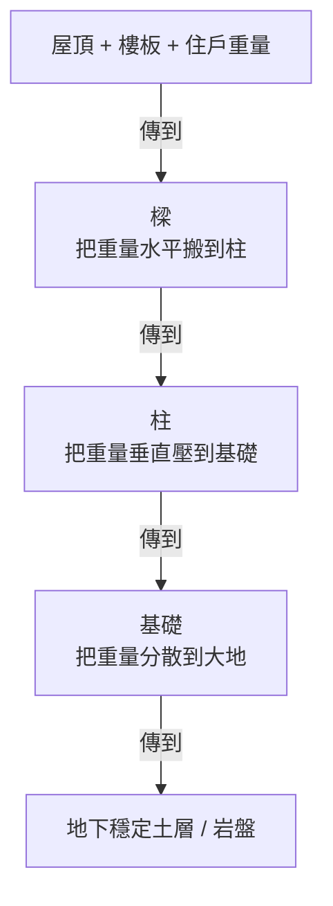

這就是「**重力路徑**（gravity load path）」。**任何打斷這條路徑的事情都會出大問題**——譬如打掉一根柱、或樑被切斷。

**對主委的意義**：當住戶要求「打掉這面牆」「樓板上加水池」時，第一個問題是「**這會不會中斷重力路徑？**」。

### 4.1.2 地震的水平力：剪力牆與韌性

地震不是「上下震動」這麼簡單——主要威脅來自**水平方向的反覆推擠**。大樓本身有重量、地基隨地震晃動，結果是大樓被「水平方向推來推去」。

為什麼有些大樓地震時垮了、有些沒垮？關鍵在兩個概念：

- **剛性（stiffness）**：建築物對抗變形的能力。太剛 → 受力時容易瞬間斷裂（像玻璃，硬但脆）；太柔 → 變形太大可能傾斜或撞到旁邊建築
- **韌性（ductility）**：建築物在大變形下仍能撐住、慢慢消耗能量的能力。韌性高 → 地震時樑柱會「彎曲」但不會「斷裂」——這是**地震時保命的關鍵**

**剪力牆**就是地震時「**抵抗水平推力**」的關鍵元件——通常是樓梯間、電梯間旁邊的厚重牆。

**對主委的意義**：**任何剪力牆絕對不能打掉**。921 地震後台灣建築規範大幅強化，「韌性設計」是 2003 年後的新建物標準。閱大安建照核發於民國 104 年（西元 2015 年）、使照於民國 110 年（西元 2021 年）10 月——屬新規範後的建物，加上採 SC 鋼骨結構（韌性表現優於 RC），理論上抗震設計到位。

### 4.1.3 風壓：高樓才嚴重

對 12 樓以下的住宅，**風壓通常不是主要設計負載**——地震遠大於風。但 25 樓以上、或外牆是大面玻璃（帷幕牆），風壓就要納入設計。

**對主委的意義**：閱大安屬一般高度住宅，風壓不是主要威脅。但**強颱期間頂樓設備（廣告物、空調主機、太陽能板）的固定**仍需檢查——颱風 SOP 在《總幹事手冊》§1.2 颱風。

### 4.1.4 結構不是「越粗越好」，是「平衡」

新手會以為「樑越粗越好、柱越多越好」——錯。結構工程的核心是**重量、剛性、韌性三者的平衡**。樑太粗會增加重量、傳給柱更多負擔；柱太多會妨礙空間機能；剛性太高反而失去韌性。

**對主委的意義**：對結構技師提出的方案，不要輕易說「能不能加粗一點更安全」——可能反而破壞了原始設計的平衡。**結構工程的判斷要交給結構技師，主委的角色是審計、不是設計**。

## 4.2 結構材料三大主流：RC / SRC / 鋼骨

台灣住宅最常見的三種結構材料：

| 結構類型 | 全名 | 結構原理 | 常見高度 | 主要優勢 | 主要弱點 | 主要老化模式 |
|---|---|---|---|---|---|---|
| **RC** | 鋼筋混凝土<br/>Reinforced Concrete | 鋼筋抗拉 + 混凝土抗壓的複合材料 | 1-15 樓 | 成本低、防火、隔音好 | 重、抗震時韌性中等 | **鋼筋鏽蝕**（水侵入碳化）|
| **SRC** | 鋼骨鋼筋混凝土 | RC 內再加大型鋼骨，雙重承重 | 12-30 樓 | 抗震強、樓層高 | 成本高、施工複雜 | RC 老化 + 鋼骨鏽蝕 |
| **SC（鋼骨）** | Steel Construction | 主要靠大型鋼骨；樓板用輕質混凝土 | 25 樓以上 | 韌性最高、施工快、自重輕 | **怕火**（高溫變形）、隔音差 | **鋼骨鏽蝕 + 連接點老化** |

### 4.2.1 RC 的奧妙：鋼跟水泥的互補

為什麼鋼筋混凝土如此普及？因為兩種材料**完美互補**：

- **混凝土**：抗壓強（被壓很厲害）、抗拉弱（拉一下就斷）、便宜、防火
- **鋼筋**：抗拉強（拉很厲害）、抗壓弱（細長件壓會彎）、貴、不防火

把它們組合：**鋼筋負責抗拉的部位、混凝土負責抗壓的部位**，剛好互補，而且混凝土保護鋼筋不被火燒。

但這個美好的組合**有個致命弱點：水**。

### 4.2.2 為什麼 RC 會老化：鋼筋鏽蝕

新澆好的混凝土是強鹼性（pH 約 12-13）——這個鹼性環境會在鋼筋表面形成一層「**鈍化膜**」，保護鋼筋不生鏽。**只要鈍化膜在，RC 可以撐 50-100 年**。

但有兩件事會破壞鈍化膜：

1. **碳化（carbonation）**：空氣中的二氧化碳慢慢滲入混凝土，把鹼中和成中性——這是長期且必然發生的（速度約每年 1-3 mm 從外表向內）
2. **氯離子侵入**：濱海地區的鹽分、或施工時不當使用海砂——氯離子會穿透混凝土到達鋼筋層，破壞鈍化膜

鈍化膜一旦破壞，鋼筋就開始生鏽。**鋼筋生鏽會體積膨脹 2-6 倍**——這個膨脹力會把外面的混凝土撐裂、撐脫，露出更多鋼筋，加速鏽蝕。

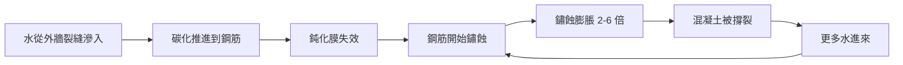

這就是 RC 老化的**惡性循環**。一旦啟動，沒有干預就會持續惡化。

**對主委的意義**：

- **任何外牆滲水都不能拖**——拖越久鋼筋鏽蝕越嚴重
- 老屋（30 年以上）若見到「混凝土外殼脫落露鋼筋」就是已進入嚴重階段，需要結構技師評估
- **預防勝於治療**——每 10 年做一次外牆檢查（這也是法規要求）

### 4.2.3 SRC / 鋼骨的老化模式

- **SRC**：除了 RC 的老化模式，內部鋼骨若被水滲入也會生鏽。檢查更困難（鋼骨包在 RC 裡看不見）
- **鋼骨**：主要敵人是「**火災**」（高溫下鋼會軟化、屈服強度大幅下降）、「**生鏽**」（外露鋼構件需定期油漆防鏽）、「**疲勞**」（反覆受力導致微裂紋累積）

**對主委的意義**：

- 不同結構材料對應**不同的維護重點**
- 鋼骨建物的消防尤其重要——一場長時間火災可能導致整層結構失效
- SRC 跟鋼骨建物需要更專業的結構技師檢查（非一般土木技師能勝任）

### 4.2.4 閱大安的結構類型：SC（鋼骨）

**閱大安是 SC 鋼骨結構**——這在 15 樓住宅裡相對少見（多數選 RC 或 SRC），但鋼骨在台灣中高層住宅這 10 年來逐漸增加。

**這個事實對閱大安的維護有 4 個獨特意涵**：

1. **消防系統的可靠性比一般 RC 大樓更重要** ⚠️
   - 鋼骨在高溫（約 540°C 以上）會大幅軟化失去強度
   - 火災延燒時間若超過撒水系統能控制的範圍，鋼骨會比 RC 更早出狀況
   - **§7 消防章節對閱大安比對 RC 社區更關鍵**，自主消防申報絕對不能漏
2. **內部鋼骨的腐蝕／疲勞檢測較困難**
   - 鋼骨多被防火被覆（噴砂、防火板、防火塗料）+ 飾面包覆
   - 平常看不見，必須在大型翻修或損害事故時才能檢視
   - 主委該知道：**地震後若見到飾面剝落露出鋼骨**，要請結構技師看
3. **樓板較輕但隔音較差**
   - SC 樓板通常是「鋼承板 + 輕質混凝土」組合
   - 比 RC 樓板輕，但厚度較薄，**樓上樓下隔音較差**
   - 住戶投訴噪音時，可解釋這是結構本身特性、規約還是要約束日常起居
4. **韌性表現好（地震時的優勢）**
   - SC 韌性高於 RC，**地震時的安全性實際較好**
   - 0403 地震後閱大安的損害較輕，鋼骨結構是部分原因
   - 但這不代表保固爭議好處理——見 §3.4.4

**SC 結構主要老化模式**：

- **防火被覆老化**（10-20 年）→ 影響耐火時效
- **鋼骨接合部疲勞**（地震反覆受力後微裂紋累積）→ 大地震後評估
- **外露鋼構件鏽蝕**（屋頂機房等外露處的鋼構件需定期防鏽塗層 5-10 年）

> ⚠️ **接任主委該追蹤**：閱大安建照圖說裡會有「**防火被覆規格**」（譬如噴塗厚度、種類）——這個資訊保固期內若有保護不夠的疑慮可向建商主張改善。

## 4.3 結構的關鍵元件深入

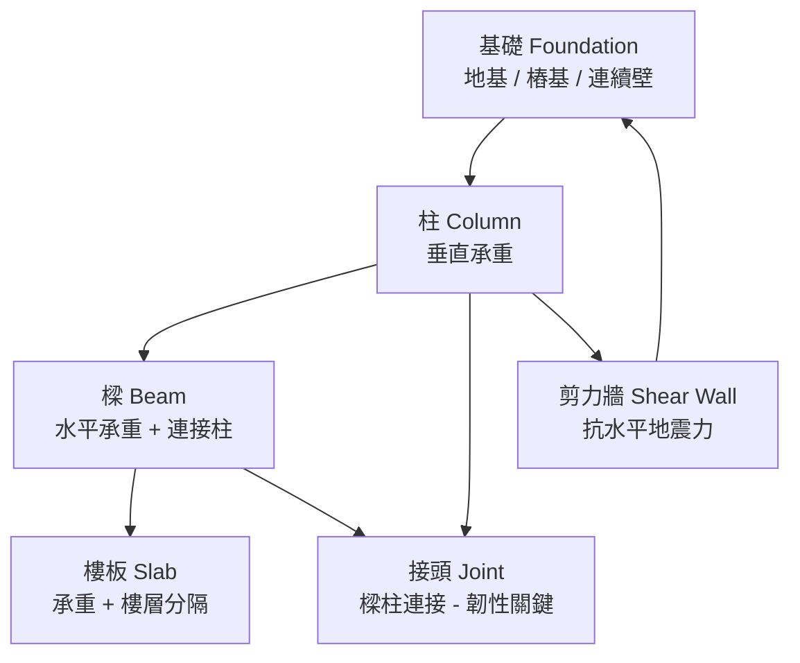

### 4.3.1 基礎：把整棟樓重量「分散到大地」

基礎的功能：**把建築物的重量擴散到夠大的地下面積、讓土壤不被壓壞**。

三種常見基礎類型：

| 類型 | 適用 | 原理 |
|---|---|---|
| **板式基礎**（Mat Foundation）| 低層、地質好 | 整片大型 RC 板舖在土上 |
| **樁基礎**（Pile Foundation）| 高層、軟弱地質 | 長柱（樁）打到地下深層硬岩 |
| **連續壁 + 樁基礎**（複合系統）| 中高層、有地下室 | 連續壁同時擋土、樁基礎承重 |

**閱大安的基礎**：含地下停車場（B1-B4），代表有**連續壁系統 + 樁基礎**。連續壁同時擔任「擋土」+「擋水」雙重角色。

> 連續壁的維護議題詳見 §4.6.3 + 《總幹事手冊》§1.9 地下室連續壁截水溝

### 4.3.2 柱與樑：傳力路徑的骨架

**柱**：

- 垂直元件，把樓板與樑的重量往下傳到基礎
- **打掉一根柱 = 該柱原本承擔的重量無處可去 = 結構崩塌**
- 主委要知道：任何裝修工程**絕對不能打掉柱**

**樑**：

- 水平元件，把樓板的重量水平搬運到最近的柱
- 樑也不能打掉，**但有時樑可以被「鑿洞穿管」**——前提是穿在規定範圍內（樑中段、不超過樑深 1/3 直徑）
- 主委要知道：住戶裝修要在樑上穿洞穿水電管時，要請結構技師確認

### 4.3.3 樓板：水平承重 + 樓層分隔

**樓板**通常 12-15 cm 厚（RC 結構），同時擔任：

- **承重**：上面的人、家具、隔間牆的重量
- **聲音隔絕**：上下樓的聲音傳遞屏障
- **防火**：上下樓火災延燒屏障

樓板的設計負載通常是「每平方公尺 200-300 公斤」。**超過設計負載會出問題**——譬如有人在自家陽台堆放整面書牆、放大型水族箱（一立方公尺水就 1000 公斤）、加蓋鋼骨工作室。

**對主委的意義**：

- 規約應禁止住戶過度堆載（譬如「室內地坪不得放置單點超過 500 公斤之物件」）
- 接到「樓下天花板出現裂縫」的反映時，要看樓上有沒有重物堆載

### 4.3.4 剪力牆：地震時的真正主角

**剪力牆**是地震時抵抗水平推力的關鍵——通常是樓梯間、電梯間旁邊的厚重 RC 牆。

特徵：

- **比一般隔間牆厚**（15-30 cm vs 一般 10-12 cm）
- **連續從基礎到屋頂**——不能有層斷
- **位置通常在大樓的中央或對稱兩側**——平衡受力

**絕對禁止**：

- 打掉任何剪力牆
- 在剪力牆上鑿大洞（小於 10 cm 鑿管可，超過就影響結構）
- 在剪力牆內亂埋管路

**對主委的意義**：

- **規約必須明文禁止住戶變更剪力牆**
- 任何住戶裝修申請，**結構審查的第一個重點就是「有沒有動到剪力牆」**
- 從原始建築圖說可看出哪些是剪力牆

### 4.3.5 接頭：韌性設計的關鍵點

「**接頭**」是樑柱、樑樑、柱柱的連接處——這是地震時最容易出狀況的地方。

921 地震後的結構規範特別強化接頭的設計，要求：

- **箍筋加密**（接頭處的鋼筋圈圈要密集）
- **錨定足夠長度**
- **保護層厚度足夠**

這些細節主委不必懂，但要知道：**新建物（2003 年後）的接頭設計通常比舊建物好——這就是為什麼老屋耐震評估特別重要**。

## 4.4 外殼系統：把結構跟外界隔開

「外殼」是把結構跟外界隔開的層次——包含外牆、屋頂、開口部、地下外牆、防水層。

### 4.4.1 外牆飾材：四種主流

| 飾材 | 安裝方式 | 耐久 | 維護 | 成本 | 常見問題 |
|---|---|---|---|---|---|
| **磁磚** | 黏著層貼上 | 20-30 年 | 中（要看膨拱）| 中 | 膨拱、剝落 |
| **石材**（花崗岩、大理石）| 乾掛或濕掛 | 30-50 年 | 低 | 高 | 風化、變色 |
| **塗料**（彈性塗料、ABA）| 直接塗刷 | 5-10 年 | 高（要重塗）| 低 | 變色、剝落 |
| **帷幕牆**（玻璃 + 鋁框）| 鋁框結構吊掛 | 25-30 年 | 中 | 高 | 漏水、玻璃自爆 |

**閱大安的外牆**：以磁磚為主（待確認）——所以**磁磚膨拱是主要關注點**。

### 4.4.2 屋頂：三層結構

屋頂從上到下：

```
[1] 表面層（隔熱磚、植栽、PU 跑道、太陽能板基座等）
[2] 防水層（橡膠瀝青、PU 塗膜、卷材防水等，10-15 年壽命）
[3] 結構層（RC 屋頂板，50+ 年）+ 排水洩坡
```

**主委該知道**：

- 屋頂漏水 95% 是防水層失效，不是結構層問題
- 防水層壽命 10-15 年，**社區建立 25 年以上要評估全屋頂防水更新**
- 屋頂排水孔（雨水排出口）要定期清理，**堵塞會讓水積聚、加速防水層老化**

**閱大安實例**：頂樓有閱覽室、空中花園、植栽——這些設施都增加防水層的負擔，需要更頻繁的檢查（總幹事手冊 §3.2、§5.5）

### 4.4.3 開口部：窗戶與陽台

**窗戶**：

- 玻璃、窗框、密封條
- 弱點：密封條老化、窗框與牆面接縫裂開
- 漏水通常出現在「窗戶上緣」或「窗框與牆面接縫」

**陽台**：

- 通常半開放、會淋到雨
- 防水尤其重要——大部分陽台漏水是「陽台地坪防水失效」
- 排水孔堵塞會讓陽台積水、最終滲到下層

### 4.4.4 地下外牆：連續壁

- **位置**：地下室外圍，跟外面土壤直接接觸
- **功能**：擋土（防止土壤崩塌）+ 擋水（防止地下水滲入）
- **施工方式**：開挖前先在外圍灌注 RC 牆，等強度足夠再開挖內部
- **常見問題**：施工縫滲水、止水帶老化

**閱大安的連續壁**：B1-B4 整圈，74 個排水孔中 22 個是「濕孔」（持續有水滲出）——這個設計是「**內側排水法**」，刻意讓水進來再用截水溝引導排出去（總幹事手冊 §1.9）

### 4.4.5 防水層：最後一道防線

**所有外殼問題追到底，95% 都是「水從不該進的地方進來」**。防水層是所有外殼共用的最關鍵層。

防水材料三大類：

| 材料 | 適用 | 壽命 |
|---|---|---|
| **橡膠瀝青（asphalt-based）** | 屋頂、陽台 | 10-15 年 |
| **PU 塗膜防水** | 屋頂、陽台、浴室 | 7-10 年 |
| **卷材防水（HDPE / EPDM）** | 屋頂、地下室 | 15-25 年 |

**對主委的意義**：

- 任何外殼工程，**第一個問廠商**：「**有沒有重做防水？用什麼材料？保固多久？**」
- 防水材料的選擇影響後續 10-25 年的維護成本——便宜的塗料 5 年後就要重做，貴的卷材可撐 20 年

---

## 4.5 結構與外殼的四大敵人

### 4.5.1 水：第一號敵人

**所有外殼問題的根源**。水會：

- 滲入混凝土碳化、加速鋼筋鏽蝕
- 從接縫進入磁磚黏著層、導致膨拱
- 透過防水層失效進入屋頂與陽台
- 從連續壁施工縫進入地下室

**處理原則**：**找到水的源頭比修補表面重要**。看到天花板漏水就只重做天花板，是治標不治本——水的源頭可能在更上層的防水。

### 4.5.2 地震：累積疲勞

每次地震對結構都有微小影響——即使沒明顯損傷，**結構內部的微裂紋會累積**。

**對主委的意義**：

- 大地震後（譬如花蓮 0403 地震），**即使建物外觀看起來沒事，也應該做一次目視檢查**——重點看「樑柱接頭、剪力牆、樓板與牆面接縫」
- 若見到新增裂縫（特別是 X 型或對角線裂縫，是結構性裂縫的徵兆），應請結構技師評估

**閱大安實例**：第三屆管委會在 0403 地震後**重點檢查 5 樓至 7 樓區域**——這段樓層發現磁磚膨拱徵兆（總幹事手冊 §5.1.4 提到的「403 大地震後的災損經驗」）

### 4.5.3 風：高樓的隱形壓力

對 15 樓住宅，風壓不致命，但**強颱期間**的風壓可能：

- 吹落鬆動的磁磚、招牌、廣告物
- 撞擊窗戶造成破裂
- 拉扯頂樓設備（空調主機、太陽能板、廣告物固定座）

**對主委的意義**：颱風前的檢查清單（《總幹事手冊》§1.2 颱風前防颱準備）涵蓋這些。

### 4.5.4 時間：所有材料都會老化

材料壽命有上限，沒有「**裝完就不必管**」的東西：

- 混凝土：表面碳化 1-3 mm/年
- 磁磚黏著層：20-30 年
- 防水層：10-15 年（瀝青）、7-10 年（PU）、15-25 年（卷材）
- 鋼結構油漆：5-10 年
- 密封膠（窗框、接縫）：5-10 年

**對主委的意義**：**編預算時要把這些「必然老化」納入長期規劃**——不是「會不會壞」的問題，是「什麼時候壞」。

## 4.6 主委會碰到的五大實際問題

### 4.6.1 外牆磁磚膨拱與剝落

- **症狀**：外牆某幾片磁磚「凸起來」（膨拱），敲擊有空心聲；嚴重時整片剝落
- **原因鏈**：水從上方縫隙滲入 → 黏著層浸水降解 → 磁磚與混凝土分離 → 熱漲冷縮加速分離 → 膨拱或剝落
- **危險性**：剝落會砸到行人——**這是法律上主委的直接責任**
- **處理選項**：

| 嚴重度 | 處理方式 | 成本級距 |
|---|---|---|
| 個別膨拱 | 局部敲下重貼，或灌注修補 | 千元至萬元 |
| 局部多片 | 局部整面換新磁磚 | 數萬至 20 萬 |
| 大面積 | 該面外牆更新（拉皮）| 50-200 萬 |
| 全棟老化 | 外牆整體更新 | 300-800 萬 |

- **法定要求**：建物 15 年以上每 10 年需做「外牆安全檢查申報」

**閱大安實例**：5-7 樓區域磁磚膨拱觀察中（總幹事手冊有記載）——這幾層應該是 403 地震後加速劣化。建議**每年雨季前後各做一次目視巡查**，發現新增膨拱即處理。

### 4.6.2 屋頂與陽台防水失效

- **症狀**：頂樓住戶天花板出現水漬、發霉、油漆剝落；陽台牆面、地坪有水漬
- **原因**：防水層老化（壽命 10-15 年）、施工縫處理不良、樓上住戶植栽過度澆水、屋頂排水孔阻塞
- **處理選項**：

| 範圍 | 處理方式 | 成本 |
|---|---|---|
| 點漏水（找得到源頭）| 該點防水重做 | 5,000-3 萬 |
| 該面屋頂局部 | 局部防水層重做（每 m² 1000-3000 元）| 5-30 萬 |
| 整個屋頂 | 屋頂全面防水更新 | 50-150 萬 |

**閱大安實例**：頂樓植栽自動澆水曾長期過量（4 年數據），加速防水層的負擔。第四屆改成「手動 + Calendar 提醒」既節水也降低防水負擔（總幹事手冊 §3.2）。

### 4.6.3 地下室連續壁滲水

- **症狀**：地下室牆面有水漬、水痕、滴水；嚴重時積水
- **原因**：連續壁施工縫、止水帶老化；地下水位高度變化壓迫；地震後連續壁微裂紋
- **處理選項**：

| 範圍 | 處理方式 | 成本 |
|---|---|---|
| 個別滲水點 | 內側打釘做截水溝 | 千元每點 |
| 多點滲水 | 內側系統性截水溝 + 集水井 | 萬元至 10 萬 |
| 大量滲水 | 外側注入止水劑（成本高、效果不一定）| 數十萬 |

**閱大安實例**：採「**內側截水法**」——連續壁共 74 個排水孔，22 個是有功能的「濕孔」（總幹事手冊 §1.9）。冠駿潔境清潔報價過 9,200 元清通 22 孔（市價 200-300 元/孔，遠低於市價）——這是「**已知濕孔，定期維護**」的策略。

### 4.6.4 結構裂縫的分類與處理

不是所有裂縫都嚴重。**裂縫類型決定危險程度**：

| 裂縫類型 | 走向 | 嚴重度 | 處理 |
|---|---|---|---|
| **沉陷裂縫** | 對角線、由窗角延伸 | ⚠️ 中-高，可能地基不均勻沉陷 | 結構技師評估 |
| **收縮裂縫** | 細小、不規則、寬度 < 0.3 mm | ✓ 低，材料正常收縮 | 美觀考量，可填補 |
| **結構性裂縫** | X 型、貫穿樑柱、寬度 > 0.5 mm | ⚠️⚠️⚠️ 高，結構受力異常 | **立即結構技師評估** |
| **施工裂縫** | 沿施工縫、規則直線 | ✓ 低，原始施工縫老化 | 防水處理 |
| **熱漲冷縮裂縫** | 細小、表面、季節性出現 | ✓ 低 | 監測即可 |

**對主委的意義**：

- 看到新增裂縫**先拍照記錄**（含日期、位置、長度標尺）
- 寬度 > 0.3 mm 的裂縫請結構技師看
- **X 型或對角線裂縫**最危險——可能是地震後結構損傷

### 4.6.5 老屋健檢、耐震評估、外牆安全申報

三個容易混淆的法定 / 補助項目：

| 項目 | 法源 | 對象 | 性質 | 費用 |
|---|---|---|---|---|
| **外牆安全檢查申報** | 建築法 | 15 年以上建物，每 10 年一次 | **強制** | 自費（找認可機構執行）|
| **老屋健檢** | 內政部補助 | 30 年以上建物 | 自願申請，**政府補助**部分費用 | 補助多數成本 |
| **耐震評估** | 內政部補助 | 30 年以上建物（部分情況更寬）| 自願申請，**政府補助** | 補助多數成本 |

**對主委的意義**：

- 閱大安 12 年左右，**外牆安全檢查再 3 年要做**（15 年起算每 10 年）
- 距離老屋健檢、耐震評估補助對象（30 年）還有距離——但要編列預算
- 接近 15 年時要找認可機構（建管處公告名單）執行外牆檢查

## 4.7 法定檢查與保養

| 項目 | 法源 | 頻率 | 執行單位 | 估計成本 |
|---|---|---|---|---|
| **外牆安全檢查申報** | 建築法 | 15 年起每 10 年 | 建管處認可機構 | 5-15 萬 |
| **建物公共安全申報** | 建築法 | 部分建物年度 | 建管處認可機構 | 視範圍 |
| **耐震評估**（建議）| 內政部補助計畫 | 30 年起建議 | 結構技師事務所 | 補助後自付幾萬 |
| **屋頂與陽台目視檢查** | 自主 | 建議每 1-2 年 | 自行 / 廠商 | 千元 |
| **地震後檢查** | 自主 | 規模 5 以上地震後 | 自行 | 0 |

---

## 4.8 閱大安實例深入

### 4.8.1 連續壁截水溝（B1-B4 全棟）

- **歷史**：原設計 74 個排水孔，多年運作後實際有功能的「濕孔」為 22 個
- **建議廠商**：冠駿潔境清潔（前廠商，熟悉管路） / 潤泰物業配合廠商
- **成本參考**：冠駿曾報價 9,200 元清通 22 孔（市價 200-300 元/孔）
- **策略**：目前採「**有狀況再處理**」，未來可考慮將「**颱風季前預防性通管**」列為年度例行項目
- **權責**：不包含在機電廠商（太古華電）合約內，需自行發包

### 4.8.2 5-7 樓區域磁磚膨拱

- **觀察**：第四屆管委會持續觀察，未到剝落階段
- **可能成因**：5-7 樓位置正好是 403 地震後（2024）的高風險區
- **建議追蹤**：每年雨季前後各一次目視巡查，新增膨拱即處理
- **若惡化**：考慮局部修補（千元至數萬）或局部換新（10-30 萬）

### 4.8.3 頂樓植栽與防水

- **狀況**：頂樓植栽過去採自動澆灌（多年），長期過量加重防水層負擔
- **改善**：2026 年起改手動 + Calendar 提醒，4 年回測平均一年澆 123 天（vs 過去 365 天，理論節水 67%）
- **副益**：防水層負擔大幅減輕，延長防水層壽命
- **下一步**：找第三方廠商評估雨水感測器補裝、流量感測器（總幹事手冊 §3.2.2）

### 4.8.4 地板石材晶化

- **執行紀錄**：2024/03 由鼎峰石材行施作（大廳、交誼廳、頂樓、電梯），費用 34,650 元
- **建議**：若無更優廠商，建議沿用

### 4.8.5 外牆清洗

- **頻率**：每 2-3 年一次
- **成本參考**：8-15 萬 / 次（視面積與施工方式）
- **執行時機**：建議連同外牆檢查一併規劃（節省鷹架費用）

---

## 4.9 廠商生態與比價邏輯

結構與外殼領域的廠商可分四類：

### 4.9.1 結構技師事務所

- **業務**：結構評估、耐震評估、結構補強設計
- **執照**：結構技師證書
- **何時找**：結構性裂縫、地震後評估、結構補強、耐震評估
- **比價**：以「**技術評估 + 案例**」為主，不是「**最低價**」為主——這是專業服務

### 4.9.2 土木技師事務所

- **業務**：土木工程、地工、開挖、地下水
- **執照**：土木技師證書
- **何時找**：連續壁、地下室、基礎相關問題

### 4.9.3 建築物公共安全檢查機構

- **業務**：執行法定的外牆安全申報、公共安全申報
- **執照**：建管處公告認可
- **何時找**：法定申報時程到時
- **比價**：可比 2-3 家報價，但**信譽比價格重要**

### 4.9.4 防水專業廠商

- **業務**：屋頂防水、陽台防水、地下室防水
- **何時找**：防水層更新時
- **比價**：**比 2-3 家**，要問清楚「**用什麼材料、保固多久、保固範圍**」

### 4.9.5 外牆磁磚 / 飾材廠商

- **業務**：外牆磁磚修補、飾材更換、整體外牆更新
- **何時找**：磁磚膨拱、剝落、外牆翻新
- **比價**：**至少 3 家**，且必看「**過去 5 年類似社區的施作案例**」

---

## 4.10 給主委的「不必懂但要會問」（結構與外殼）

### 4.10.1 廠商提案時的 10 個必問

- ☐ 「這個損害是『**安全層級**』『**美觀層級**』還是『**預防性**』？」——層級不同，急迫性與預算規模差很多
- ☐ 「**除了這個方案，還有其他做法嗎？分別的成本、壽命、施工難度？**」
- ☐ 「**修補後保固多久？保固範圍包含哪些？什麼情況下保固失效？**」
- ☐ 「**有沒有最近 5 年內類似社區做過同樣工程的案例可以參考？**」
- ☐ 「**若我們先處理 X，剩下的部分能撐多久？**」——避免廠商把所有「以後可能要做」的都打包到現在
- ☐ 「**會不會影響結構安全？**」——若涉及打掉任何牆，第一個必問
- ☐ 「**需不需要報請建管處？**」——某些工程需要報備或請領執照
- ☐ 「**廠商現場施工人員的資格？有沒有保險？**」——避免施工意外影響社區
- ☐ 「**用的材料是什麼品牌、什麼規格？跟低階替代品差別多少？**」
- ☐ 「**這次施工會不會影響住戶生活？預計工期？需不需要搭鷹架？**」

### 4.10.2 巡查時的視覺判斷指南

主委每年應自己（或帶總幹事）走一次的目視檢查重點：

- ☐ **外牆**：有沒有新增的裂縫？有沒有磁磚變色（顏色比鄰近不同代表受潮）？有沒有膨拱（敲擊測試）？
- ☐ **屋頂**：植栽 / 排水孔有無阻塞？防水層有沒有龜裂、剝落？
- ☐ **陽台**：有沒有水漬、發霉？
- ☐ **地下室**：哪些位置有水漬、滴水？跟去年比有沒有變化？
- ☐ **樓梯間**：有沒有新增裂縫？特別是樑柱接頭、剪力牆
- ☐ **大門前廊 / 騎樓**：天花板有沒有水漬、剝落？

### 4.10.3 大型工程的兜底機制

- **任何 30 萬以上的單一工程進管委會討論**，不獨自決策
- **任何 50 萬以上的工程要書面記錄決策依據**，作為日後檢視
- **任何「廠商說很急要立刻簽」的提案，至少冷卻 24-48 小時**——真正急的事不需要催你 24 小時內簽
- **重大工程務必訂明分期付款** + **保固期間部分保留款**

---

## 4.11 給主委的「年度結構與外殼巡查」SOP

建議每年固定時間執行：

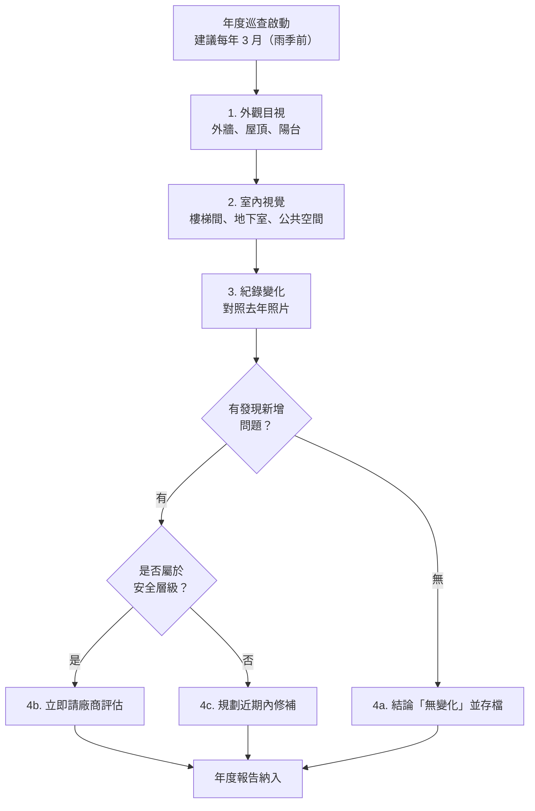

**每年的巡查紀錄存進 Google Drive「年度法規遵循 / 結構與外殼巡查」資料夾**，下任主委可調閱對照。

> 📋 第三、四屆已建立此巡查習慣，建議延續

---

# 第五章：給排水──水的三條路

## 5.1 為什麼這章對主委重要

給排水跟「日常生活感受」最直接相關——水龍頭沒水、馬桶不通、地下室淹水、頂樓植栽缺水、雨水池滿溢⋯⋯**這些都在 24 小時內會收到住戶投訴**。

而且給排水法規分散複雜：**自來水**歸自來水事業處、**汙水**歸環保局、**雨水下水道**歸工務局水利處（流出抑制設施就是這條線）。主委必須知道「哪條水歸哪個單位管」，遇到事情才找對窗口。

## 5.2 水的三條路

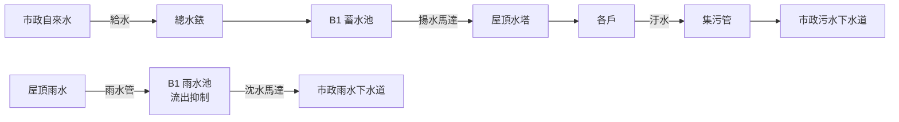

### 給水（進來的水）

- 來源：市政自來水
- 流程：自來水進站總錶 → B1 蓄水池儲存 → 揚水馬達把水「打上去」屋頂水塔 → 各戶靠重力流下來
- 為什麼要繞屋頂水塔？**因為市政壓力不夠把水直接送到 15 樓**——所以要先儲存再加壓送上去

### 汙水（黑水與灰水）

- 來源：各戶馬桶、洗澡水、廚房水
- 流程：各戶 → 集污管 → 化糞池（部分舊大樓）or 直接接污水下水道（新大樓）→ 市政污水下水道
- 主委該知道：閱大安是否有獨立化糞池？接管時間？需不需要定期清理？

### 雨水（從天而降的水）

- 來源：屋頂、陽台、中庭表面降雨
- 流程：雨水管 → B1 雨水池（流出抑制設施）→ 沈水馬達 → 市政雨水下水道
- **這就是 §1.11 流出抑制設施的位置**——閱大安每年 4 月要自主上傳到水利處

## 5.3 揚水 vs 沈水：兩個常被混淆的馬達

| 名詞 | 命名依據 | 安裝位置 | 作用 |
|---|---|---|---|
| **揚水馬達** | 功能方向：「把水往上揚升」 | 通常 B1 機房，不必泡水 | 給水系統——把蓄水池的水打到屋頂水塔 |
| **沈水馬達** | 馬達本體環境：「沉入水中運作」 | 池底，泡在水裡 | 排水系統（例如流出抑制設施）——把雨水池的水加壓排到下水道 |

> 詳細說明見總幹事手冊 §1.11.5。重點：兩個都是「往上抽水」，但一個是供水（揚水）、一個是排水（沈水）。

## 5.4 用戶設備 vs 公共設備：法律分界線

非常重要的觀念，影響「誰要付費修」。

- **公共設備**：服務多戶住戶共用的部分——總水錶、揚水馬達、屋頂水塔、各層集污管主幹、雨水池、流出抑制設施
- **用戶設備**：單戶獨享的部分——戶內水管、戶內衛浴、戶內水龍頭、各戶分錶

**漏水案的判斷邏輯**：

- 漏水來源在公共設備 → 管委會公基金修
- 漏水來源在用戶設備 → 戶主自費修
- 漏水牽涉兩端（譬如戶間漏水）→ **這是最常見的爭議**，需要協商或仲裁

## 5.5 給排水法規涵蓋三個單位

| 議題 | 主管機關 | 接觸頻率 |
|---|---|---|
| 自來水（給水）| 臺北自來水事業處 | 偶爾（管線抽換、總錶換新）|
| 污水下水道 | 臺北市政府環保局或工務局衛工處 | 偶爾（化糞池清理、外洩通報）|
| **雨水下水道（含流出抑制設施）** | **臺北市政府工務局水利工程處** | **每年（4 月自主上傳）** |

主委該知道：**這三個主管機關不是同一個窗口**——遇到問題要分流。

## 5.6 主委會碰到的給排水三大問題

### 5.6.1 揚水馬達燒毀

- **症狀**：屋頂水塔水位異常下降、各戶水壓不穩、長時間缺水
- **原因**：馬達老化、負載超量、潤滑不足
- **常見處理**：
  - 維修：1-3 萬
  - 整組換新：10-30 萬（依容量）
- **預防**：每年保養（馬達是消耗品，5-10 年要規劃更換）

### 5.6.2 戶間漏水爭議

- **症狀**：某戶天花板漏水，懷疑樓上戶內漏水
- **常見處理流程**：
  1. 樓上戶配合自費抓漏（基本義務）
  2. 確認漏水點：若在用戶設備（戶內水管、馬桶、淋浴間），樓上戶自費修
  3. 若在公共設備（譬如樓板內主幹管），公基金修
  4. **爭議常出在「漏水點在哪裡」雙方各執一詞**——必要時請第三方專業抓漏
- **主委可介入**：協調雙方、必要時動用調解；但**不能用公基金幫住戶修自家漏水**

### 5.6.3 流出抑制設施年度自主檢查

- 詳見總幹事手冊 §1.11
- **主委該知道**：這是每年 4 月的法定義務，未上傳會被列抽檢，最重可罰 1-5 萬，按次連續處罰
- 不是大支出議題（檢查本身免費），但**不做的代價遠大於做的成本**

## 5.7 法定保養／檢查

- **水塔清洗**：依《飲用水管理條例》每半年一次
- **流出抑制設施自主檢查**：每年 4 月上傳到水利處
- **揚水馬達**：機電廠商月保養合約涵蓋（閱大安：太古華電）
- **化糞池清理**：依容量與使用量，通常每年 1-2 次（若有獨立化糞池）

## 5.8 給主委的「不必懂但要會問」（給排水）

廠商提案時要問：

- ☐ 「這是公共設備還是用戶設備？」——影響付款方
- ☐ 「修這個之後對水質有沒有影響？需不需要重新做水質檢驗？」
- ☐ 「修的時候會不會停水？停多久？要不要先通知住戶？」
- ☐ 「換馬達／管線後保固多久？」
- ☐ 「水塔清洗除了清洗本身，水質檢驗報告有沒有？」

每年至少做：

- ☐ 確認流出抑制設施 4 月已上傳水利處
- ☐ 跟總幹事確認水塔清洗已執行兩次
- ☐ 看一次揚水馬達月保養報告，有沒有「該換零件還沒換」的警告

---

# 第六章：機電──大樓的電力骨架

## 6.1 為什麼這章對主委重要

機電是「沒事的時候你不會注意，一出事整棟癱瘓」的子系統。

- **沒事**：每月按時付電費、每年保養合約照跑
- **小事**：某層跳電、某戶斷電、緊急照明壞了
- **中事**：UPS 電池徹底失效、避雷針損壞、配電盤異常
- **大事**：變壓器燒毀（整棟停電 24-72 小時）、電氣火災

主委必須對機電有基本概念，因為**機電問題常常牽動消防、弱電、給排水**——電源跳了之後，消防警報器、監視主機、揚水馬達會接連停擺。

## 6.2 電是怎麼進到你家的

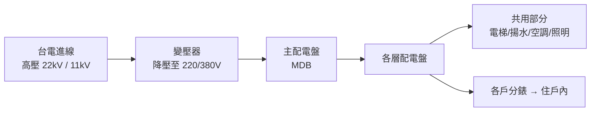

幾個概念：

- **高壓 vs 低壓**：台電送電可能用 22kV 或 11kV 高壓送，到大樓變壓器後降到家用 220V/380V
- **強電 vs 弱電**：強電指 110V 以上的電力配送；弱電指 48V 以下的訊號（監視、對講、網路）——兩者用不同管線、不同廠商
- **公共用電 vs 戶用電**：公共部分（電梯、樓梯間照明、揚水）由社區付；戶內用電由住戶各自跟台電結算

## 6.3 機電的關鍵零件

### 6.3.1 變壓器與配電盤

- **變壓器**：通常 25-30 年壽命，整修或更換是百萬等級
- **主配電盤（MDB）**：分電到各層的中樞——故障時會跳脫保護或燒壞
- **各層配電盤**：分電到該層各戶 + 該層公共空間

### 6.3.2 緊急電源系統

當市電中斷時，這套系統撐起最關鍵的負載——

- **發電機**（柴油 / 天然氣）：較大型，可撐數小時至 24 小時，需定期試運轉
- **UPS（不斷電系統）**：靠電池，撐 15 分鐘到數小時，給對中斷敏感的設備（譬如監視主機、消防控制盤）

### 6.3.3 避雷系統

- **避雷針**：屋頂上、把雷電引導到地下接地
- **接地系統**：把電引到地下大地，避免設備被雷擊
- **法規檢查**：每年至少目視檢查連續性

## 6.4 主委會碰到的機電三大問題

### 6.4.1 公共電費異常上升

- **症狀**：某月公共電費比同期高 30% 以上
- **原因可能**：
  - 公設使用增加（譬如住戶開始大量用閱覽室空調——閱大安已遇過此類情況）
  - 設備故障導致長時間運轉（譬如揚水馬達卡死持續抽不到水）
  - 偷接電（從公共線路接到戶內）
  - 計費抄表錯誤
- **處理流程**：
  1. 先確認台電抄表是否準確（複查）
  2. 跟總幹事看設備運轉紀錄
  3. 分時段比對：上下午、平假日差異
  4. 必要時請機電廠商查設備耗電

### 6.4.2 UPS 電池徹底失效

- **症狀**：UPS 控制盤顯示電池異常或無電；模擬停電測試 UPS 撐不到設計時間
- **原因**：鉛酸電池正常壽命 5-7 年，無維護的話更短
- **常見處理**：
  - 半年放電一次延長壽命（閱大安做法，總幹事手冊 §5.1.1）
  - 整組換新：1-3 萬
- **後果**：UPS 失效會讓「火災時緊急照明不亮、監視主機沒錄到關鍵畫面」——是看不見的風險

### 6.4.3 避雷或接地問題

- **症狀**：雷雨後設備異常（譬如監視主機重開、門禁系統失靈）
- **常見處理**：
  - 請機電廠商檢查避雷針連續性、接地電阻
  - 必要時補強接地
- **預防**：每年至少做一次避雷系統檢查

## 6.5 法定保養

- **機電月保養**：機電廠商合約（閱大安：太古華電）
- **UPS 放電維護**：每半年（閱大安做法）
- **避雷接地**：每年至少目視檢查

## 6.6 給主委的「不必懂但要會問」（機電）

廠商提案時要問：

- ☐ 「這個壞掉是設備老化還是使用不當？」——影響後續預防策略
- ☐ 「換新的有沒有比修舊的划算？」——維修成本接近新品價時應換新
- ☐ 「我們的負載已經到設計容量幾成？」——超過 80% 要警惕，超過 100% 必須擴容
- ☐ 「新設備的能效如何？多久回本？」——某些更新可以節電
- ☐ 「停電施工時間能不能控制在 X 小時內？」——直接影響住戶接受度

每年至少做：

- ☐ 確認 UPS 兩次放電已執行
- ☐ 跟總幹事看公共電費 12 個月趨勢
- ☐ 看一次機電月保養報告，注意「該換零件還沒換」的警告

---

# 第七章：消防──保命系統，最高優先級

## 7.1 為什麼這章對主委重要

消防是七大系統裡**法律責任最重**的。發生火災造成人員傷亡時，主委可能要負刑事責任（過失致死 / 業務過失致重傷）——這不是嚇你，是真實案例。

而消防系統最大的問題是：**平時你不會用到它，所以容易忽略**。每年消防檢查報告交了就放抽屜，廠商按月保養就好。但實際出事的那一刻，系統是不是真的能運作，主委要負最後責任。

## 7.2 消防系統的四個層次

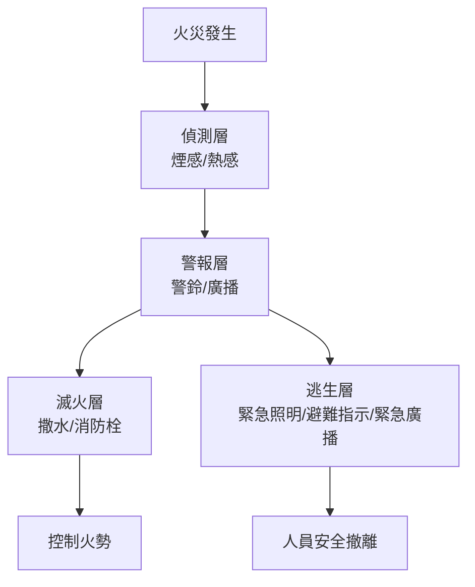

### 7.2.1 偵測層

- **煙感**：偵測煙霧粒子——最常見，誤報率低
- **熱感**：偵測溫度——廚房、機房用（避免被油煙誤觸發）
- **瓦斯探測**：偵測天然氣／液化瓦斯外洩
- **連線到火警受信總機**：總機在管理中心，集中顯示哪一區起火

### 7.2.2 警報層

- **警鈴**：響徹整層
- **緊急廣播**：可由管理中心或自動播放——「請就近往安全梯方向避難」
- **連動電梯**：火警時電梯自動降到一樓並停用

### 7.2.3 滅火層

- **自動撒水**：偵測到溫度達某點（通常 68°C 或 72°C）後該點撒水頭自動破裂噴水
- **室內消防栓**：每層樓配置，可由訓練過的人員（譬如保全）使用
- **滅火器**：每層配置；藥劑有效期 5 年
- **滅火毯**：廚房、機房用

### 7.2.4 逃生層

- **緊急照明**：停電時自動亮起，撐 30 分鐘以上
- **避難方向指示**：綠色出口標示
- **緊急廣播**：引導避難路徑
- **逃生通道**：安全梯（兩座以上）、防火門

## 7.3 防火管理人與消防安全管理人

兩個容易混淆的法定角色：

| 角色 | 法源 | 誰可以擔任 | 職責 |
|---|---|---|---|
| **防火管理人** | 消防法 | 持有「防火管理人證」者 | 制定/執行防護計畫；定期消防演練；協助消防申報 |
| **消防安全管理人** | 消防法 | 通常由總幹事 / 主委兼任 | 法律上擔任消防安全的「窗口」 |

> **閱大安做法**：防火管理人通常由總幹事擔任（需持證）；換總幹事或委員會換屆時需更新資料給臺北市消防局**金華分隊**（總幹事手冊 §5.1.3）

## 7.4 防火區劃：看不見但救命的設計

「防火區劃」是把建築物切割成多個「**就算這個區劃整個燒掉、火也不會跨到下個區劃**」的小區。

- **防火門**：把走道、安全梯、機房切割
- **防火區劃牆**：上下穿透時要做防火填塞
- **防火建材**：天花板、地板、隔牆要符合一定的耐火等級

**主委該知道**：

- 防火門平時就要保持「**會自己關上**」——不能用磚塊、椅子卡住讓它常開
- 任何裝修工程都不能破壞防火區劃（譬如把樓層之間打洞接管路但沒做防火填塞）

## 7.5 主委會碰到的消防三大問題

### 7.5.1 消防申報

- **半年自主檢查 + 申報**：依消防法每半年要做檢查並向消防局申報
- **責任**：建築物使用人（社區）
- **執行**：通常委託消防廠商代執行
- **主委該知道**：簽收申報書時要至少看一眼，不能只簽不看

### 7.5.2 滅火器有效期管理

- **藥劑壽命**：5 年（具體看廠牌與型號）
- **過期後**：廠商會建議換藥（不換筒身）
- **批量管理**：建議建一張表記錄每支滅火器位置、藥劑換填日期、下次到期日

### 7.5.3 新興議題：電動車鋰電池火災

- 鋰電池火災**水撲不滅**，傳統消防設備效果有限
- 多戶停車場開始裝防火毯、細水霧防火系統
- **目前法規仍在發展中**——閱大安已開始研究（總幹事手冊 §5.1.2）

## 7.6 法定保養與檢查

- **半年自主消防安全檢查**：依消防法
- **設備保養**：消防廠商月或季合約
- **滅火器**：藥劑換填依有效期
- **緊急照明 / UPS**：閱大安半年放電一次
- **演練**：依規模可能需要定期消防演練（疏散演練）

## 7.7 給主委的「不必懂但要會問」（消防）

廠商提案時要問：

- ☐ 「這次申報報告裡有沒有缺失改善建議？」——是否有「不符合」項目
- ☐ 「如果現在出火災，這套設備從偵測到滅火的時間是多久？」——某些老設備已退化
- ☐ 「防火管理人證有沒有快過期？」——證照有有效期
- ☐ 「廠商有沒有最近的政府查核 / 罰則？」——避免合作不肖廠商
- ☐ 「我們的緊急電源（UPS）能撐多久？符合消防局要求嗎？」

每年至少做：

- ☐ 兩次消防申報均已上傳完成
- ☐ 防火管理人證仍在有效期內
- ☐ 巡查一次：防火門有沒有被卡住、滅火器有沒有過期、緊急照明會不會亮
- ☐ 跟金華分隊聯繫，更新管委會主委與防火管理人聯絡資料

---

# 第八章：升降梯──法規最嚴格的設備

## 8.1 為什麼這章對主委重要

升降梯（電梯）是社區裡**法規最嚴格、保養最頻繁、住戶投訴最多**的單一設備。

- 法規：每年勘檢 + 每月保養（《建築物升降設備設置及檢查管理辦法》）
- 故障率：高（電梯是大樓最常壞的設備之一）
- 修一次：保養合約幾千元/月；大型整修可上百萬

跟其他系統不同，**電梯廠商在台灣是寡占市場**——三菱、奧的斯（OTIS）、KONE、東芝、Schindler⋯⋯五大廠商佔市場 80%。換廠商不容易，整體更新更貴。

## 8.2 升降梯的解剖

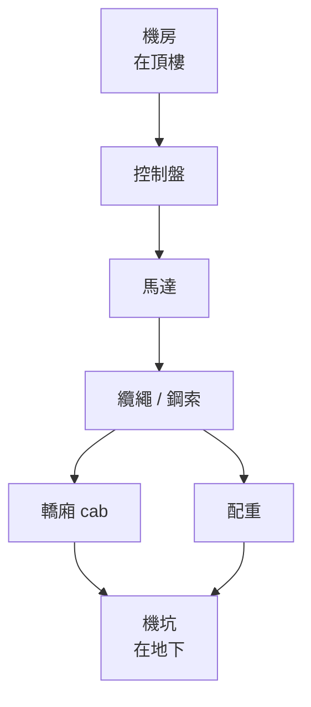

- **機房**：放控制盤、馬達——通常在頂樓
- **控制盤**：電梯的「大腦」——接收按鈕指令、控制馬達、處理異常
- **馬達**：把轎廂拉上去 / 放下來
- **纜繩**：拉著轎廂的鋼索（消耗品，7-10 年要換）
- **轎廂**：你進去的箱子
- **配重**：在另一邊，重量跟轎廂相近，讓馬達省力
- **機坑**：地下空間，緩衝跌落用
- **安全裝置**：限速器、緩衝器、終端開關——多重保護

## 8.3 升降梯的兩大法規動作

### 8.3.1 每年勘檢

- **執行單位**：政府認可的勘檢機構（建管處公告名單）
- **流程**：勘檢機構派員測試所有安全裝置 → 合格發勘檢合格證 → 貼在電梯內
- **主委該知道**：合格證上有**到期日**，到期前一個月要安排下次勘檢；逾期未勘檢可被開罰

### 8.3.2 每月保養

- **執行單位**：電梯廠商（按合約）
- **內容**：清潔、潤滑、零件檢查、故障排除、紀錄
- **保養紀錄簿**：每次保養要填，**主委每幾個月應該抽一次看**——確認廠商有實際來

## 8.4 主委會碰到的升降梯問題

### 8.4.1 故障停在樓層之間

- **症狀**：電梯卡在兩樓層之間、警報響、住戶受困
- **應急流程**：
  1. 透過電梯內對講機跟住戶通話保持冷靜
  2. 立即通知電梯廠商緊急派員
  3. **救援只能由廠商技師執行**——保全不能擅自把住戶拉出來，安全裝置設計上不允許這樣
- **預防**：穩定的月保養 + 定期更新老化零件

### 8.4.2 老化跡象

20 年以上的電梯常見：

- 上下時搖晃變大
- 平層精度變差（停下來不齊樓層地板）
- 開關門卡頓
- 異音變大

**這時候需要評估**：

- 局部更新（換控制盤、纜繩）
- 整體更新（5-15 年規劃，數百萬等級）

## 8.5 法定保養與檢查

- **每年勘檢**（政府認可勘檢機構）
- **每月保養**（電梯廠商合約）
- **保養紀錄**：每次保養都要填表

## 8.6 給主委的「不必懂但要會問」（升降梯）

廠商提案時要問：

- ☐ 「下次勘檢到期日是哪天？」——避免逾期
- ☐ 「這次保養有沒有發現需要換的零件？」——大部分廠商會建議零件換新，要判斷哪些真的必要
- ☐ 「故障率：過去 12 個月停機幾次？平均故障到復原時間？」——若異常高需追究廠商
- ☐ 「我們的纜繩已用幾年？什麼時候要換？」——纜繩是消耗品但常被忽略
- ☐ 「整體大修的時程預估？」——20 年以上電梯該開始規劃

每年至少做：

- ☐ 確認勘檢合格證在有效期內
- ☐ 抽看 1-2 個月的保養紀錄簿
- ☐ 看故障紀錄，跟廠商討論預防

---

# 第九章：弱電與智能──不會死人但讓你日子不好過

## 9.1 為什麼這章對主委重要

弱電（low-voltage）相對於強電（high-voltage power），指 48V 以下的訊號線——監視、門禁、對講、網路、電視、智能管理系統。

**這個系統不會直接危及生命，但**——

- 監視壞了 → 偷竊、糾紛無法仲裁
- 門禁壞了 → 安全感歸零，外人隨意進出
- 對講壞了 → 訪客找不到住戶、外送無法上來
- 網路壞了 → WFH 住戶崩潰、智能管理當機
- 智能管理當機 → 繳費、報修、公告全部停擺

弱電的特性：**廠商分散、技術更新快、整併頻繁**。主委要注意「**廠商不見了**」的問題。

## 9.2 弱電的子系統

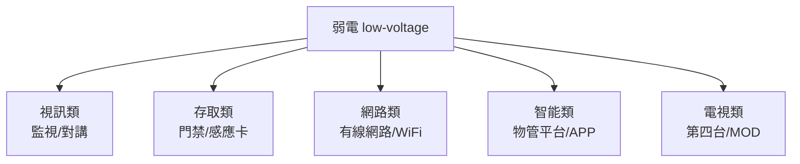

## 9.3 監視系統

- **攝影機**：類比 vs IP——目前 IP 為主流
- **錄影主機（NVR / DVR）**：把畫面錄下來儲存
- **儲存**：硬碟容量決定能存多久（通常 30 天）
- **解析度**：1080p（HD）/ 4K——影響辨識能力

**主委該知道**：

- 攝影機壽命 5-7 年，定期該換
- 儲存的硬碟也會壞——要監控
- 隱私法規：監視範圍不能拍到他戶住宅內部

## 9.4 門禁系統

- **大門**：感應卡 / 密碼 / 人臉 / 手機 NFC
- **樓層門禁**：分隔不同樓層
- **管理：感應卡發放、註銷紀錄要保留**——換戶時要追蹤卡片回收

## 9.5 對講系統

- **大門對講**：訪客按戶號 → 戶內回應 → 開門
- **樓層對講**：戶間或戶到管理中心

## 9.6 網路與 WiFi

- **對外**：跟 ISP（中華電信、台灣大、第四台、有線等）租光纖
- **內部**：路由器、AP 分布
- **主委該知道**：閱大安歷史評估過多個方案，目前用兩家廠商配置（總幹事手冊 §6.3）

## 9.7 智能管理系統

- 物管平台：管理員的後台（住戶資料、繳費、報修、公告）
- 社區 APP：給住戶用的前台
- 智能管理逐漸成為趨勢，但不必為了智能而智能——**主委要評估「實際解決什麼痛點」**

## 9.8 給主委的「不必懂但要會問」（弱電與智能）

廠商提案時要問：

- ☐ 「廠商在這個產業多久？整併風險？」——避免簽完合約廠商消失
- ☐ 「系統的『資料』所有權歸誰？」——影響日後換廠商是否能轉移
- ☐ 「保固期過了之後，維護費是多少？」
- ☐ 「能不能用 demo 試一個月再決定？」——大型系統升級前先試
- ☐ 「我們現有設備能不能繼續用？」——避免被迫整套換

每年至少做：

- ☐ 巡查所有監視畫面是否清晰
- ☐ 確認 NVR 硬碟健康狀態
- ☐ 更新公佈欄 / APP / Line 群的主委 / 總幹事聯絡資訊

---

# 第十章：環境──讓大樓住得舒服

## 10.1 為什麼這章對主委重要

環境是「**沒人會因為這個叫你下台，但每個人都會持續抱怨**」的子系統。

- **綠化**：頂樓植栽、中庭景觀、騎樓盆栽
- **廢棄物**：垃圾、回收、廚餘、大型廢棄物
- **清潔**：日常清潔、外牆高壓清洗、地坪保養
- **蟲鼠**：預防、消滅、後續監測

跟其他系統不同，**環境的優劣很主觀**——「中庭花漂不漂亮」「垃圾房臭不臭」每個人標準不一樣。主委要設定一個 baseline 並穩定執行。

## 10.2 綠化

- **位置**：頂樓植栽（閱大安最大綠化區）、中庭、騎樓
- **管理**：園藝廠商（潤泰系統）、自動澆灌或人工澆灌
- **預算**：園藝合約是社區持續性支出之一

**閱大安實例**：頂樓植栽過去採自動澆灌，2026 年起改手動 + Calendar 提醒（總幹事手冊 §3.2），測算節水 67%

## 10.3 廢棄物

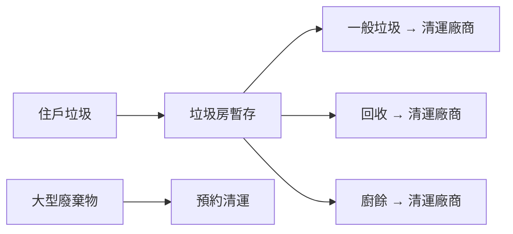

- **日常清運**：跟清運廠商簽合約，定期收運
- **大型廢棄物**：住戶預約，環保局或社區清運
- **政策困境**：政府要求精細分類，但住戶不會配合，最後落到清潔人員身上

**閱大安實例**：因大型壓縮車無法進入巷弄，2025 年換廠商，改 3.5 噸貨車清運（總幹事手冊 §5）

## 10.4 清潔

- **日常清潔**：駐衛清潔人員，每日打掃公共空間
- **大型清洗**：
  - 外牆高壓清洗（每 2-3 年一次，8-15 萬）
  - 地坪石材晶化（每幾年一次，視材質）
  - 水塔清洗（每半年）

## 10.5 蟲鼠

- **預防**：消毒（每月或季）、阻絕通道、清理積水
- **發生時**：立即消殺
- **後續監測**：避免反覆出現

## 10.6 給主委的「不必懂但要會問」（環境）

廠商提案時要問：

- ☐ 「合約涵蓋的『標準』寫清楚了嗎？」——主觀項目要儘量量化
- ☐ 「住戶對品質的反映率是多少？」——每月可請總幹事統計
- ☐ 「清潔人員的勞動條件合理嗎？」——別讓服務品質透過剝削維持

每年至少做：

- ☐ 走過外牆 / 公共空間，目視整體乾淨度
- ☐ 看垃圾房一次（最直觀的「日常品質」測試）
- ☐ 跟園藝確認頂樓植栽狀況

---

# Part III：主委的判斷工具箱

# 第十一章：不必懂但要會問──廠商提案的批判性閱讀

## 11.1 為什麼這章是這份文件最重要的一章

如果你只能讀這份文件的一章，讀這一章。

主委的工作 80% 是「**做決策**」，而做決策的最重要技能是「**問出讓廠商不好唬弄你的問題**」。前面 Ch 4-10 給你的是各系統的「廣度」——但實際碰到廠商提案時，重點不是你懂多少，而是你問什麼。

## 11.2 廠商提案的常見「動作」

廠商不是惡人，但他們有自然動機要：

1. **把案子做大**（更多收入）
2. **把工期講長**（更多保留空間）
3. **把不確定講小**（避免後續被質疑）
4. **把替代方案隱藏**（避免你比較）

了解這些動機後，主委的問題就是「**用問題把這些動機平衡掉**」。

## 11.3 八個必問模式

### 模式 1：層級分類

「這個損害是『安全層級』『美觀層級』還是『預防性』？」

- 安全層級：必須立刻處理
- 美觀層級：可規劃
- 預防性：可選擇時機

廠商若把美觀講成安全，就要追問「具體會發生什麼後果？什麼時間範圍？」

### 模式 2：替代方案

「除了這個方案，還有其他做法嗎？分別的成本與壽命？」

每個工程議題都至少應該有 2-3 種做法。廠商只給一個，主委要主動問。

### 模式 3：分項拆解

「報價單能不能拆成『拆除』『施工』『材料』『清運』分別多少？」

包套報價容易藏水：拆解後容易看出哪一項不合理。

### 模式 4：比價樣本

「能不能拿到 2-3 家比價？」

對工程類項目，比價是基本。少於 5 萬的小修可以不比；超過 10 萬建議比 2-3 家。

> 但要注意：消防、電梯這類「廠商寡占」項目，比價意義有限——主要看品質與信譽

### 模式 5：時間風險

「不做、或晚一年做，會發生什麼？」

廠商往往把急迫性誇大。問清楚「不做的後果」可讓你判斷該不該立刻動。

### 模式 6：保固

「修完保固多久？保固範圍包含哪些？什麼情況下失效？」

保固是工程後續品質的保險。若廠商不願給保固或保固很短，要追問為什麼。

### 模式 7：類似案例

「最近有沒有類似社區做過同樣的工程？做完反映如何？」

廠商若拿不出案例或案例都很模糊，要警惕。

### 模式 8：終止條件

「如果工程做到一半發現預估錯誤，怎麼處理？」

大工程的不確定性高。事先講清楚「**超出預算如何處理**」「**遇到隱藏狀況如何加減項**」，避免事後爭議。

## 11.4 廠商「不應該回答得很順」的徵兆

如果廠商對以下問題能立刻無延遲地給出標準答案，要警惕——這代表他們可能背了話術而非真的想清楚：

- 「為什麼這個方案比較好？」（如果只說「業界都這樣」要追問）
- 「最壞情況會花多少？」（如果說「絕對不會超」要警惕）
- 「能不能寫進合約？」（口頭保證 vs 合約條款是兩回事）

## 11.5 主委如何「兜底」

即使做完上面所有功課，仍可能誤判。**所以主委要建立兜底機制**：

- **任何 30 萬以上的單一工程都進管委會討論**，不獨自決策
- **任何 50 萬以上的工程要書面記錄決策依據**，作為日後檢視
- **任何「廠商說很急要立刻簽」的提案，至少冷卻 24-48 小時**——真正急的事不需要催你 24 小時內簽

---

# 第十二章：必懂的 50 個術語

> 主委需要懂這些詞、不一定能造句講出來，但聽到時要不會卡住。每個術語給一句話解釋 + 你會在哪裡聽到。

## 結構與外殼

1. **RC**：鋼筋混凝土——最常見的住宅結構
2. **SRC**：鋼骨鋼筋混凝土——12-30 樓常見
3. **連續壁**：地下室外圍的混凝土牆，擋土兼擋水
4. **剪力牆**：抗震關鍵牆，**絕對不能擅自打掉**
5. **膨拱**：磁磚跟混凝土黏著層失效，磁磚凸起來
6. **防水層**：屋頂與陽台下面的防水材料，10-15 年壽命
7. **施工縫**：兩次澆築混凝土的接縫，常是漏水起點
8. **梁 / 柱 / 板**：結構三大基本構件——梁水平、柱垂直、板樓地板

## 給排水

9. **給水**：進來的水（自來水）
10. **排水**：出去的水（汙水 + 雨水）
11. **揚水馬達**：把水「打上去」的馬達（B1 蓄水池 → 屋頂水塔）
12. **沈水馬達**：泡在水裡的馬達，用於排水（雨水池 → 下水道）
13. **流出抑制設施**：暫存雨水的緩衝池，避免暴雨衝垮市政下水道
14. **化糞池**：部分舊大樓的污水預處理，新大樓多已直接接污水下水道
15. **止水閥 / 逆止閥**：單向放行的閥門，防止下水道水倒灌
16. **浮球**：水池內的水位感測器，控制馬達啟停
17. **公共設備 vs 用戶設備**：分管總管與戶內，影響「誰付錢修」

## 機電

18. **強電**：110V 以上的電力配送
19. **弱電**：48V 以下的訊號線（監視、對講、網路）
20. **變壓器**：把台電送來的高壓降到家用低壓
21. **配電盤**：分電到各層／各戶的盒子
22. **UPS**：不斷電系統，市電中斷時靠電池撐關鍵負載
23. **避雷針**：屋頂上引導雷電到地下的金屬棒
24. **接地**：把電引到地下大地的線路
25. **避雷接地**：兩者合稱，每年至少檢查
26. **斷路器（NFB）**：超載自動跳脫的保護開關

## 消防

27. **煙感 / 熱感**：火警偵測器——偵煙 vs 偵溫度
28. **撒水頭**：天花板自動撒水點，溫度到後自動破裂噴水
29. **消防栓**：層樓配置的水帶
30. **防火區劃**：把建築物切成多個防火單元的設計
31. **防火門**：分隔防火區劃的門，平時要會自閉
32. **緊急照明**：停電時自動亮的逃生燈
33. **避難方向指示**：綠色出口標示
34. **防火管理人**：法定持證人，制定防護計畫
35. **消防安全管理人**：法定窗口
36. **消防安全申報**：依法每半年自主檢查 + 申報

## 升降梯

37. **機房 / 機坑 / 轎廂 / 配重 / 纜繩**：升降梯五大基本構件
38. **勘檢**：法定每年由政府認可機構執行
39. **平層**：轎廂停下時是否齊樓層地板，影響使用體驗

## 弱電

40. **NVR / DVR**：監視錄影主機，IP 系統用 NVR、類比系統用 DVR
41. **網路 ISP**：對外網路服務商（中華電信、台灣大等）
42. **AP**：無線基地台
43. **門禁卡**：發卡、註銷要登記

## 環境與行政

44. **公基金**：社區的長期維修基金，跟管理費分開
45. **公設**：共用部分（電梯、樓梯、中庭等）
46. **使用執照（使照）**：建築物合法使用的政府文件
47. **建照**：建築許可，建照核發後才能開工
48. **點交**：建商把公共設施正式移交給管委會
49. **保固期**：建商對公共設施負保固責任的期間（通常 5 年）
50. **區權人會議 vs 管委會**：前者是所有區分所有權人組成的最高權力機關；後者是執行單位

---

# 第十三章：主委建築面年度時程地圖

## 13.1 一張表整合：每年該做什麼

| 月份 | 議題 | 找誰 | 法源／頻率 | 對應章節 |
|---|---|---|---|---|
| **1 月** | 上年度公基金結算、預算編列討論 | 委員會內部 + 會計 | 公寓大廈管理條例 | — |
| **2 月** | 一季度水塔清洗準備 | 水塔清洗廠商 | 飲用水管理條例（半年一次）| Ch 5 |
| **3 月** | 半年消防安全自主檢查 | 消防廠商 | 消防法 | Ch 7 |
| **4 月** | **流出抑制設施年度自主上傳** | 自主上傳到水利處平台 | 臺北市雨水下水道相關設施與用戶排水設備審查暨查驗及檢查要點 | Ch 5 + 總幹事 §1.11 |
| **5 月** | 升降梯勘檢（依到期日）；UPS 上半年放電 | 三菱（電梯）；機電廠商 | 升降設備設置及檢查管理辦法；社區自定 | Ch 8 + Ch 6 |
| **6 月** | 上半年財報整理；防颱準備 | 會計 + 總幹事 | 公寓大廈管理條例；颱風季前 | Ch 5 + 總幹事 §1.2 颱風 |
| **7 月** | 二季度水塔清洗 | 水塔廠商 | 飲用水管理條例 | Ch 5 |
| **8 月** | 颱風季中——隨警報啟動 SOP | 全員 | 災害應變 | 總幹事 §1.2 |
| **9 月** | 下半年消防安全自主檢查 | 消防廠商 | 消防法 | Ch 7 |
| **10 月** | 升降梯勘檢（依到期日）；UPS 下半年放電 | 三菱；機電 | 同 5 月 | Ch 8 + Ch 6 |
| **11 月** | 年度合約檢視（物業、機電、清潔、園藝）| 總幹事提報、委員會討論 | 各合約年度 | Ch 3 全章 |
| **12 月** | 年度結算、年度報告、區權人會議準備 | 全員 | 公寓大廈管理條例 | — |

**每月固定**：

- 委員會月會
- 機電廠商月保養
- 電梯月保養
- 環境消毒

## 13.2 給主委的提醒

- 把這張表存進 Google Calendar，每年自動跳提醒
- 任期內遇到的「新議題」，要回頭把對應的時程加進此表
- **這張表是社區的「機構記憶」**——下任主委照表就不會漏

---

# 第十四章：延伸學習資源

## 14.1 建議自學的書

入門級（管委會主委友善）：

- 《公寓大廈管理條例》原文 + 各種釋義書
- 《公寓大廈管理服務人員訓練教材》——內政部營建署出版
- 《社區管理 100 問》類書——市面上多家出版

進階級（願意深入）：

- 《建築物理》《建築構造》——大學建築系教科書
- 《設備工程》——建築設備設計入門
- 《消防安全設備設置標準》詳解

## 14.2 推薦的機構與課程

- **臺北市建築管理工程處**官網——法規查詢
- **臺北市政府工務局水利工程處**官網——下水道相關
- **內政部建築研究所**——建築相關研究
- **消防署訓練中心**——防火管理人培訓

## 14.3 推薦的線上資源

- **法規查詢**：全國法規資料庫 https://law.moj.gov.tw
- **臺北市政府開放資料**：建管、消防、水利各局處資料
- **建築技術規則**：建築設計的詳細規範（很厚但能查到很多細節）

## 14.4 給主委的最後一句話

如果你讀完這份文件覺得「**啊，原來我有這麼多不懂**」——那就對了。

**主委這個角色的真正智慧不是「知道所有答案」，而是「知道自己不知道什麼、然後找到能回答的人」**。

這份文件給的是地圖，不是地形。實際走到每個地方時，你會繼續學習。歡迎你在任期結束後，把你的學習回填到這份文件，留給下一任。

> **這份文件是一個「持續累積的社區資產」，不是一份「定版的書」。**

---

# 附錄

## A. 文件版本歷史

| 版本 | 日期 | 修訂者 | 主要變更 |
|---|---|---|---|
| 0.1 | 2026-05-20 | 文泰（第四屆主委）| 初版骨架 + Ch 1-14 草稿 |

## B. 與其他文件的關係

- **本文件**（chair-primer）：給**主委**的建築整體觀地圖
- **總幹事手冊**（`/admin/handbook/`）：給**總幹事**的執行 SOP
- **主委筆記**（`/admin/chair-notes/`）：歷屆主委的個人備忘
- **網站公開內容**（公告、會議、規約、財報）：給**住戶**的資訊

四份文件**互相獨立但 cross-link**——遇到具體議題時，可從本文件的章節跳到總幹事手冊的對應 SOP。
