# 前言

歡迎您進駐閱大安社區擔任總幹事。本份 Wiki整理了社區的數位系統、設施保養、行政財務、安全防災、住戶關係等各面向的工作內容與標準作業流程，作為您到職訓練、日常工作與未來交接時的依據。

社區自第一屆管委會以來追求「**屬社區的資產而非屬個人的習慣**」——也就是不論誰擔任總幹事，社區的管理品質應該維持穩定、文件格式應該一致、廠商關係與住戶資料應該完整保存。本份 Wiki是這個理念的具體實踐，也希望您在工作中持續累積、優化內容，下任接手時能無縫接續。

---

在第一屆管委會任期內，我們經歷了極不穩定的管理震盪，具體表現為**「四位總幹事、四種公告格式、四種財報格式、四種會議記錄格式」**。這不僅是行政效率的耗損，更反映了深層的結構性問題。

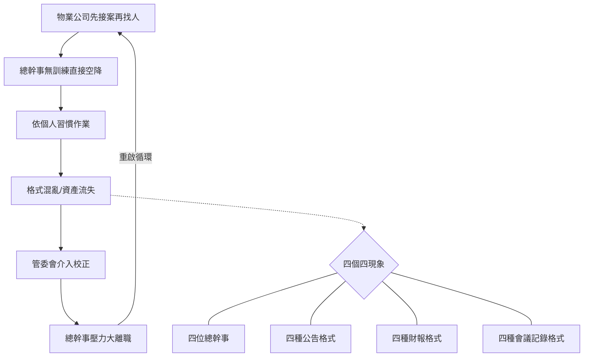

本章節將剖析造成此現象的成因與影響，並確立本份 Wiki存在的必要性。

## 1. 系統性根源：產業結構的先天限制

整體物業產業目前面臨人才供不應求的結構性困境，導致一線人員素質參差不齊。

- **物業管理公司未落實儲備訓練**：
    - **成本考量**：物業公司為控制營運成本，傾向「少養閒人」，不願在派駐前投入資源培訓儲備幹部。
    - **匹配性無法預期**：總幹事的人格特質與未來派駐案場的工作地點、屬性是否匹配難以預料，降低了公司預先培訓的意願。
- **「先接案，再找人」的惡性模式**：
    - 業界常態傾向於開發到新案場後，才開始在市場上緊急招募總幹事。
    - 一旦招募成功，在完全沒有空檔進行職前教育訓練的情況下，即直接「空降」至案場，導致總幹事缺乏對社區文化的理解與標準化作業能力。

## 2. 中間環節：管理斷層與經驗歸零

- **頻繁的人員異動導致「格式重置」**：
    - 高流動率使得每一次交接都像是一次「管理模式的重置」。
    - 每位新任總幹事往往帶來個人的工作習慣與格式，而非延續社區既有的制度，造成行政風格無法統一。

## 3. 具體衝擊：社區行政資產流失

- **知識與經驗無法累積**：
    - 由於缺乏統一標準，流程與檔案格式混亂。
    - 社區的隱性資產（如過往決策邏輯、廠商應對細節、住戶特殊服務紀錄）無法有效沉澱，隨著人員離職而一併流失，導致管委會不斷在處理重複的問題。

## 4. 最終困境：管委會職能錯置

- **監督者被迫成為執行者**：
    - 委員被迫花費大量時間糾正基本的行政格式、錯字與流程細節，而非專注於社區的重大決策與方向規劃。
    - 難以建立長久且穩定的運作模式，導致社區管理品質始終在低檔徘徊，無法提升。

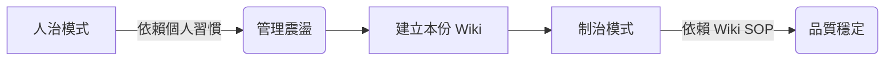

# 第一章：核心管理哲學與職責定位

## 1. 目標與願景

本份 Wiki的編撰並非僅為了規範行政細節，而是為了達成以下戰略目標：

- **願景**：實現社區管理的連續性與一致性，不因人員更迭而中斷。
- **核心轉變**：將管理知識從依賴個人的「屬人」性質，轉變為歸屬於社區的「屬社區」資產。
- **終極目的**：保護並累積閱大安社區的「無形資產」（如：管理經驗、廠商關係、決策脈絡）。

## 2. 核心策略與指導原則

為了落實上述願景，總幹事在執行日常勤務時，應遵循以下四大指導原則：

### 2.1 數位化優先

社區自第一屆管委會起便確立「無紙化辦公」的傳統。總幹事應熟練運用雲端協作工具（如 Google Workspace, Notion），擺脫傳統紙本作業模式，確保資料能即時同步與備份。

### 2.2 成本效益意識

總幹事應具備主動為社區「省錢」與「創造價值」的意識。

- 善用電商平台進行比價與採購。
- 為社區尋求最具經濟效益的解決方案，而非僅依賴廠商報價。

### 2.3 視覺形象一致性

為維護社區整體的專業形象與品牌質感，**嚴禁使用任何自製、非官方設計的標語或公告**（如手寫、Word 簡易排版）。

- 社區已建立一套完整的視覺識別系統 (VIS)。
- **執行要點**：所有公告請直接取用**Google Drive 資料庫中的「官方設計範本」**進行文字替換，杜絕「土法煉鋼」式的管理痕跡。

### 2.4 自立自強原則

無論進駐的物業管理公司品牌為何，社區的實際管理品質，最終取決於「管委會的投入」與「駐點總幹事的專業責任心」。我們應將物業公司視為合作資源，而非過度依賴其總部的標準化流程，必須建立屬於閱大安自己的管理靈魂。

## 3. 角色定位與職責界定

### 3.1 角色分工

- **管理委員會**：制度建立者（制定遊戲規則與決策）。
- **物業公司/總幹事**：專業執行者（落實決策並提供專業建議）。

### 3.2 總幹事職責界定

為了讓總幹事能專注於高價值的管理工作，我們明確區分核心與非核心職責：

- **核心職責**：
    - 專業管理顧問。
    - 廠商協調與談判。
    - 行政與財務作業。
    - 數位系統操作與維護。
    - 確實執行管委會決議。
- **非核心職責（釐清期待）**：
    - **範疇**：如更換燈管、簡易修繕等勞務工作。
    - **原則**：此類工作屬於總幹事在**「不影響核心勤務」且「確保自身安全」前提下**，願意提供的額外協助，**但不應被視為理所當然的份內之事**。責任劃分需清晰，避免因瑣事癱瘓核心管理機能。

## 4. 具體執行辦法

為落實管理哲學，我們將透過以下具體手段執行：

1. **文件標準化**：統一所有公告、財報、會議記錄的格式。
2. **流程制度化**：將複雜的任務拆解為標準作業程序。
3. **建立社區知識庫**：利用 Notion 建構可搜尋、可積累的知識中心。
4. **管委會主導的職前訓練**：由管委會親自對新任總幹事進行導讀與訓練，以**彌補物業公司職前訓練不足的產業缺口**，並確保其理解社區文化。

# 第二章：數位營運系統操作指南

## 1. 核心數位身份與帳號管理

閱大安社區的數位運作核心建立在統一的公務身份上，總幹事需妥善保管以下核心資產：

### 1.1 公務手機門號

- **號碼**：`0989-648-285`
- **合約與電信商變更紀錄**：
    - 原為遠傳電信（499元限速 21Mbps 吃到飽），合約於 2025/08/30 到期。
    - **現況**：已於 **2025/10/03 凌晨起** 攜碼轉移至 **中華電信**（合約維持499元限速 21Mbps 吃到飽）。
    - **目的**：方便將行動電話帳單與社區市話帳單整合為同一份電子帳單，簡化請款流程。

### 1.2 公務 Google 帳號

- **帳號**：`culturalcity85@gmail.com`
- **重要性**：此帳號為社區數位資產的「鑰匙」，綁定了所有雲端檔案、照片、聯絡人與第三方服務。

### 1.3 密碼存放與交接

- **存放原則**：嚴禁寫在便利貼或私下記錄。
- **指定路徑**：所有社區相關系統（含 Wi-Fi、廠商後台、公務帳號）的最新密碼，統一存放於 Google Drive：
    - 路徑：`\01. 行政管理\11. 帳號密碼\社區各項密碼.xlsx`

### 1.4 帳號安全政策

遇下列時機，**必須強制變更** Google 及網銀等重要帳號之密碼：

1. **總幹事交接後**（新任到職日當天）。
2. **管理委員會換屆交接後**。

## 2. Google Workspace 雲端辦公室規範

### 2.1 Gmail（對外溝通樞紐）

- **日常維護**：作為與外部廠商的主要聯絡管道，總幹事應每日巡查。
- **信件管理**：
    - 定期刪除不必要的登入通知與廣告信。
    - 善用「標籤 (Label)」與「資料夾」功能，將重要合約、報價單歸檔。
    - 保持收件匣整潔，避免重要訊息被淹沒。

### 2.2 Google 聯絡人（動態名冊）

- **維護職責**：社區於 2024 年間已建立基礎聯絡人資料，總幹事需根據住戶異動（買賣/租賃）及廠商更替情形，即時更新通訊錄。
- **進階資料庫 (Notion)**：
    - 自 2025 年 6 月起，更完整且具備交互參照功能的「住戶名冊」與「廠商名冊」已建立於 **Notion 社區資料中心**。
    - **操作原則**：日常快速查找可用 Google 聯絡人，但**正式資料維護請以 Notion 為主**。

### 2.3 Google 日曆（排程管理中心）

所有社區時程務必數位化，嚴禁只寫在紙本桌曆上：

- **會議排程**：第四屆管委會例會固定於 **每月第二個星期一 20:00**。
- **維護排程**：每月初需主動向廠商（機電、電梯、園藝、水塔、消毒、高壓清洗、修繕等）確認當月保養日期，並登錄至日曆。
- **清潔排程**：
    - 主要是因為清潔人力通常無法在一天當中將大樓進行完整的清潔，因此勢必要依照有限的人力進行排程，請總幹事針對清潔排程進行公告
    - 住戶通常會關心何時會輪到打掃自家門前走廊，特別是有他們發現有髒污時，若有住戶主動反映此類事件請總幹事指揮清潔人員或保全機動支援

**自動建立的事件（系統提醒）**：culturalcity85 日曆上有些全天事件是後台系統根據資料自動建立的，請依**標題開頭的 emoji** 判斷類型、對應 SOP：

| Emoji 前綴 | 事件來源 | 對應 SOP |
|---|---|---|
| 💧 | 澆水提醒（依降雨/預報判斷） | 第三章 §3.2 頂樓植栽澆灌 |
| ⚠️ CWA 高溫警報 | 中央氣象署正式發布黃/橘/紅燈 | 第六章 §2.4（必須關懷）|
| 🌡️ 預報高溫 | 大安區明日預報 ≥ 36°C | 第六章 §2.4（建議關懷）|
| 🌀 颱風陸上警報 | CWA 發布陸上颱風警報含臺北市 | 第五章 §1.2（防颱準備）|
| 🔍 颱風後巡查 | 陸上颱風警報解除後隔日 | 第五章 §1.2（災後巡查）|

未來其他社區作業（電梯保養、消防演練自動排程等）若加入自動化也會比照此模式，靠 emoji 區分。

### 2.4 Google Tasks（任務指派）

- 此為**主任委員與總幹事之間**的主要溝通介面。
- 日常待辦事項、臨時交辦任務，均透過此工具進行指派與追蹤，避免 Line 訊息洗版而被遺忘。

### 2.5 Google Photos（影像資產庫）

- **集中管理原則**：
    - 本社區的相關照片/影片請盡量用已經設定好社區Google帳號的手機進行拍攝，並注意是否已經順利上傳至Google Photos的空間
    - 若您私人手機的畫質較社區手機佳，或手邊剛好只有私人手機，也歡迎直接使用私人手機拍攝，但請記得最後還是將相片**手動上傳**至Google Photos
- **禁用平台**：
    - ❌ **Line 相簿**：檔案會過期，畫質會被壓縮，且不易搜尋。
    - ❌ **YouTube**：社區雖然也可上傳影片至Youtube且較不佔空間，但考慮相片與影片的集中度與便利性等問題，請仍然以Google Photos為唯一的上傳平台，不另行上傳 YouTube。
- **拍攝指引（短影片優先）**：
    - **以短影片為主，靜態相片為輔**：對於漏水、設備異音等動態問題，影片能提供比照片更豐富的資訊。
    - **附帶旁白**：拍攝時應有意識地運用廣角、特寫、多視角取景，並搭配口頭說明，讓平日比較沒有接觸到社區細節的住戶或管委能夠較完整的瞭解問題全貌

### 2.6 Google Drive（雲端檔案總管）

- **工作模式變革（重要）**：
    - ❌ **錯誤做法**：在電腦桌面編輯 Word/Excel 檔 -> 做完再上傳（容易造成版本混亂、漏上傳）。
    - ✅ **正確做法**：**直接在 Google Drive 資料夾中開啟檔案進行編輯**。Google 具備即時儲存與版本紀錄功能，確保資料永遠同步。
- **容量說明**：本社區 Google One 方案已於 2025 年 7 月擴容至 **200GB**，請安心存放文件與影像。

## 3. Line 官方與群組管理

### 3.1 群組分類與功能

社區 Line 群組區分為不同層級，總幹事需嚴格遵守發言界線：

1. **社區公告群組**：僅限管理中心發布重要公告（單向），避免社區公告被住戶的討論淹沒。
2. **住戶討論群組**：住戶交流區，總幹事需適度關注但不介入非公務閒聊。
3. **管理委員會群組**：核心決策圈。
4. **管委會+建設公司群組**：涉及保固修繕議題使用。

### 3.2 權限交接

- 總幹事異動時，務必確認所有群組的管理權限已完整移轉給新任總幹事或主委。

## 4. Notion 社區資料中心

- **啟用時間**：2025 年 6 月建置。
- **核心價值**：
    - 解決傳統 Office 檔案分散、難以交互參照的問題。
    - 包含 **12 個模組、32 張資料表**（如：住戶資料可直接連動管理費紀錄、廠商資料可連動維修紀錄）。
- **操作與學習門檻**：
    - 此系統功能強大，但對於習慣傳統文書作業的總幹事可能會有**轉換陣痛期**。
    - **心態建設**：初期操作較慢是正常的，請務必參閱專屬教學章節，一旦上手，將大幅減少重複作業的時間。

## 5. 智生活（社區管理APP）管理後台

### 5.1 核心功能操作

- **管理費收繳**：每月 **20 號** 為系統關帳日，需登入後台進行結算與報表產出。
- **包裹通知**：確實登錄，系統將自動推播給住戶。
- **瓦斯度數回報**：提醒住戶透過 App 回報度數。

### 5.2 公告發布

- 智生活 App 為社區「公告張貼三處」之二（另外兩處為 Line 公告群組、信箱區螢幕）。

## 6. 其他數位設備與規範

### 6.1 信箱區液晶螢幕

- **用途**：電子佈告欄（公告張貼三處之三）。
- **內容**：需與 Line、智生活公告同步更新。

### 6.2 文件掃描標準

- 使用 Canon 事務機掃描多頁合約或文件時，務必設定存為 **PDF 格式**。
- **嚴禁**存成多張 JPG 圖片檔，以利後續歸檔與閱讀。

### 6.3 網路環境 (Wi-Fi)

- **服務商**：
    - **凱擘大寬頻**：提供 1F 大廳、2F 公共空間。
    - **今網寬頻**：提供 RF 頂樓、地下室公共空間。
- **歷史決策脈絡（為何不選中嘉？）**：
    - 第一屆管委會曾評估導入「中嘉寬頻」，但因**管道數量**與**機電箱空間限制**，最終決定不導入。
    - **提醒**：未來若有網路升級需求，請優先考量現有兩家廠商，避免重複評估不可行的方案。
- **密碼管理**：全社區公共區域 Wi-Fi 密碼皆已統一（請洽弱電廠商或查閱密碼表）。

### 6.4 AI 工具應用

- 鼓勵總幹事使用 **ChatGPT** 或 **Gemini** 等生成式 AI 工具，協助草擬公告文案、信件回覆或活動企劃，提升行政效率。

## 7. AGM Tool（區權會專用工作檔）

每年一度的區分所有權人會議（AGM）由本社區自製單檔工具 `agm-tools.html` 處理「簽到 → 議題唱票 → 委員選舉 → 紀錄」全流程。工具以六個分頁串接會議當天工作流：

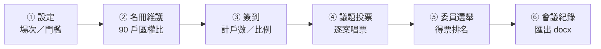

### 7.1 部署與授權

- **檔案位置**：Google Drive 共用資料夾下的 `agm-tools.html`（單檔 SPA，無後端依賴）
- **開啟方式**：雙擊即可（瀏覽器直接讀 file://），不需要架伺服器
- **同步**：Drive Desktop 即時雙向同步，會議當天可在不同電腦切換不掉資料
- **權限**：物業協助簽到時可委派物業同事操作 ③ 簽到分頁；簽到完成後工作檔交回主委由主委接續 ④–⑥

> 物業同仁簽到分頁的詳細步驟見 `/admin/staff-guide.html`（總幹事可印給物業協助人員預習）。

### 7.2 會議當天 SOP（主委視角）

| 時點 | 分頁 | 動作 |
|---|---|---|
| 會前 1 週 | ② | 把最新住戶名冊（樓層／戶號／姓名／區權比／代理委託）匯入確認 |
| 13:00 報到開始 | ③ | 物業逐戶報到，畫面投影即時統計給住戶看出席進度 |
| 14:00 會議成立 | ③ | 主席切到 ③ 統計區，宣讀「出席戶數比例」確認過半 → 宣告會議成立 |
| 議程 04 委員選舉 | ⑤ | 收齊選票後逐張唱票，工具自動排名 |
| 散會前 | ⑥ | 主席帶委員/監委檢視會議紀錄草稿、確認決議文字 |
| 會後 7 日內 | ⑥ | 匯出 docx 給主委定稿 → 寄發住戶 |

### 7.3 常見問題

- **簽到資料突然不見**：先檢查瀏覽器是否誤開了另一份 `agm-tools.html`（會議當天最好只開一個分頁）。Drive Desktop 同步衝突會出現 `agm-tools (1).html`，要刪掉
- **委託書怎麼登錄**：在 ③ 簽到分頁勾「委託」並輸入委託人戶號；同一被委託人最多代理戶數依規約檢查
- **議案唱票數字對不上**：④ 投票分頁的「贊成／反對／棄權」三者相加應等於該案有投票權戶數；若對不上，回 ③ 確認簽到資料是否在過程被改

## 8. 每日水電公告產生器（每日例行工作）

每天早上完成「每日水電公告」是總幹事的核心例行工作之一。位於 `/admin/utility/`，**用社區公務帳號的密碼即可登入**。

這個工具會：
- 自動帶昨日臺北氣溫（GitHub Actions 凌晨自動抓取 CODiS 資料）
- 根據昨日最高溫推算「**目標用電量**」並標示狀態（低於 / 接近 / 超出預期）
- 根據是否清潔日，套用兩段式用水標準（清潔日 ≤0.5 度為正常、非清潔日 ≤0.2 度為正常）
- 一鍵產生公告卡片 PNG，可直接下載發布

### 8.1 每日工作流（5 步驟）

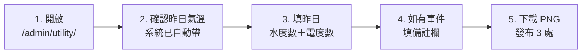

**詳細步驟**：

| # | 動作 | 時點 | 來源 |
|---|---|---|---|
| 1 | 開啟 `/admin/utility/` | 每天早上 09:00 前 | 瀏覽器書籤 |
| 2 | 確認昨日氣溫（系統已自動帶）| — | CODiS 466920 臺北站 |
| 3 | 填昨日**水度數**（單日 + 累計）| — | 台北自來水「水管家」系統 |
| 3 | 填昨日**電度數**（單日 + 累計）| — | 「臺灣電力 APP」AMI 智慧電錶 |
| 4 | 填備註（如有事件）| — | 見 §8.3 |
| 5 | 下載 PNG → 發布 3 處 | 09:00 前 | 見 §8.2 |

### 8.2 三個發布管道（同步）

公告 PNG 必須同步發布在以下三處——這是「公告張貼三處」的標準作業（呼應 §3.1、§5.2、§6.1）：

| 管道 | 操作 | 受眾 |
|---|---|---|
| **Line 公告群組** | 在「閱大安社區公告群組」貼上 PNG | 全體住戶（即時推播） |
| **智生活 App 公告** | 後台上傳 PNG | 全體住戶（App 推播） |
| **信箱區液晶螢幕** | 透過後台更新顯示圖檔 | 進出大樓住戶（被動看到） |

### 8.3 備註欄使用原則（重要）

備註欄不是裝飾——是**社區用水/用電歷史資料庫的關鍵欄位**，每筆事件都會成為未來判斷異常的依據。請務必當天填寫，事後補登記憶會模糊。

**該填的事件類型**：

- **設備異常或故障**：揚水馬達、抽水泵、空壓機、冷氣等運作異常
- **設備維修或更換**：哪天請哪家廠商來修什麼
- **計水/計電中斷**：智慧電錶或水管家系統當機、抄表延遲
- **特殊用水/用電場景**：水塔清洗、外牆清洗、高壓沖洗、大型活動
- **施工**：住戶裝修、社區工程、廠商進場
- **異常天氣**：颱風前後、寒流、熱浪

**為什麼這件事重要**：2026 年 4 月曾發生揚水馬達軟管破裂、3 天用電飆到 540 度（vs 平日 200 度）。**因為當時備註欄有記**，事後查資料時才能快速判斷「這 3 天是設備故障、不是熱浪」，避免污染整個迴歸模型。詳見第四章 §3.1.3。

### 8.4 故障排除

| 症狀 | 處理 |
|---|---|
| 開頁面跳「需要登入」 | 用社區公務帳號密碼登入；密碼存於 Google Drive `\01. 行政管理\11. 帳號密碼\社區各項密碼.xlsx` |
| toolbar 顯示「離線模式」 | 雲端 KV 同步失敗，工具會自動降級用 localStorage；網路恢復後資料會自動同步上去 |
| 昨日氣溫沒帶 | GitHub Actions 偶爾延遲，可從 [CWA CODiS](https://codis.cwa.gov.tw/) 466920 臺北站手動查 |
| 電度數對不上 AMI | 台電 AMI 顯示有時延遲一天，以實際抄表日為準 |

### 8.5 為什麼這個工具的真正價值是「資料庫」

**短期看**：每天發 1 張公告而已。
**長期看**：4 年累積下來，是社區從未擁有過的真實水電歷史資料庫——

- 知道社區基準負載 ~190 度／日（不開冷氣最低耗電）
- 知道冷氣負載年化 ~18,500 度（19% 總用電）
- 知道公水自動澆灌排程過量 2-6 倍（vs 校準後的合理用量）
- 設備故障時可快速比對歷史 pattern 判斷原因

**這份資料庫就是您每天 10 分鐘工作的最大產出**。下任總幹事接手時，整套歷史可無縫延續判斷力。

# 第三章：設施維護與廠商管理

## 1. 例行性保養排程與策略

### 1.1 機電保養

- **廠商**：太古華電
- **頻率**：依合約定期執行
- **年度換約啟動點**：合約到期前 2 個月由總幹事啟動議價，避免年底匆忙。詳見本章 §3 廠商管理與招標。
- **延伸**：機電廠商有時會額外提報修繕／改善案（如緊急發電機保養、外掛式充電器增設），需由管委會單獨議決，不可預設併入年度合約。

### 1.2 電梯保養

- **廠商**：三菱電梯
- **合約期**：**兩年期**（與其他保養合約不同點）
- **到期月份**：11 月底（如 114/11/30 到期 → 115/12/01 起算下一個兩年）
- **歷年單價**：113 年起每月 $12,870；115 年議價後維持原價續約 2 年至 117/11
- **議價原則**：
    - 廠商通常會嘗試小幅調漲（如 $12,870 → $13,100，漲 $230）
    - **管委會應堅持維持原價續約**，過往三菱多會接受
    - 議價策略：以「持續配合且無重大變動」為理由
- **法規衍生注意**：每三年公共安全檢查時，可能會有新的電梯相關法規要求（詳第四章 §7）

### 1.3 園藝

- **頻率**：每年 7 次（3、5、6、7、8、10、12月）。
- **策略**：跳過冬季月份以節省預算。
- **年度換約啟動點**：合約到期前 2 個月由總幹事啟動議價。詳見本章 §3。

### 1.4 電動大門

- **核心問題**：本社區電動大門因門扇重量（單扇約 190-200 公斤）對電動馬達造成較大負擔，使其成為最脆弱、最不耐久的一環，因此需要定期的專業保養。
- **市場特性**：自動門馬達（鉸鏈）在雙北市場基本上為「多堡科技」與「美德亞」兩家代理商所寡佔，導致議價空間極小。
- **決策過程**：管委會曾深入探討多個方案，包括將大門改為較輕的手動門（備案）、增設玻璃小門以降低大門使用頻率等，但最終考量到大門使用的必要性與穩定性，決議仍維持現有電動大門並執行定期保養。
- **廠商更替**：大門馬達的保養廠商已由初期的「多堡」更換為後來的「美德亞」。
- **現行保養合約與 SOP**：
    - **決議方案**：第二屆第十次管委會（2024/04/18）決議，接受「美德亞」的保養方案。
    - **合約內容**：每三個月一次，每次 8,000 元（未稅）。
    - **保養項目**：依 DORMA 原廠規定程序進行（檢視、清潔、防銹、潤滑、微調、校正、及教育住戶正確使用方式）。
    - **注意事項**：保養涉及專業系統檢查，無法由社區人員自行執行。總幹事應定期安排時程並登錄至 Google 日曆。
- **長期議題與備援方案**（若未來需更換，需經區權會決議）：
    - **備案一（輕量化手動大門）**：由「金耀」廠商設計，重量降至 150KG，預算約 35.88 萬元（不含泥作）。
    - **備案二（增設玻璃小門）**：由「金耀」設計，將小門寬度由 60cm 增加至 72cm，預算約 12.45 萬元。
    - **委員會共識**：任何「換門」決策必經區權會同意。

### 1.5 水塔清洗

- **技術特性**：頂樓為「單一進出水閥」相通設計，清洗時必定需要停水。
- **地下室水箱定水位閥問題**：
    - **B2 水箱**：已於 2025/07 更換（社區第四年）。
    - **B4 水箱**：於 2025 年間發現水流較小，但尚足補充用水，暫不更換。
- **最佳化時程 SOP (公告範本)**：
    - **事前宣導**：提醒儲水。**請 13-15 樓住戶 09:00 前關閉加壓馬達電源**，以免空轉燒毀。
    - **09:10-11:20**：放空頂樓上水塔（開始停水）。
    - **11:20-13:00**：清洗頂樓上水塔。
    - **13:00-15:00**：地下室打水至頂樓（逐漸復水），清洗地下室下水塔。
        - **復水提醒**：若無水請開水龍頭排氣。13-15 樓住戶記得重啟加壓馬達。
    - **15:00-17:00**：清洗地下室下水箱。

### 1.6 高壓沖洗

- **緣由**：曾有騎機車住戶因雨天地下室入口車道濕滑而摔倒。
- **解決方案**：評估後暫不採化學或物理防滑工程，維持每年兩次由物業公司執行高壓沖洗，已有效改善青苔問題。
- **延伸待辦**：需請總幹事向潤泰清潔人員確認上次交接的「吹苔清」藥劑施作地點（據稱為身障停車位區域）。

### 1.7 公設空調保養清洗

- **執行策略**：安排於淡季（如 12 月），可與機電保養協調，利用搭設的鷹架一併處理大廳高處燈具更換。
- **高處燈具更換原則**：
    - **成本策略**：採「集中處理」或「一次性全數更換」，換下良品做備品，避免頻繁搭架。
    - **安全責任**：嚴禁非專業人員搭架。合約需明訂廠商指派持證（高空作業證照）人員，以實現責任轉移。
    - **長期方案**：研議採購社區自有鷹架供廠商使用，以降低報價。

### 1.8 垃圾冷藏設備

- **維護策略**：取得鴻海環境科技報價後，因非營業急迫性設施，第四屆管委會決議採取「壞了再報修」策略。

### 1.9 地下室連續壁截水溝

- **歷史現況**：社區共 74 個連續壁排水孔，確認真正有功能的「濕孔」為 22 個。
- **權責範圍**：**不包含**在機電廠商（太古華電）合約內，需自行發包。
- **建議執行廠商**：
    - **首選**：冠駿潔境清潔（前廠商，熟悉管路）。
    - **備選**：潤泰物業配合廠商。
- **成本參考**：冠駿曾報價 9,200 元（22 孔），遠低於市價（200-300元/孔）。
- **策略**：目前採「有狀況再處理」，未來可考慮將「颱風季前預防性通管」列為年度例行項目。

### 1.10 地板石材晶化

- **執行紀錄**：2024/03 由鼎峰石材行施作（大廳、交誼廳、頂樓、電梯），費用 34,650 元。
- **建議**：若無更優廠商，建議沿用。

### 1.11 流出抑制設施（雨水緩衝池）

#### 1.11.1 主管機關、法源與年度義務

**主管機關**：

- **臺北市政府工務局水利工程處**（業務承辦：**雨水下水道管理科**）
- 地址：110204 臺北市信義區市府路 1 號 7 樓西南區
- 電話：(02) 2720-8889 或 1999 轉 8191
- 電子信箱：da_hsj@gov.taipei

**法源**：

- 《**臺北市雨水下水道相關設施與用戶排水設備審查暨查驗及檢查要點**》第 11 點
- 《**臺北市基地開發排入雨水下水道逕流量標準**》（設施設置依據）
- 《**臺北市下水道管理自治條例**》第 23 條（**罰則依據**）

**閱大安專屬資訊**（公文上載明）：

- 案件編號：**OF1100624001**
- 建造號碼：**104 建字第 0086**
- 設施位置：106012 臺北市大安區羅斯福路 2 段 83 之 3 號

**年度義務**：

- **每年 4 月**自主上傳維護文件到「**臺北市排水案件管理平台**」
- 上傳網址：<https://heochk.gov.taipei/DrainWater/Default> → 點選「**流出抑制設施檢查**」項下
- 上傳項目：**維護設施平面圖** + **現況照片**（只接受圖檔，不收 PDF——這點重要，影響檢查表設計）

**罰則**：

> 依《臺北市下水道管理自治條例》第 23 條：維護相關流出抑制設施之基地使用人，**如經通知限期改善，屆期仍未改善者，得處新臺幣 1 萬元以上 5 萬元以下罰鍰，按次處罰至其改善為止**。

**抽檢機制**：

- 水利處受託專業單位「**社團法人台北市水利技師公會**」每年抽檢部分社區
- 被抽到會另行通知，社區需配合現場檢查
- **未自主上傳的社區更容易被列入抽檢名冊**——這是 4 月按時上傳的實際誘因

**閱大安處理紀錄**：

- **115 年 5 月 7 日**收到水利處 `北市工水水字第 1156030111 號` 函（因 4 月底前未上傳，要求延期至 5 月 20 日前完成）
- 自此每年 **4 月底前**主動上傳，避免被催 + 被列抽檢
- 完整紀錄、廠商函詢、檢查照片集中放入 Google Drive 「年度法規遵循 / 流出抑制設施」資料夾，下任主委可調閱對照

#### 1.11.2 系統概念

**這是緩衝池（buffer），不是蓄水池（reservoir）**——平時應該接近空池，下雨時暫存、雨停後排空，跟「儲水備用」邏輯**剛好相反**。

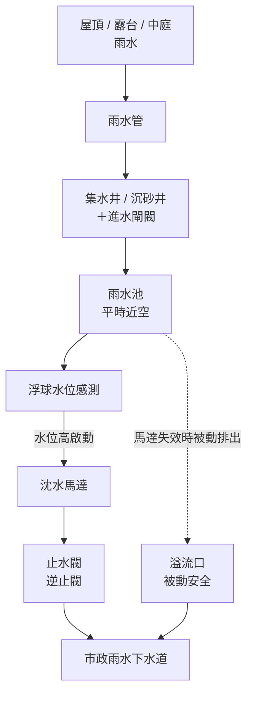

設計核心：進水（雨）是「隨機暴衝」、出水（馬達抽出）是「定速穩定」，中間靠水位緩衝。市政下水道收到的就不再是瞬間暴雨，而是平緩水流——這就是「**流出抑制**」這個名字的由來。

**物理空間配置（剖面示意）**：


#### 1.11.3 五個核心零件

| 零件 | 功能 | 檢查重點 |
|---|---|---|
| **雨水管** | 把屋頂／陽台／中庭雨水導入地下雨水池 | 管口無堵塞、無破損 |
| **雨水池** | 緩衝暫存（平時近空，雨時暫蓄，雨停排空） | **平時水位應低**；若長期蓄水代表馬達或浮球失效 |
| **浮球** | 水位感測，自動觸發馬達啟停（跟廁所水箱浮球同理）| 能自由上下浮動，沒被淤泥／雜物卡住——**最常見故障點** |
| **沈水馬達** | 沈於池底的離心式抽水機，把池水加壓抽到地面層下水道 | 控制箱電源燈、自動／手動切換鈕、運轉燈正常 |
| **止水閥（逆止閥）** | 裝在馬達出水管末段，**單向放行**：池內水可出，市政下水道水不可倒灌回池 | 手動閥要在「開」位置（手把與管路平行）；逆止閥閥瓣無卡死 |

#### 1.11.4 進水閘閥與溢流口（兩個必須認得但不日常操作的點）

- **進水閘閥**：在雨水管即將進入池體之前的閘閥。**平時應該是「開」**，只有以下三種狀況才關：
    1. **檢修時關閉**：派人下池清淤／檢查馬達／換浮球時，若不關進水萬一突然下雨人在池底會很危險
    2. **故障時隔離**：池體破裂、馬達燒毀、止水閥失效市政水倒灌時，手動關閉避免擴大
    3. **平時驗證**：年度注水測試確認馬達能啟動時可能會用
- **溢流口**：當馬達徹底失效、池水暴漲時，從一個「比較高、但低於池頂」的位置溢流到市政下水道，避免水從人孔蓋頂出去淹到地面。**被動安全機制、沒有閥可控**，檢查時看有沒有被雜物堵住

> ⚠️ **常見住戶誤解**：「下大雨前是不是把進水關起來就好？」——**錯**。雨水不會因為你關閉就消失，反而會在屋頂、露台、車道截水溝、集水井累積，嚴重時倒灌淹到地下室。流出抑制設施就是要讓水進來暫存再受控排出，**主動拒絕進水違背系統設計初衷**。

#### 1.11.5 「沈水馬達」名詞釐清（避免跟「揚水馬達」混淆）

兩個工程名詞的命名邏輯不同：

| 名詞 | 命名依據 | 範例 |
|---|---|---|
| **揚水馬達** | **功能方向**：「把水往上揚升」 | 地下水箱抽到屋頂水塔的馬達（社區也有，在 §6.4 揚水系統） |
| **沈水馬達** | **馬達本身環境**：「馬達本體沉入水中運作」 | 流出抑制設施的這台 |

兩個概念**可以重疊**：
- 「沈水式揚水馬達」：泡在水裡、把水打到高處的供水機
- **本社區流出抑制設施的馬達是「沈水式排水馬達」**：泡在水裡、把水加壓排到下水道（功能是排水、命名是依環境）

**為什麼這台要沈水？** 因為它要把池底的水抽到地面層的市政下水道，位置比排水終點低、靠重力流不出去，必須加壓。馬達本體和接線都做了防水處理；泡在池水裡反而能藉水散熱。

#### 1.11.6 年度自主檢查 SOP

每年 4 月上傳前執行。**目標：證明這幾個零件目前都是正常可用的狀態**。

> 📋 **檢查表工具（自用工作底稿）**：`/admin/inspection-osf.html`（CC-FORM-OSF-001）
> 22 項分 6 區、手機／平板現場填寫、自動儲存。**僅供社區內部紀錄**——「臺北市排水案件管理平台」**只接受圖檔上傳，不收 PDF**，所以這份檢查表不會出現在政府平台上，但可列印或存 PDF 留在 Google Drive 當當年度檢查的工作底稿，並可給接任主委對照學習。

**完整理解圖（拍照部位 + 名詞 + 簡單記法一張看完）**：


> 此圖由 AI 生成，**照片部分為示意非本社區實景**，僅供總幹事與管委會教育學習用。**不可上傳市政平台**——平台要求社區實景照片。

**實際上傳到平台的東西**（只有兩類，**都是圖檔**）：

1. **維護設施平面圖**（top-down 平面圖）—— 從建商交付的原始圖說中找；**不是剖面示意圖**。檔案如果是 PDF 要先轉成 PNG/JPG。
2. **現況照片**—— 按下表分區拍攝，**檔名建議用 `A1-01.jpg` 這種對得起來檢查表編號的格式**

**必拍照片（按區塊分）**：

| 區塊 | 拍什麼 |
|---|---|
| **A. 雨水池本體** | 人孔蓋（檢查口）、池體標示牌（如有）、池內全景（打開人孔蓋往下拍） |
| **B. 進水側** | 雨水池進水口、進水前的集水井／沉砂井、進水閘閥、池內進水管口、溢流口 |
| **C. 排水側** | 池內出水管口、止水閥（逆止閥）、排放口或接入市政雨水下水道處 |
| **D. 控制系統** | 沈水馬達本體與電源線、控制箱（電源燈、自動／手動切換鈕、運轉指示燈）、配電箱內部（無跳脫、無警示燈亮） |
| **E. 浮球** | 浮球本體與纜線（重點：能否自由上下浮動，沒被卡住） |
| **F. 周邊** | 池內無大量淤泥堆積、無雜物 |

**功能測試（可選但建議）**：
- 注水測試：人工灌少量水進池，確認浮球觸發馬達啟動、馬達能把水抽出
- 停水測試：水位降到設定低點時，浮球落下、馬達自動停止

#### 1.11.7 三個最常見失效情境

1. **浮球卡死**（被池底淤泥、雜物纏住）→ 馬達該啟動時不啟動，池子越積越滿，下大雨時直接溢流
2. **沈水馬達燒毀**（長期不運轉、繞組受潮）→ 同上，水抽不出去。**建議每年至少一次注水測試**確認馬達能啟動
3. **止水閥失效**（閥瓣卡住關不緊）→ 市政下水道倒灌進池子，把池子變成藏污納垢之地，下水道臭味也會從你家管線冒上來

**發現異常時的責任分工**：

- **發現方**：通常是保全或總幹事（潤泰維護派駐人員）日常巡檢時察覺，或年度自主檢查時發現
- **回報方**：總幹事彙整異常項目（含現場照片）通報主委
- **檢修方**：
    - **機電一般故障**（控制箱、配電、線路、止水閥）→ **機電廠商太古華電**
    - **沈水馬達／浮球專業故障**（馬達燒毀、浮球感測失靈）→ **太古華電評估後若超出能力，轉沈水馬達原廠**
    - **池體結構問題**（裂縫、滲水）→ 視範圍另尋土木／結構廠商
- **紀錄方**：改善前後的照片務必留存於 Google Drive「年度法規遵循 / 流出抑制設施」資料夾，這在後續查核輔導時是重要佐證

#### 1.11.8 廠商歸屬

> **115 年首次處理時待確認**：流出抑制設施的保養是否在機電廠商（太古華電）合約範圍內？若否，需單獨發包。建議首次上傳前致電太古華電與潤泰維護分別確認，並把答覆記在合約附註內。

## 2. 重大維護項目與策略

### 2.1 停車場 Epoxy 地面

- **問題根源**：地面顯髒主因為顏色過淺，非清潔不力。
- **處理原則**：全面改色報價高達 75 萬元，故現階段採「有住戶反映髒污時，再安排專案清洗」。

### 2.2 大樓外牆清洗

- **週期**：每四年一次「全外牆清洗」，與「單獨洗玻璃」交錯進行。
- **法律規範**：依「台北市建築管理自治條例」，本社區屋齡未滿 15 年，無強制申報外牆安檢之急迫性。
- **執行策略**：以「清洗」為主，請廠商順便目視檢測磁磚即可。
- **預算**：費用可能超過 30 萬，需經區權會決議。

## 3. 廠商管理與招標

### 3.1 物業管理合約年度換約 SOP

物業管理合約**每年 12 月 31 日到期**。第三季（9 月）必須啟動以下流程：

#### 3.1.1 標準時程

| 月份 | 動作 | 備註 |
|---|---|---|
| 9 月 | 管委會討論：續約 vs 公開招標 | 第三季管委會議決方向 |
| 10 月 | 若公開招標：刊登招標訊息 | 管道：**台北市保全商業同業公會 + 新北市保全商業同業公會**官網 |
| 11 月初 | 第一階段書面審查 | 從投標廠商遴選簡報名單 |
| 11 月中 | 第二階段簡報會議 | 4 家為合理規模 |
| 11 月底 | 議價並決定續約對象 | |
| 12 月 | 完成合約用印程序 | |
| 翌年 1 月 | 新合約生效，存查 | |

#### 3.1.2 上架要件

- 招標文件需蓋社區大章
- 必須註明「**不收押標金及履約保證金**」

#### 3.1.3 服務延續性原則

社區一貫的價值觀：**「服務延續性與穩定性」優於「廠商比價」**。除非廠商表現有明顯不足，否則傾向續約。

對總幹事的工作意義：
- 物業合約年底議價的協助項目，請按 §3.1.1 的時程準備（9 月彙整資料、10 月若招標則協助刊登、11 月協助會議紀錄）
- 議價方向與結果由管委會議決後通知總幹事執行

### 3.2 其他保養合約年度換約

機電、園藝、垃圾清運、電梯（兩年期）、消防（含安檢） — 各合約到期前 **2 個月**啟動議價，避免年底匆忙積壓。詳細各廠商資訊見第三章 §1。

## 4. 清潔

### 4.1 人力管理

- 需持續觀察並向物業公司反映「休假不補人」對品質的影響，避免連續兩天無人清潔。

### 4.2 排程 SOP

- **緣由**：應對住戶對於「走廊為何多日未掃」的抱怨。
- **管理要求**：總幹事需維護詳細「清潔工作排程表」（可參考新美齊時代範本）。
- **溝通用途**：遇投訴時，出示排程告知預計打掃日期。

### 4.3 環境維護技巧

- **防狗尿**：可使用零用金購置「明星花露水」噴灑於騎樓柱邊驅趕犬隻。

## 5. 垃圾清運與環保室管理

### 5.1 變革背景與核心原因

- **核心改變**：因大型壓縮車無法進入，改由清潔人員打包後以 3.5 噸貨車清運。
- [**原始作業模式**](https://photos.app.goo.gl/MX3qyVDkvYjsdL287)

- **主要限制因素**：
    - **地理限制**：大型車難以通過和平東路一段 104 巷轉進社區（轉彎死角、碰撞風險）。
    - **經濟規模**：社區垃圾量（1.5 噸/月）太少，廠商無意願冒險派大車。

### 5.2 廠商更替與決策過程

- **與原廠商「誠上」的協商困境**：
    - 原廠商「誠上」在未經司機實際勘查的情況下逕行接單，清運近一年後，司機與廠商已不願再承受轉彎不易的風險。
    - 廠商提出方案，要求將垃圾量估算加倍（由一噸增至兩噸），否則將提前解約，且即使加價，未來也只願派遣3.5噸貨車。

    - 管委會曾嘗試溝通為司機加價，但所能提供的價格，仍無法覆蓋司機所認知的風險。
- **尋找其他廠商的挑戰**：
    - 垃圾清運廠商間彼此熟識，會相互打聽社區風評與棄單原因。
    - 經管委會與總幹事實際洽詢本地區其他社區（如耕曦、正隆天第）的清運廠商後，得到的反應大同小異，幾乎可以判斷已無廠商願意派遣大型垃圾壓縮車前來服務。
    - 其他社區（如隔壁大安晶華）的解決方案則是派員追垃圾車，此模式不適合本社區。
- **更換為新廠商「極速環保/仕功」**：
    - 2024/02/01 起接手（原為「耕曦社區」廠商）。
    - **選擇原因**：願意承接風險，且同意採「連續七天秤重」推估月總量，計價合理；春節不休息。

> 2025年間仍有其他垃圾清運廠商到社區來招攬生意，但是在經過司機路線場勘後紛紛放棄。

### 5.3 現行作業流程與影響

- **垃圾桶更換**：
    - 移除 660L 深底大子車（無法撈取）。
    - 改用多個 **175L 淺底垃圾桶**（方便清潔員徒手打包）。

- **衍生問題與應對**：
    - 小桶易滿且投遞口不易對準。
    - 應對：清潔員需頻繁對調桶位；總幹事引導住戶若前方桶滿，直接開冷藏庫門丟後方空桶。

### 5.4 總幹事與住戶配合事項

- 此改變加重清潔員負擔，需籲請住戶配合：
    1. 確實分類。
    2. 廚餘瀝乾、垃圾袋密封綁緊。
    3. 維持環保室整潔。

### 5.5 相關資產與附註

- **舊垃圾子車去向**：原 660 公升子車清洗後，暫存於 **B4 消防機房前**。

- **為何無法每日秤重？**：
    - 秤重耗時，對以「總載運量」計效的司機無效益（寧願多跑幾家）。
    - **市場生態**：此為台北市普遍現象（規模小、單價低 4-5 元）；與新北市（規模大、單價高 7-8 元）不同。
- **B1-43 號車位使用權**：
    - 管委會協調該車位無償提供給廠商每日暫停，總幹事需了解此交換歷史。
- **清運價格調整**：
    - 2024/02 起：5,000 元/噸（月費 7,875 元）。
    - 2025/04 起：**6,000 元/噸**（因焚化爐漲價），月費 **9,450 元**（含稅）。

# 第四章：行政、財務與法規遵循

## 1. 銀行與財務帳戶

### 1.1 往來銀行策略

- **主要銀行**：**永豐銀行**。
- **選擇原因**：雖然周邊有更近的台北企銀、土地銀行，但因永豐銀行為社區管理 APP「智生活」的主要配合銀行，故第一屆管委會選定其為主要往來銀行。

### 1.2 各分行帳戶明細與用途

- **建成分行** (開戶行，但距離遠，現僅作帳戶存續)
    - **管理費帳戶**
        - 戶名：閱大安管理委員會
        - 帳號：`103-018-2003121-9`
    - **公共基金帳戶**
        - 戶名：閱大安管理委員會
        - 帳號：`103-018-2003120-2`
- **南門分行** (最近但不方便)
    - 雖為實體距離最近，但步行辛苦，故幾無往來。
- **東門分行** (主要實體往來行)
    - **優勢**：捷運古亭站搭一站至東門站，4 號出口即達，交通最便。
    - **充電樁線路維護費帳戶** (專款專用)
        - 戶名：閱大安管理委員會
        - 帳號：`033-018-0013393-2`
        - **開戶背景**：原永豐拒絕多開第三帳戶，經解釋充電樁基金需專款專用後才獲准開設。

## 2. 財務流程

### 2.1 財務報表製作

- **分工模式**：
    - **前端**：總幹事於「新都興社區財務系統」登錄支出與確認管理費收繳。
    - **後端**：由潤泰總公司會計支援製作正式財報。
- **目標**：潤泰會計將持續輔導，最終目標為移轉給總幹事獨立製作。

### 2.2 零用金管理

- **標準作業**：廠商押金退款等應由**管理費主帳戶**支出，**嚴禁直接從零用金墊付**，避免帳務混亂（2025/01 曾發生誤用零用金支付公共意外險保險金之案例，需引以為戒）。
- **撥補程序**：如有不合規帳目，需透過正式請款流程進行「撥補」，確保帳實相符。

### 2.3 管理費收繳方式比較

總幹事需掌握以下兩種模式的優缺點，以回應住戶詢問：

- **模式 A：智生活虛擬帳號 (永豐中崙分行)**
    - **機制**：每戶每月帳號不同。
    - **繳款管道**：APP 信用卡、超商 (手續費 10-15 元)、轉帳。
    - **優點 (管理端)**：系統自動對帳，方便。
    - **缺點 (住戶端)**：因帳號每月變動，**無法設定銀行自動轉帳**。
- **模式 B：固定帳號匯款 (永豐建成分行)**
    - **帳號**：`103-018-200-31219` (銀行代號 807)。
    - **優點 (住戶端)**：帳號固定，可設定每月自動定期定額轉帳 (適合一次繳多月或懶人法)。
    - **缺點 (管理端)**：需人工核對匯款帳號後 5 碼。

### 2.4 電動車充電代墊代收流程

1. **代墊**：管委會收到台電帳單，先以管理費支付。
2. **計算**：總幹事依據 EMS 報表計算個別住戶電費。
3. **收費**：發出收費通知 (或併入管理費)。
4. **歸墊**：收回款項後歸入管理費帳戶。

### 2.5 對住戶報告財務的口徑原則

這節是**做年度財報簡報時必讀**，避免同一份簡報內出現自打嘴巴的論述（2026 第五屆首次 AGM 排雷出來的共識）。

#### 2.5.1 總資產視角（重要框架）

社區的「維修基金提撥」（每月 6 萬，從 #31219 一般帳戶撥入 #31202 公共基金帳戶）本質上是**內部轉帳，不是費用**——錢只是從左口袋換到右口袋，住戶共有的總資產淨值並未減少。

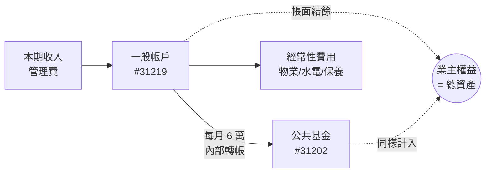

**為什麼這件事重要**：如果用「帳面結餘」（扣掉 6 萬提撥後的本期損益）來談財務，會看起來像每月貼平甚至虧損；但用「總資產淨增」（業主權益、資產負債表視角）來看，社區其實是穩定累積。**同一份簡報不能一頁用帳面、另一頁用總資產**——住戶會困惑、信任度下降。

#### 2.5.2 收入用「合約承諾下限」，不用「實際數外推」

預算編列、長期模型、年化推估**全部使用合約承諾的固定收入下限**（房屋管理費依坪 × 12、停車位依車位 × 12），不要把過去實際年收入直接外推。

| 項目 | 該入「年化收入」嗎 | 為什麼 |
|---|---|---|
| 房屋管理費（依坪） | ✅ 入 | 合約承諾、收齊率 100% |
| 停車位（依車位） | ✅ 入 | 合約承諾、不變 |
| 利息收入 | ❌ 不入 | 隨利率波動 |
| 氣候行動獎獎金 | ❌ 不入 | 一次性 |
| 裝潢清潔費 | ❌ 不入 | 入住率到頂後歸零 |
| 充電樁電費代收 | ❌ 不入 | 代收代付，有對應費用沖銷 |

**Why**：偶發收入「能多賺最好，但不能依賴」。最忌諱「預估持平、實際赤字」——若採用保守估法，實際好過預估反而是正面驚喜。

#### 2.5.3 代收代付類科目要先看對應費用才能談淨值

代收代付類（電動車充電樁電費、押金）對結餘的影響為 0，因為有對應的「沖銷費用」抵掉。**敘事時不能單獨列這 33,076 元收入**，會誤導住戶以為社區多賺。要嘛同時列收入與費用、要嘛就不講。

#### 2.5.4 跨投影片數字一致性檢查

如果同一個數字在多張投影片出現（譬如「年收入 500 萬」），務必跨頁對齊：

- 譬如：第 24 張投影片的「年收入 500 萬」必須等於第 26 張投影片預算明細的「房屋管理費 4,528,692 + 停車位 470,400 = 4,999,092」
- 改一個數字就要從頭跑一遍跨投影片檢查（財報簡報通常 5–8 張會引用同一條基礎數字）

## 3. 公共事業費管理

### 3.1 台灣電力公司 (四張帳單)

需每月追蹤並更新至「氣候行動獎」相關明細表：

1. **大公電（分攤到各戶電費單中）**
    - 契約：低壓電力非時間電價 (契約容量 50瓩)。
    - 現況：最高需求曾達 48瓩，下調空間不大。
    - 重點：偶有住戶質疑分攤費過高，需定期追蹤度數以備解釋。
2. **電信室**：表燈非時間電價。
3. **B1+B2 充電樁**：表燈非時間電價。
4. **B3+B4 充電樁**：表燈非時間電價 (預定改為二段式時間電價，無契約容量)。
- **管理工具**：已申請電子帳單，電號管理需透過手機「臺灣電力 APP」操作。

#### 3.1.1 大公電契約容量年度檢討（每年 10-11 月）

**啟動點**：每年 **10 月底至 11 月初**檢視當年夏季高峰用電（通常落在 7、8、9 月）。

**歷年下修記錄**：

| 年度 | 契約容量 | 觸發 |
|---|---|---|
| 原始 | 99 kW | 建設公司初期設定 |
| 112/01 起 | 70 kW | 參考福一潭美社區後初次下修 |
| 113/01 起 | 50 kW | 第二次下修 |
| 114 觀察 | 維持 50 kW | 9 月最高 48 kW 已接近上限 |

**判斷原則**：
- 若**夏季最高用電 < 契約容量 × 80%** → 可考慮下修
- 若**> 80%** → 維持，避免超約罰款
- **延伸觀察**：夏季電費異常高漲時，要追查根因（雨水多 → 廢水池馬達運轉時間增加；防火門無自動回歸 → 冷氣外洩等）。曾發現一樓大門電梯旁防火門因風大常開導致冷氣流失，建議聯絡金屬門廠商「金亞」尋找新的不鏽鋼門鉸鏈或自動關門器（Waterson）。

#### 3.1.2 大公電 1 年資料洞見（AMI 智慧電錶 2025-04 起）

**基準負載與冷氣負載拆解**：
- 冬季最低 ~190 度／日 = 「不開冷氣的最低耗電」（燈、電梯、抽水馬達、監視器、走廊照明）——稱為**基準負載**
- 夏季高峰 ~344 度／日，扣掉基準負載後 **冷氣負載 ~154 度／日**
- 冷氣負載年化 ~18,500 度 ≈ 年度總用電 19%
- **節電優化空間最大的是夏季冷氣相關設備**（變頻 vs 定頻、運轉時段、溫度設定）；冬季基準負載不可壓縮

**目標用電量公式（凍結迴歸模型）**：
```
目標用電量 = max(190, 72.99 + 7.07 × tmax)
（floor=190；轉折 16.6°C；資料基礎 2025-04-20 ~ 2026-04-19 共 365 筆）
```
- 公式植入 `/admin/utility/`（每日水電公告產生器），總幹事每日填昨日用量、系統自動算「低於 / 接近 / 超出預期」
- 模型在高溫端可能略低估（31.5°C 公式預測 292 度、實測 ~299 度），4 年氣溫資料補齊後可重新校準

#### 3.1.3 設備故障導致用電飆升的案例（重要：必須記入備註）

2026-04-13 至 15 三天突然衝到 540 度／日（vs 平日 200 度），4/16 一夜回到基準值（base load）。**這不是熱浪**——熱浪不會「一夜跌 63%」。實地查驗發現是**揚水馬達軟管破裂**導致馬達持續高轉空載運轉，4/15 修復後立刻歸位。

**為什麼這件事教訓重要**：

> 如果這次沒記下來，未來看到類似的用量飆升曲線會誤以為是熱浪。所有設備故障、檢修、調整**必須當天記入 `/admin/utility/` 備註欄**，否則資料會逐漸失去診斷力。

**處理 SOP**：
1. 發現異常飆升（連續 1-2 天 >150% 平日）→ 第一個動作不是查冷氣，是**檢查機房**（揚水馬達、抽水泵、空壓機）
2. 在 `/admin/utility/` 備註欄記下：日期、症狀、查證原因、處理結果
3. 修復後在 `/admin/utility/` 備註欄補一筆「已修復」確認回到基準值

### 3.2 台北自來水

- 已申請網路會員與電子帳單，需定期登入「水管家系統」查詢明細並更新紀錄。
- 公水度數每日記入 `/admin/utility/`（每日水電公告產生器），4 年資料庫已累積至 2026-04，作為下任主委的判斷依據

#### 3.2.1 公水 4 年治理脈絡（建議新總幹事必讀）

社區公水用量 4 年走過 4 個治理階段，每段台階對應一個決策，不是自然波動：

| 期間 | 月均用水 | 治理狀態 |
|---|---:|---|
| 2022-02 ~ 2022-06 | 0.55–0.87 度 | 啟動期，系統剛啟用 |
| 2022-07 ~ 2024-07 | 1.1–4.3 度 | 園藝廠商自動澆灌，**從未跳過雨天** |
| 2024-08 ~ 2025-06 | 0.45 度 | 節電輔導期：改手動，但**沒人勤快執行**，**植物開始渴死** |
| 2025-07 ~ 2026-03 | 2–4.5 度 | 園藝廠商重啟自動避免植物渴死，回到無腦撒水模式 |
| 2026-04 起 | 顯著下降 | **主動斷開自動 + 主委手動 + Calendar 提醒**，目前最低配置 |

**關鍵發現（2026-04 斷開後驗證）**：
- 過去自動排程「3 次/日 × 5 分鐘」相對需求**過量 2–6 倍**（夏 2–3 倍、冬 4–6 倍）
- 自動澆灌**從未在雨天跳過**（455 天日線無一日歸零）——原機電廠商承做的雨水感測器疑似從未運作
- 真正主因是**排程過量**而非大漏水

**目前的治理機制**：

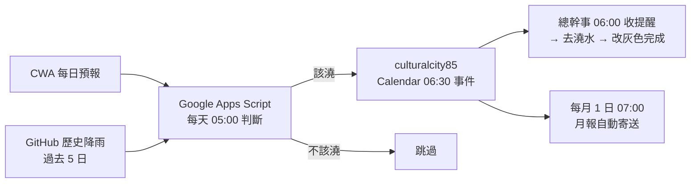

**4 年回測**：平均一年澆 123 天（vs 過去無腦撒水 365 天，理論節水 67%）。**3 月才是澆水主力**（年均 15.4 天/月），不是夏天——3 月乾日多、梅雨/颱風季反而濕。

#### 3.2.2 給下任主委 / 總幹事的 3 步建議

1. **第一步：維持目前的「手動 + Calendar 提醒」配置**
   - 這已是用量最低配置，園藝廠商評估期間不必急動
2. **第二步：找第三方廠商評估**（原機電廠商已倒閉）
   - 翼詠科技 Yardian、機電工程行或大型景觀工程公司
   - 評估項目：實測植栽面積、雨水感測器補裝（~3,000 元，第一年回本）、小滲漏壓力測試、流量感測器（~10,000 元）
3. **第三步：若決定重啟自動，務必校準排程**
   - **絕對不要回到「3 次 × 5 分鐘」舊設定**
   - 新排程：夏季清晨 1 次 × 5 分鐘 / 冬季清晨 1 次 × 3 分鐘 / 雨天靠感測器跳過
   - 重啟後 2-3 個月密切記錄，建立社區從未擁有過的真實基準值

### 3.3 電信門號 (中華電信)

- **市話**：`(02) 2367-7065`
- **行動**：`(0989) 648-285`
    - **異動紀錄**：2025/10/03 自遠傳攜碼至中華電信，已申請合併帳單。
- **服務據點**：
    - **特約**：對面神腦國際 (簡易業務)。
    - **直營**：台北師大服務中心 (和平東路一段 182-2 號，複雜業務需至此)。

## 4. 行政與文件管理

### 4.1 公告與標語製作 SOP

- **指導原則**：「張貼標語」僅是手段，解決問題才是目的。
- **流程**：
    1. **例行性公告** (水塔清洗、開會通知)：直接套用 Google Drive 官方範本，知會主委後發布。
    2. **新議題公告**：
        - 先提出問題根源。
        - 總幹事草擬內容 (Word/Excel 皆可)。
        - **提交管委會討論定稿**。
        - 由主委或委員依 VIS 系統進行美編設計。
        - 總幹事張貼發布。

### 4.2 區權會年度召開 SOP

公寓大廈管理條例 + 社區規約：**每年至少召開一次**區分所有權人會議。

#### 4.2.1 標準時程模板（以第五屆為例，115/05/16）

| 時點 | 動作 |
|---|---|
| 召開前 8-10 週 | 管委會議決召開日期、開始前置作業 |
| 召開前 6-8 週 | 公告徵求區權會提案；徵求下一屆管委會委員候選人 |
| 召開前 4-6 週 | 完成正式公告 |
| 召開前 **2 週** | **調閱謄本確認區權人資格**（本社區僅 90 戶，2 週足夠；大型社區 300+ 戶可能 2 個月前就要準備）|
| 召開前 **10 日** | 法定開會通知（最後期限）|
| 開會當日 | 召開區權會（建議**週六下午**） |
| 開會後 | 進入新舊管委會交接流程（詳本章 §5 換屆交接）|

#### 4.2.2 召開地點

固定使用「閱大安二樓管委會使用空間」。物業負責後續執行細節。

#### 4.2.3 任期管理

- 管委會委員任期 1 年（依規約）
- 任期到期年必須重選（如 115 年）
- 即使非任期到期年也須召開區權會（規約規定每年一次）

#### 4.2.4 會議當天時間軸（以第五屆 2026/05/16 為例）

```mermaid
gantt
  title 區權會當天時間軸
  dateFormat HH:mm
  axisFormat %H:%M
  section 報到時段
  住戶簽到（投影封面）          :a1, 13:00, 60m
  section 會議成立
  出席比例報告（成立程序）      :a2, 14:00, 5m
  section 正式議程
  01 上屆管委會工作報告         :a3, 14:05, 40m
  02 年度財務報告               :a4, 14:45, 15m
  03 長期財務展望（意見交流）   :a5, 15:00, 15m
  04 新屆管理委員選舉           :a6, 15:15, 25m
  05 臨時動議                   :a7, 15:40, 15m
```

**會議學原則**：「出席戶數比例報告」是**會議成立前的程序**，不算正式議程、不列入議案編號。確認過半才宣告會議成立，再進入正式議程。

**會前 1 週準備**：
- AGM Tool（`agm-tools.html`）名冊匯入校對完成（第二章 §7）
- 簡報終稿、決議票卡備妥（議案票卡、委員選舉票卡分顏色）
- 報到桌動線：簽到 → 領票 → 入座
- 物業簽到人員預習 `/admin/staff-guide.html`

**總幹事在會議當天的協助項目**：
- **13:00–14:00 報到**：操作 AGM Tool ③ 簽到頁、引導住戶簽到（詳細步驟見 `/admin/staff-guide.html`）
- **14:00 開會時點**：簽到頁數字定格，將工作筆電交給主席
- **議程進行中**：協助接收住戶提案紙條、提醒主席殘存議題
- **委員選舉**：發票、收票、計票（AGM Tool ⑤ 自動排名）
- **散會後**：保存 AGM Tool 工作檔、整理現場、確認 Drive 已同步

#### 4.2.5 會議結束後文書 SOP

區權會散會不等於工作結束，後續還有 50–70 天的文書與行政動作要走完：

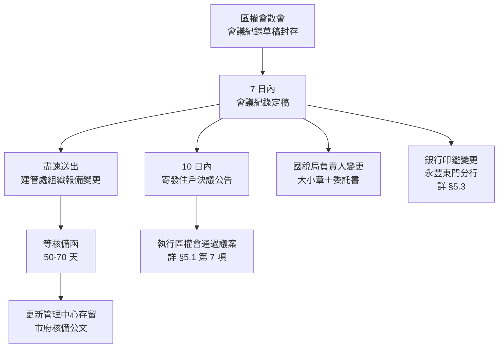

**時間敏感度**：
- 會議紀錄寄發有規約規定的時效（10 日內）——遲了會被住戶質疑
- 建管處報備是**唯一可控的動作**，越早送越早收到核備函；核備函未到之前，新主委對外仍以舊主委身分行事不合法
- 銀行印鑑變更需「新任主委、財委、監委 + 原任主委」共 4 人到場（詳第四章 §5.3），時間要先約

**接續到 §5.1 換屆 12 步**：若該屆是任期到期年（如 115 年），會議結束就觸發 §5.1 全套交接流程；非任期年則只需執行決議事項。

### 4.3 辦公室設備

- **Canon 多功能事務機**：已改用副廠碳粉匣以節省成本。
- **文件掃描標準**：務必設定存為 **PDF** 格式 (嚴禁多張 JPG)。

## 5. 管委會換屆交接流程

### 5.1 交接 12 步 SOP（任期屆滿時）

新舊主委交接時必須完成以下 12 項。標準交接日為 **6/30**（與會計年度切齊）。

| # | 項目 | 注意點 |
|---|---|---|
| 1 | **建管處公寓大廈科** | 組織報備變更管理委員會負責人 |
| 2 | **國稅局** | 變更管理負責人 — **需填寫委託書並蓋大小章** |
| 3 | **永豐銀行東門分行** | 變更管委會帳戶、公共基金帳戶取款印鑑（詳本章 §5.3）|
| 4 | **帳戶移交** | 管理費帳戶 + 公共基金帳戶 |
| 5 | **印鑑交接** | 本大樓管委會印鑑（含大小章）|
| 6 | **合約續簽** | 本大樓各項合約到期者於交接後續簽 |
| 7 | **區權會決議執行** | 執行該屆區權會通過的各項決議 |
| 8 | **免稅證明** | 管理中心櫃檯存留 |
| 9 | **市府組織報備證明** | 管理中心櫃檯存留 |
| 10 | **市府核備公文** | 管理中心櫃檯存留 |
| 11 | **共同消防防護計畫書變更** | 變更共同防火管理人 |
| 12 | **建築竣工圖、財產清冊、收發文件、操作說明電子檔** | 管理中心櫃檯、二樓管委會空間存留 |

**執行原則**：委請物業團隊協助新任管委會完成必要之組織報備變更與相關事務。

### 5.2 報備時程 (台北市工務局)

- **經驗值**：從報備到收到核備函約需 **50-70 天**。
- **總幹事職責**：區權會結束後，應盡速送出報備資料，這是唯一可控的環節。

### 5.3 銀行印鑑更換 (永豐東門分行)

- **出席人員 (共 4 位)**：
    - **新任**：主委、財委、監委 (三位皆需到場，主委財委更換印鑑，監委交接大章)。
    - **原任**：僅需 **原主委** 出席即可 (原財委、監委不必到場)。

## 6. 公共意外險與火險

### 6.1 投保策略

- **日期對齊**：自 **2026/01/01 起**將公共意外險與火險日期對齊（每年 12 月底到期）。
- **廠商選擇**：固定比價南山、國泰、富邦三家。**國泰產險**在組合報價上最具優勢，故已從南山更換為國泰。
- **條款重點**：
    - **無自負額**：優先選擇無自負額保單，確保小額損壞 (1-2萬) 能獲得理賠
    - **承保範圍**：確認涵蓋 **EMS 中控主機、伺服器及公共配電盤**

### 6.2 公共意外險年度換約 SOP

#### 6.2.1 時程

合約**每年 12 月 31 日到期**。**每年 11 月**啟動比價。

#### 6.2.2 比價框架

- 固定比價三家：**國泰、富邦、南山**
- **只評估零自負額方案**（已有歷年共識）
- 廠商間價差通常不大（百元級）→ 以**穩定續保**為原則

#### 6.2.3 歷年參考

- 115 年：$6,350（國泰，零自負額）
- 比價結果：南山 $6,680，富邦未在最終比較中

### 6.3 商業火險年度換約 SOP

#### 6.3.1 投保標的（歷年微調的最終結果）

| 標的 | 金額 |
|---|---|
| 原有建物 | $11,000,000 |
| 保留營業裝修 | $10,000,000 |
| 營業生財器具（櫃檯螢幕、主機等）| $2,000,000 |
| 機器設備（公共區域機電含電梯）| $10,000,000 |
| **合計** | **$33,000,000** |

**附加險**：**不投保煙燻險、爆炸險**（已多次檢討確認無必要）

#### 6.3.2 比價廠商與報價（113 年範例）

| 廠商 | 保費 | 自負額 |
|---|---|---|
| 富邦 | $3,564 | 每事故賠償金額 10%，至少 $30,000 |
| 南山 | $4,752 | 每事故賠償金額 10%，至少 $30,000 |
| **國泰** | **$5,280** | **無自負額**（歷年首選）|

#### 6.3.3 比價基礎一致性原則（重要）

**若三家報價基礎不同，務必先協商統一報價基礎再比較**，否則無法做出有效對照。歷年常見的不一致來源：保額拆分項目、附加險種、自負額條款。

#### 6.3.4 設備變動觸發

如有大樓設備價值變化（新增機電、電梯改造），需請建設公司或機電廠商提供**機械設備估價更新**後再報。

## 7. 公共安全檢查（每 3 年一次）

### 7.1 法規依據

建管處函令：**8 樓以上集合式建築自 112 年起每 3 年須做公共安全檢查申報**。下次到期年：**115 年**（再下次：118 年）。

### 7.2 廠商與報價

- **固定廠商**：大台北建築物公共安全檢查股份有限公司
- **115 年報價**：$14,390（未稅）
- **行情對比**：其他廠商多在 $20,000 以上 → 大台北仍是合理選擇
- **議價要點**：如有漲價需確認漲價原因與是否含稅

### 7.3 標準時程

| 時點 | 動作 |
|---|---|
| 1 月 | 管委會議決廠商與議價 |
| 2 月 | 確認安檢日程 |
| 上半年內 | 安檢執行 + 申報完成 |

### 7.4 法規衍生改善要求（115 年範例）

公安檢查不只是「派人來看一遍」 — **每次檢查都會帶來新的法規衍生改善要求**，總幹事要主動跟廠商確認當年法規變化。115 年實例：

- **各樓層安全梯門檻**需貼**反光防滑膠帶**（已執行）
- **B1 梯廳通往停車場的防火門**：消防規定關閉時不能上鎖且必須能直接推開 → 將該扇門的磁力鎖（陽極鎖）感應處貼起使其無法通電上鎖

**這類「順便要做的事」往往是公安檢查最大的價值來源 — 別只把它當作報備程序。**

## 8. 住戶室內裝修管理 SOP

### 8.1 階段一：申請審核 (判斷要務)

總幹事需依《建築物室內裝修管理辦法》判斷是否需申請許可：

- **必需申請之條件**：
    1. **天花板**：固著於構造體之裝修。
    2. **內部牆面**：不含壁紙壁布。
    3. **固定隔屏**：高度超過 1.2 公尺 (含系統櫃)。
    4. **分間牆變更**。
- **文件查核**：匯款證明 (保證金 5 萬)、申請單、切結書、施工圖、許可文件 (若符合上述條件)。

### 8.2 階段二：施工前現場管理

- **保護工程會勘 (關鍵)**：廠商施作保護「前」，務必錄影存證公共區域現況，釐清責任。
- **保護材標準**：
    - 地板/壁面：三層 (防水布+PP板+木板)。
    - 電梯：雙層 (PP板+木板)，需保護門框。
    - 門口：透明防塵布簾。

### 8.3 階段三：施工期間巡檢

- **每日清潔**：收工前 30 分鐘巡查電梯與動線。
- **廢棄物**：嚴禁堆置社區或丟入垃圾間。
- **違規開罰**：依罰則表開立通知書，並從保證金扣款。

### 8.4 階段四：完工與退款

- **陽台測試**：需協同測試前後陽台排水是否暢通。
- **拆除會勘**：拆除保護材時再次會勘，確認無損後始可退還保證金。

## 9. 圖書管理

### 9.1 來源與原則

- **來源**：敦寶建設回饋 (Boven 選書，2024 年期滿未續約)、住戶捐贈。
- **管理原則**：**禁止外借**。為減少物業負擔，請住戶於公共區域閱讀，不外借回自家。

## 10. 議題：社區採購與比價流程

### 10.1 困境分析

- **規定**：超過一萬元需三家比價。
- **實務痛點**：
    - 金額小、利潤薄，廠商不願「陪標」。
    - 緊急搶修或獨家代理產品，根本找不到三家。
    - 長期導致社區信用受損，廠商拒絕報價。

### 10.2 解決策略

- **修訂規約**：增訂緊急搶修或獨家代理之例外條款。
- **續約機制**：針對優良廠商建立評估續約制，取代重複比價。
- **建立備援**：平時將非核心小案件發包給備援廠商，培養關係以備不時之需。

# 第五章：安全防災相關標準作業程序

## 1. 安全防災

### 1.1 安防系統

- **基礎要求**：需全盤了解監視器與門禁系統運作狀況、鑰匙與門禁卡管理權限。
- **伺服器維護**：
    - **設備**：使用飛瑞 UPS 鉛酸電池。
    - **維護頻率**：應**每半年放電一次**以延長電池壽命。

### 1.2 颱風

**自動提醒系統**：社區後台每天 6:00 / 12:00 / 18:00 自動讀取中央氣象署警特報資料，臺北市進入陸上颱風警報時，culturalcity85 日曆會自動建立 **🌀 颱風陸上警報・防颱準備清單**（紅色全天事件）；警報解除後隔日會自動建立 **🔍 颱風後巡查清單**（藍色全天事件）。

系統設定為「臺北市進入陸上颱風警報」才觸發，**海上颱風警報不會觸發**，社區從陸上警報才開始進入防颱模式。臺北市範圍涵蓋大安區，所以「臺北市發布陸上警報」與「大安區受影響」是等義的。

#### 1.2.1 防颱準備公設施作項目

颱風來臨前的施作項目：

- R3F電梯機房窗戶檢查與關閉
    - 務必將靠電梯設備側的活動百葉窗葉片關閉
- R2F水錶室窗戶檢查與關閉
- 2F-15F排煙窗、窗戶檢查與關閉
- 2F-15F各樓層A、B兩安全梯防火門檢查與關閉
- 1F、B1F排水溝檢查
    - 1F後花園排水溝檢查及淤泥、落葉清除
    - 1F車坡道出入口排水溝檢查及淤泥、落葉清除
    - B1F車坡道出入口排水溝檢查及淤泥、落葉清除
    - 1F行動不便車位拒馬綁牢固定串聯，放倒
- R樓閱覽室防颱作業
    - R樓閱覽室出入口門口沙包預防
        - 沙包平時收在地下停車場B4消防機房裡，風雨還不大時沙包可暫堆在近內外出入門口窗戶下方
    - R樓空中花園桌椅收入室內
        - 大理石板易碎，曾發生搬動過程掉落碎裂需花費更換，搬動時請小心
- 防水閘門安裝

    > 雖然羅斯福路淹水的機會不高，但是請新總幹事上任時務必**至少安裝一次防水閘門**。
    >
    > **操作提醒**：防水閘門普遍被認為不太好裝，有其訣竅，安裝前請務必參照教學影片練習。

    - 前門防水閘門安裝
        - 全程需時約40分鐘──防水閘門支柱安裝以及門片安裝各約20分鐘。
        - 前門的防水閘門支柱較容易安裝。
        - 防水閘門片在從上往下安裝時，由於門片與門片間有橡膠墊可能會造成無法很順利的往下卡緊、門片之間有間隙，也會造成手轉的螺絲難以對位鎖入的情況，這種狀況下最好能**準備膠槌將門片稍作敲打**較能順利密合與將螺絲鎖入。
        - 在風雨還不明顯的時候我們會先將防水閘門支柱的部分先安裝好，門片暫放置於入口進門左側處，底部先鋪瓦楞紙板或厚紙板以免門片刮傷大理石地板。
    - 後門防水閘門安裝
        - 全程需時約40分鐘──防水閘門支柱安裝以及門片安裝各約20分鐘。
        - 後門的防水閘門支柱安裝難度較高
            - 由於所螺絲時螺帽上方的空間限制，在鎖入兩邊上下個三根螺絲的時候最好使用10元硬幣而非螺絲起子；
            - 鎖螺絲的順序最好是由最下面的螺絲開始往上鎖（有實證成功經驗）；如果從上面的螺絲開始鎖的話，下面兩顆螺絲孔會有對位的困難。
        - 在風雨還不明顯的時候我們會先將防水閘門支柱的部分先安裝好，門片暫放置於門外左側處，底部先鋪瓦楞紙板或厚紙板以免門片刮傷大理石地板。
- 地排蓋拔除
    - 一樓至十五樓安全梯（A梯，靠近電梯之安全梯）流水地排蓋拔除
    - 流水地排蓋拔除置放旁邊
    - 一樓A安全梯排水溝拆除蓋片，引導雨勢大時的水流疏通，有部分水量是由雨水打入樓上安全梯間後所流到一樓來的
    - 茶水間水槽底部地排蓋設法打開，並可考慮將圍牆上的排水孔（從狀元及第端流往圍牆內的）堵住
- 與狀元及第鄰接牆的排水疏通
    - 該洞必須疏通後水才有辦法往暗溝排走

#### 1.2.2 災後巡查

颱風警報解除後系統會自動建立 🔍 颱風後巡查清單事件（隔日全天）。視當日風雨狀況執行，雨勢仍大可延至次日。**重點是確認災損狀況、及早通報、及早處理**。

巡查項目：

- 地下室排水溝、機房地坪是否積水
- 頂樓植栽倒伏、盆器破損狀況
- 外牆磁磚剝落（從對街用望遠鏡或無人機檢查）
- 招牌、廣告物、頂樓設備固定情況
- 停車場入口擋水閘門 / 抽水馬達回復狀態
- 電梯機房積水、電梯運作測試
- 緊急照明、逃生燈是否正常
- 信箱區 / 公佈欄漏水
- 中庭排水孔阻塞（落葉、塑膠袋）
- 對講機、門禁系統運作正常

巡查發現異常處請**拍照記錄、通知主委、視損害程度決定是否動用社區公基金修繕**。重大災損（外牆磁磚成片脫落、結構性裂縫、設備損毀）建議當天通報主委召開臨時委員會。

### 1.3 火災

- **共同消防防護計畫**：
    - **防火管理人**：依法應由持有防火管理人證照者掛名（通常由總幹事擔任）。
    - **更新時機**：應於總幹事更換或委員會換屆的時候，更新資料給**臺北市消防局金華分隊**。
- **電動車火災防治**：
    - **現況**：鑑於鋰電池火災風險，提前研究新型滅火系統（如防火毯、細水霧防火系統）。
    - **法規備註**：行政院國土署建築技術科目前還沒有正式推出電動車防火相關規範，需持續關注。

### 1.4 地震

地震停止後，應立即依序執行以下巡檢與處置：

- **第一步：人員安全確認**
    - 立即檢查監視器畫面，確認各公共區域無明顯人員受傷或受困情況。
    - 檢查電梯是否因地震停止運作，確認是否有住戶受困於電梯內。若有，立即聯繫電梯維護廠商（三菱）進行救援。
- **第二步：設施安全巡檢（由上至下）**
    - **頂樓**：檢查水塔、水箱有無破損或位移，管線有無斷裂漏水。
    - **各樓層梯廳與走廊**：
        - 檢查天花板、消防灑水頭有無鬆脫或漏水。
        - **重點項目**：仔細檢查牆面磁磚，特別是 **5樓至7樓區域**，是否有「膨拱」（空心）或剝落的跡象（此為 403 大地震後的災損經驗）。
- **第三步：地下室巡檢**
    - **重點項目**：檢查停車場的 **Epoxy 地面** 是否有新的裂縫產生。
    - 檢查發電機房、各機電設備、管線是否有損壞或漏水。
    - 檢查連續壁是否有滲水或結構裂痕。
- **第四步：瓦斯管線**
    - 巡查是否有瓦斯外洩氣味，若有應立即關閉總閥並通知瓦斯公司。
- **第五步：狀況回報與公告**
    - 將初步巡檢結果，立即回報給主委及管委會。
    - 透過「社區公告 Line 群組」向全體住戶發布初步安全通報。
    - 若電梯停用，應立即在各樓層電梯口張貼停用公告。
- **第六步：災損記錄與修復**
    - 將所有災損情況以拍照及錄影方式詳細記錄，並上傳至 Google Photos。
    - 部分非緊急性的災損（如地下室 Epoxy 地面裂縫）可經管委會決議後，列入議題追蹤，暫緩處理。

### 1.5 停電

- **事中應變（停電發生當下）**
    - **啟動緊急電力**：確認 B2 發電機房之緊急發電機是否自動啟動。若未啟動，需手動啟動或聯繫廠商。
    - **人員安全確認**：首要任務是透過電梯監視器或對講機，確認有無住戶受困。
    - **緊急照明**：確認各樓層逃生梯間照明是否亮起。
    - **門禁管制**：檢查大門、車道柵欄是否失效。若失效需切換為手動模式，並加派人力管制。
    - **公告**：致電台電查詢原因，並於 Line 群組發布通知，提醒住戶拔除敏感電器插頭。
- **事後復原與巡檢**
    - **關閉緊急電力**：確認市電穩定後，依程序關閉發電機。
    - **系統重啟測試**：
        - **電梯**：測試上下行是否順暢。
        - **門禁**：讀卡機、自動門、柵欄是否恢復。
        - **網路監控**：管理中心網路與監視器是否連線。
        - **揚水馬達**：確認頂樓水塔馬達是否正常補水。
    - **紀錄**：詳細記錄停電時間與復原狀況於工作日誌。

## 2. 特殊場景

### 2.1 大門保護與風力監測

- **緣起**：直到 2023 年 9 月初才明確建立「遇強風需將電動大門切換為手動」的觀念。
- **標準訂定的困難**：對於「多強才是強風」缺乏客觀定義。
- **2023 年小犬颱風的經驗**：
    - **原定標準**：以「台北測站測得 8 級陣風」作為切換指標。
    - **實際狀況**：雖然當時陣風僅 5 級，但在「後玻璃門與前左大門同時打開」形成的穿堂風效應下，大門關閉時被陣風加速猛力撞擊，可能損害馬達或鬆開拉臂螺絲。
- **現行標準**：
    - 修正為**「客觀資料陣風 5、6 級之間 + 配合體感」**來決定切換手動的時機。
    - 這與是否為颱風過境無絕對關係，東北季風增強時亦可能達此標準。
- **心理建設**：請住戶做好未來「手動開門頻率增加」的心理準備。
- **參考工具**：中央氣象署風速觀測網址（台北測站數據最穩定）。

### 2.2 後巷（羅斯福路二段 81 巷）臨時阻塞應變

- **緣由**：停車場出入口巷道為單行道且僅容一線車道，任何臨停都將導致車輛無法進出。
- **應變作業流程**：
    1. **現場查勘**：判斷性質（救護/故障/違停/卸貨）與預估時間。
    2. **緊急公告（關鍵）**：
        - 立即在「住戶討論 Line 群組」發布。
        - 內容要素：事由、影響範圍、預估時效、行動建議（如建議暫緩返家）。
    3. **現場引導**：若時間長，派保全至巷口引導避免車輛誤入。若為違停且無法聯繫車主，通報警方。
    4. **解除通報**：恢復暢通後，再次發布訊息告知住戶。
    5. **紀錄**：記入工作日誌。

### 2.3 騎樓街友問題處理原則

- **核心原則**：合法合規、人道關懷。管理的是「行為」，而非「身分」。
- **分級處理 SOP**：
    - **第一級：靜態停留**（僅休息，無騷擾）
        - **動作**：保持觀察。
        - **通報**：撥打 **1999 轉社會局**（建立社工訪視檔案，這是最根本措施）。
    - **第二級：影響環境**（堆物、異味）
        - **動作**：加強清潔、溫和勸導。
        - **通報**：若未改善，通報 **1999 轉環保局**（清理前需拍照）。
    - **第三級：違法或滋擾**（騷擾、攻擊、阻礙通行、侵入）
        - **動作**：確保安全，避免衝突。
        - **通報**：立即撥打 **110 報警**（說明違反社維法或道交條例）。協助蒐證。
- **處理禁忌**：嚴禁言語羞辱、暴力驅趕、潑水或擅自丟棄其個人財物。

### 2.4 高溫關懷

- **背景**：源於 2025 年「臺北市氣候行動獎」，將「主動關懷脆弱族群」納入社會韌性策略。
- **執行原因**：極端高溫對長者（尤其是獨居者）有致命風險（熱衰竭/熱中暑）。總幹事是唯一的外部干預防線。

#### 2.4.1 自動提醒系統（不必自己盯氣象）

為避免漏接，社區後台每天 17:00 自動讀取中央氣象署資料，達條件時在 culturalcity85 日曆建立全天事件。**總幹事只需要每天打開日曆**，看到下列任一事件即啟動 SOP：

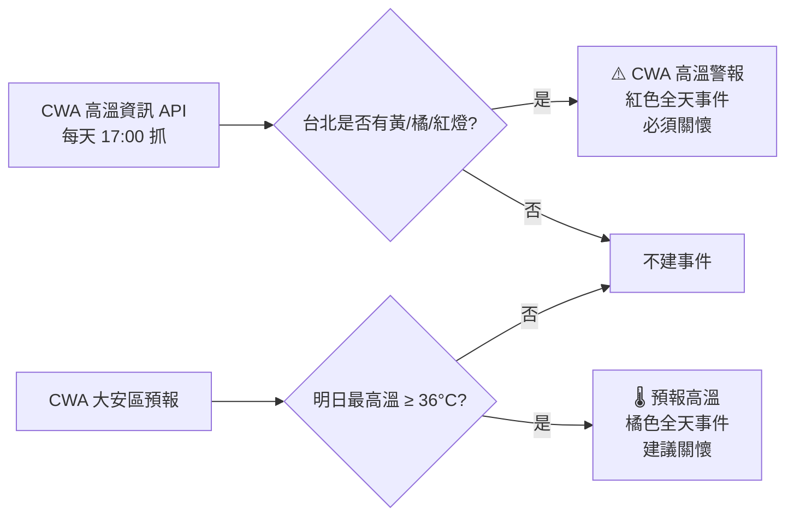

兩種事件意義不同：

| 事件 | 顏色 | 何時出現 | 意義 | SOP |
|---|---|---|---|---|
| **⚠️ CWA 高溫警報・必須關懷獨居長者** | 紅色（Tomato）| CWA 正式發布警報當天 | 中央氣象署官方認定的高溫日；對應氣候行動獎審核標準 | **當天下午 3 點前完成**全冊電話關懷 |
| **🌡️ 預報高溫・建議關懷獨居長者（明日 X°C）** | 橘色（Tangerine）| 前一晚 17:00 出現於隔日 | 預報達黃燈門檻、明天 CWA 很可能正式發布；社區主動提前一晚 | **今晚先安排明天時段**，明天視 CWA 實際發布決定是否升級為必須關懷 |

兩者可能同日出現（先有橘色預報、隔天 CWA 發布變紅色警報）。看到紅色就以紅色 SOP 為準。

#### 2.4.2 執行 SOP

- **對象**：**65 歲以上獨居者**、行動不便獨居者、日間無人照顧者。
- **名冊建立**：採「自願登記制」，建立「閱大安 安心關懷名冊」，絕對保密。
- **執行動作**：
    - 看到紅色 ⚠️ 事件：**當天下午 3 點前**完成全冊電話關懷
    - 看到橘色 🌡️ 事件：當晚先排好隔天的訪視時段；隔天打開日曆若升級為紅色，按紅色 SOP 執行
- **話術**：「X 先生/小姐您好，這裡是管理中心，今天天氣非常熱，提醒您多補水、開冷氣、盡量別出門，有不舒服請立刻通知我們。」
- **紀錄**：完成關懷後在該日曆事件加上一行 comment（譬如「2026-05-21 14:30 完成全 5 位電話關懷，X 阿嬤無人接聽已通報緊急聯絡人」），作為氣候行動獎稽核佐證。

#### 2.4.3 系統壞掉時的備援

自動提醒不是百分百保險，偶爾會碰到這兩種狀況：
- 連續幾天日曆都沒出現任何相關事件（系統可能卡住沒在跑）
- 氣象署明明發了警報、但日曆當天卻沒跳事件（資料抓取出問題）

碰到時的處理：

1. **以氣象署官網為準手動執行關懷**：到 https://www.cwa.gov.tw 點「高溫資訊」頁，自己確認台北是否在警報範圍。有的話照 §2.4.2 SOP 完成電話關懷，不用等系統。
2. **回報主委**：把狀況（譬如「2026-07-15 氣象署發黃燈但日曆當天沒事件」）傳給主委，由主委檢查自動化系統哪裡出問題、安排修復。

**重要心態**：系統只是用來減少漏接的輔助工具，**真正的責任仍在總幹事**。氣候行動獎審核看的是實際關懷紀錄，**不能用「系統當天沒提醒」當作沒做的理由**。把它想成「鬧鐘」——鬧鐘壞了人還是要自己起床。

# 第六章：重點議題與住戶關係

## 1. 會議與議題管理

### 1.1 會議記錄與追蹤

- **會議記錄**：需完整歸檔並熟悉歷屆管委會、區權會等會議記錄，以利查閱歷史決策。
- **議題追蹤**：需掌握近期重要議題、決議要點，並持續追蹤「未決議」或「待執行」事項的進度。
- **住戶提案**：需記錄並跟進住戶的提案計畫，定期回報管委會。

## 2. 住戶關係管理

### 2.0 對住戶的溝通語氣原則

閱大安管委會的姿態是「主席帶領住戶共同決定」**而非「向住戶宣布」**。所有對住戶溝通的文字（公告、月報、AGM 簡報、Line 訊息）都要反映這個姿態。下面是禁區詞與替換建議：

| 禁區詞 | 改用 | 理由 |
|---|---|---|
| 告知 | 提前意見交流、徵詢、預告 | 「告知」是行政機關下行公文的詞，不是社區自治的詞 |
| 宣告 / 通知您 | 邀請、歡迎、討論 | 同上 |
| 表決 | **議決** | 「議決」更貼近社區自治語境 |
| 「請住戶……」 | 「邀請住戶……」「歡迎住戶……」 | 主語從命令轉為邀約 |
| 口徑 | 實際/推估、比較基礎 | 「口徑」是內部術語，住戶聽不懂 |

**自我檢查問題**：寫完一句後問「這句話讓住戶覺得自己是參與者還是接收者？」——應該感覺是前者。

**為什麼這個原則重要**：第五屆 AGM 準備過程中，主委在簡報內三處主動把「告知」改成「提前意見交流」。沿用過去文字時要審視語氣對不對，不是只看文字對不對。

**自擬規則的標示原則**：如果某個閾值/公式/判斷規則是管委會憑經驗或直覺擬的（無外部依據），要主動標示「這是我們社區的內部慣例」，**不要包裝成「業界標準」「規範要求」**——否則被住戶質疑時無法辯護。

### 2.1 外送服務管理原則

- **管理原則**：
    - 為維護社區安全、隱私與管理秩序，原則上**禁止**餐飲、快遞等外送人員「單獨」進入住戶樓層。
    - 住戶需自行至一樓大廳或管理中心領取。
- **例外情況（大型重物配送）**：
    - **適用範圍**：僅限大型生鮮食品、箱裝乾糧（如家樂福、大潤發、COSTCO 線上購物）等重物，且廠商提供送貨到府服務者。
    - **SOP**：
        1. **確認**：送貨員抵達表明為特定住戶送重物。
        2. **聯繫**：管理中心致電住戶確認在家。
        3. **執行（關鍵）**：明確告知住戶，依決議需**請住戶親自下樓至大廳，接待並「陪同」送貨人員上樓**。
        4. **登記**：保全仍需對送貨員進行訪客登記。
- **決策理由**：
    - **安全與隱私**：降低陌生人遊蕩風險。
    - **成本管控**：減少管理人員頻繁換證的負擔。
    - **秩序維護**：避免用餐尖峰時刻電梯被外送員佔用。

### 2.2 頂樓空中花園禁止曬衣

- **管理原則**：全面**禁止**在頂樓空中花園等公共可視區域晾曬任何衣物、被單。
- **主要理由**：
    - **形象資產**：頂樓花園為重要公設，萬國旗般的衣物會嚴重破壞設計感與房價基礎。
    - **糾紛預防**：避免空間佔用糾紛、物品遺失責任不清。
    - **公共安全**：避免衣物滴水造成地滑，或被強風吹落砸傷人車。
- **執行 SOP**：
    - **巡檢**：列入日常巡邏動線。
    - **勸導**：發現時溫和勸導（參考話術：維護社區景觀，麻煩收一下）。
    - **開罰**：屢勸不聽者拍照存證，依規約開立違規通知單。

### 2.3 一樓閱覽室電視使用管理

- **管理原則**：一樓閱覽室 65 吋電視，僅限**管委會開會**或**經核准的社區活動**使用，**不對外開放**給住戶個人觀看節目。
- **主要理由**：
    - **功能衝突**：閱覽室核心為「安靜閱讀」，電視聲光會破壞此功能。
    - **爭議預防**：避免「遙控器戰爭」（搶頻道）及長時間佔用問題。
    - **成本考量**：減少電費與設備損耗。
- **執行 SOP**：
    - **應對提案**：若住戶建議開放，請禮貌說明上述原則（保護安靜功能）。
    - **違規處理**：發現私自使用者，上前溫和勸導並請其關閉；無效則回報管委會。

## 3. 社區活動

### 3.1 中元普渡

- **活動背景**：每年約 10 戶住戶共同參與，具凝聚力。亦會收到信義房屋、永慶房屋等外部贊助。
- **籌備事項清單**：
    - **預算**：管委會供品採購預算為 **3,000 元**。
    - **採購原則**：以零食、水果為主；**不採購**鮮花、牲禮（難處理）。
    - **普渡旗**：剩餘旗幟應填上當屆委員姓名。
    - **物資**：供桌使用健身房折疊桌；需區分兩個金爐（普渡公 vs 好兄弟）。
    - **雨天備案**：可向一樓永慶房屋借用帳棚（需提前預約，2025 年已預約 2026 年農曆七月第一個週六）。
    - **路權**：若佔用人行道需提前申請。
- **祭文內容範本**：
    - **祝禱疏文（恭請普渡公）**：
        
        > 閱大安（恭請普渡公）
        值逢七月普渡，位於臺北市大安區羅斯福路二段83至85號閱大安社區全體住戶，一心虔誠慶贊中元，虔誠敬備供品，供養十方孤魂有情眾。特先恭請普渡公駕臨主持中元普渡慶贊儀式，祈求保護社區安寧、平安、儀式順利。
        閱大安主任委員○○○率全體住戶恭請
        歲次國曆○○○年○月○日 / 農曆○○年○月○日
        > 
    - **普渡文（供養及恭送好兄弟）**：
        
        > 閱大安（供養及恭送好兄弟）
        值逢七月普渡，位於臺北市大安區羅斯福路二段83至85號閱大安社區全體住戶，虔誠敬備供品，供養十方孤魂好兄弟姊妹有情眾，請受全體住戶供養納受，並祈求保護住戶身體健康、家旺人和、出入平安。社區國泰民安、風調雨順，以此敬請受供。獻金各得其後，恭送各歸本位。
        閱大安主任委員○○○率全體住戶供養及恭送
        歲次國曆○○○年○月○日 / 農曆○○年○月○日
        > 

### 3.2 農曆新年期間管理

每年農曆春節前 1-2 週決定年節安排。

#### 3.2.1 標準公告內容（112 年起穩定版本）

```
春節期間禁止任何裝修工程。

為避免社區環境髒亂，環保室將暫時關閉上鎖：
- 關閉時間：除夕中午 12:00
- 重新開放時間：初三中午 12:00

如有需丟棄大型家具請提前告知管理中心，聯絡台北市政府環保局清潔隊收取。
長時間外出住戶請留意家中電器及安全設定。
```

#### 3.2.2 值勤人員配置

需於管委會議決定當年值勤輪班；通常以日班保全為主，夜班可輪替。

## 4. 鄰里關係管理

### 4.1 五府宮互動原則

- **背景**：位於社區後門，因地緣關係互動頻繁。
- **過往困擾**：
    - 人潮與空間佔用（曾移開拒馬佔用身障車位）。
    - 焚燒紙錢造成空污（有時是隔壁鄰居拿去燒的，廟方背鍋）。
    - 普渡供桌曾佔用地下室出入口旁花圃。
- **目前策略**：
    - **溝通管道**：主委已與廟方窗口 **李潔西小姐**（宮主姪女）建立 Line 聯繫。
    - **要求**：舉辦活動前需先知會閱大安。
    - **立場**：向廟方強調本棟已非私宅，而是區分所有權住宅，需維護住戶權益。
- **改善現況**：大型活動頻率減少；李小姐有意願推動減燒紙錢（但受長輩壓力無法即刻禁絕）。
- **關鍵人物**：李潔西小姐家人曾任其他大樓主委，對社區立場具同理心，是溝通關鍵。

## 5. 電動車充電系統營運與管理

### 5.1 基礎設施與產權定義

- **系統架構**：採用「專設一戶」供電，與大公電及住戶家用電實體隔離。
- **迴路配置**：
    - **B1+B2 迴路**：
        - 獨立電表（表燈 - 非時間電價）。
        - 現況：每月充電度數未達 800 度。
    - **B3+B4 迴路**：
        - 獨立電表（表燈 - 簡易型時間電價/二段式）。
        - 現況：每月已達 800 度。
        - **優勢**：**無契約容量**（無超約罰款風險）；離峰時段（夜間/週末）單價低（約 1.99 元）。
- **管理中樞**：台達電 (Delta) EMS 能源管理系統。
- **設備現況**：全區 49 車位，已安裝 33 支，常態使用約 4 支。
- **產權界定**：
    - **私有**：充電樁本體、公共線槽至樁體之線路。
    - **公設**：公共線路、EMS 主機。

### 5.2 設備養護

- **防潮管理**：因地下室濕氣重，採「待機通電」原則，利用設備微熱驅除濕氣，防止電路板鏽蝕。

### 5.3 財務收支流程

- **代墊代收制**：
    1. **支付**：管委會收到台電帳單，先以管理費代墊。
    2. **拆算**：總幹事登入 EMS 後台匯出報表。
    3. **收費**：依金額向車主收費（或併入管理費）。
    4. **歸墊**：款項回補管理費。
- **公用電費分攤**：EMS 主機及線損產生之費用，由全體充電樁持有者均攤。
- **維護基金**：充電樁住戶每月繳 **50 元**，存入「充電樁線路維護費帳戶」（永豐東門分行），專款專用。

### 5.4 風險管理

- **保險**：商業火險承保範圍需確認涵蓋 EMS 主機、伺服器及公共配電盤。
- **緊急應變**：EMS 當機不影響大樓供電安全，僅無法計費。

### 5.5 綠能評估 (風力發電可行性報告)

- **評估緣起**：第四屆管委會為爭取氣候行動獎，諮詢「元皓能源」並參考「新北市菠爾社區」案例。
- **先天限制 (微氣候)**：
    - 雖鄰師大操場有局部通風，但受盆地與高樓影響，風場屬「高紊流」陣風，缺乏發電所需的「穩定層流」。
    - 市區風速低，發電量可忽略，**回本年限超過設備壽命 (>20年)**。
- **法規阻礙**：
    - 需申請「雜項執照」（涉及建築師、結構技師簽證）。
    - 廠商反饋：近七年雙北幾無成功合法案例，行政成本過高。
    - 補助看得到吃不到（卡在結構簽證）。
- **結構與安全疑慮**：
    - **載重**：旋轉震動長期影響樑柱，需高成本補強。
    - **噪音**：低頻噪音難消，頂樓住戶投訴風險高。
    - **風險**：颱風強風恐致葉片斷裂。
- **最終決策**：**不予執行**。

## 6. 特殊案例與歷史沿革

### 6.1 頂樓平台照明演變

- **過程**：從早期的「太陽能燈」（效果不佳）演變至目前的「拉明線手動開關」。
- **操作**：提醒保全夜間巡邏時需手動開啟。

### 6.2 夏日防蚊措施

- **依據**：第二屆管委會決議。
- **成效**：有些許成效。
- **措施**：
    - **阻絕路徑**：蚊子多從二樓防火門進入電梯，故要求 **二樓防火門** 與 **一樓後門** 常時保持關閉。
    - **藥劑**：於電梯內黏貼防蚊片、外圍排水溝投放氯錠。

### 6.3 飲水機用水習慣

- **觀察**：物業同仁因「環境心理學」因素不願飲用公設飲水機。此細節可作為未來改善設施之參考。

### 6.4 氣候行動獎（原零碳標竿獎（2024年以前））脈絡

- **起源**：第二屆主委邀請北市府節電輔導團。
- **顧問**：柯明村博士（北科大）、黃郅凱工程師（產發局）建議報名。
- **成果**：
    - **2024 零碳標竿獎** 獲得典範獎，獎金五萬元。
    - **2025 氣候行動獎** 獲得銀質獎，獎金十萬元。
- **2025 氣候行動獎**：
    - 評審陣容（均曾蒞臨閱大安）：
        - 鄭福田（台大環工教授）。
        - 賴曉芬（主婦聯盟常務監察）。
        - 楊志彬（社大全國促進會秘書長）。
        - 楊順美（媽媽監督核電廠聯盟）。

### 6.5 電梯數位廣告看板決議

- **背景**：東森分眾傳媒於 **2025/07/22** 接洽，提議安裝並提供每月 500 元/台回饋金。
- **決議**：第四屆第一次管委會（2025/07/24）決議 **暫不考慮導入**。
- **否決理由**：
    - **優點**：雖可開源（補貼電費）、資訊即時。
    - **缺點（關鍵）**：
        - **噪音**：破壞電梯安靜環境。
        - **光害**：螢幕亮度刺眼。
        - **反感**：重複性廣告易致住戶煩躁。
        - **質感**：商業化降低住宅品質與隱私感。
- **SOP**：若未來再有廠商接洽，可依此決議婉拒。

---

# 附錄 A：年度循環議題快速索引表

> 總幹事每月初檢視本表，對照當月應啟動的議題。

| 月份 | 應啟動議題 | 對照章節 |
|---|---|---|
| **1 月** | 公共安全檢查（每 3 年）議廠商與議價 | 第四章 §7 |
| 1 月 | 物業合約用印完成、年度合約存查 | 第三章 §3.1 |
| 2 月 | 公共安全檢查日程確認、執行 | 第四章 §7 |
| 2 月 | 農曆新年公告（依當年農曆 1 月對應日）| 第六章 §3.2 |
| 3-4 月 | 區權會前置作業（如為任期年）| 第四章 §4.2 |
| 5 月 | 召開區權會（建議週六下午）| 第四章 §4.2 |
| 6 月底 | 管委會交接 12 步（如為任期年）| 第四章 §5.1 |
| 7-8 月 | 中元普渡籌備（依當年農曆 7 月對應日）| 第六章 §3.1 |
| 9 月 | **物業合約**討論：續約 vs 公開招標 | 第三章 §3.1 |
| 10 月 | 物業：刊登招標訊息（如選擇招標）| 第三章 §3.1 |
| 10-11 月 | **大公電契約容量檢討**（看夏季高峰）| 第四章 §3.1.1 |
| 11 月初 | 物業第一階段書審 | 第三章 §3.1 |
| 11 月 | **公共意外險、火險**比價（國泰/富邦/南山）| 第四章 §6.2、§6.3 |
| 11 月 | **電梯保養**合約議價（兩年期到期年）| 第三章 §1.2 |
| 11 月中 | 物業第二階段簡報（4 家為合理規模）| 第三章 §3.1 |
| 11 月底 | 物業議價、決定續約對象 | 第三章 §3.1 |
| 12 月 | 物業合約完成用印、保險續保完成 | 第三章 §3.1、第四章 §6 |
| **每月** | 台電四張帳單追蹤、更新氣候行動獎明細 | 第四章 §3.1 |

---

# 附錄 B：跨屆議題追蹤機制與進行中議題清單

## 為什麼要有正式的議題追蹤機制

社區議題天然會「跨屆延續」——譬如：

- **貨梯改造案**橫跨第二、三、四屆共 3 屆
- **車道反光鏡安全改善**從第一次討論到實際施作橫跨 4 次管委會會議
- **外牆清洗**每 4 年一次、跨多屆規劃

如果只依賴「會議紀錄逐次翻查」，新任主委/總幹事完全沒辦法接續處理；如果只放在某任主委個人 Notion 裡，**換屆就斷檔**。

## 解法：Notion 議題追蹤資料庫（社區共用 Notion）

統一存放於 **Notion 社區資料中心** 的議題追蹤模組（第二章 §4），每條議題包含：

- **議題名稱**
- **狀態**：待議 / 進行中 / 已結案 / 暫緩
- **首次提案**：哪次會議、誰提
- **歷次討論**：時間軸（含每次決議要點）
- **負責人**：總幹事 / 主委 / 特定委員
- **相關文件**：報價單、現場照、規約引用

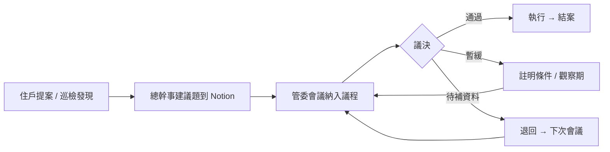

## 交接時的議題盤點原則

新舊主委/總幹事交接時，**進行中狀態的所有議題都要逐條過目**，特別注意：

1. **時間敏感**：有沒有規約/法規限期？（譬如「下次會議前回報」）
2. **暫緩條件**：暫緩的議題等什麼條件？條件何時可能觸發？
3. **跨屆原承諾**：上屆主委向住戶口頭承諾過的事項，新屆要不要繼承

## 當前進行中議題清單（2026-04-30 當下快照）

> 此清單為議題追蹤資料庫的 29 個「進行中」（未結案）議題。詳細討論紀錄留在原 Notion 議題追蹤；本清單作為總幹事案頭備忘。

### 設備維護類
- B4 電梯旁牆面底部滲水問題
- R3 電梯機房百葉更換問題
- R2 水塔頂樓排水口積水與漏水問題
- B3 13 號車位旁牆壁滲水問題
- 噴灌系統漏水處理討論
- 14F-5 陽台滴水修繕案
- 雨遮玻璃破裂修繕事宜
- 326 泡沫撒水系統一齊閥故障修繕討論
- 大門之保養價格與頻率研究
- 一樓玻璃門門把（一樓大廳後門）可靠度問題

### 安全 / 法規類
- 社區是否購置電動車防火毯
- 社區是否設置 AED（心臟除顫器）
- 電動車充電設備環境防災研議計畫
- 加強地下停車場出入口車道防滑方案
- 高空維護作業用之鷹架購置
- 太古華電消防安檢改善費用討論
- 太古華電修繕保養費用討論──緊急發電機保養與外掛式充電器

### 行政 / 治理類
- 各職司委員交接（第五屆）
- 第五屆區權會工作時間表討論案
- 充電樁收費機制調整
- 是否開放機車位停腳踏車？
- 與社區非相關之外車於社區無障礙車位臨時停車之收費相關規定
- 五府宮舉辦活動對閱大安社區的影響因應事宜
- 管理費部分定存討論規劃案

### 設計 / 形象類
- 閱大安指標優化
- 從第三層樓層開始，中華電信訊號不好

### 已執行（待結案歸檔）
- 進行 1F 和 B1F 裝修保護板拆除及各樓層電梯門片更換鈦金門板（已於 2026-04-14 部分完工）
- 地下停車場車位區感應式燈管更換 — **已完工** 2026-04-14（詳 [[閱大安地下室停車場照明改善-決策誌]]）

---

# 附錄 C：增補版維護日誌

- **2026-05-17 v4** — 全面修訂：
  - 前言改寫為對總幹事的歡迎與使用指引
  - 新增第二章 §8「每日水電公告產生器」整節（5 步驟工作流 + 三處發布管道 + 備註欄使用原則 + 故障排除 + 資料庫長期價值說明）
  - §3.1.3 改為「服務延續性原則」、聚焦總幹事在物業合約年度換約期間的協助項目
  - §4.2.4 改寫為「總幹事在會議當天的協助項目」
  - 清除 18 處原 Notion 圖檔殘留佔位
- **2026-05-17 v3** — 第五屆第一次區權會（5/16 召開）後內容補強。新增 7 個區塊：
  - 第二章 §7「AGM Tool 操作」（含 mermaid 工作流圖）
  - 第四章 §2.5「對住戶報告財務的口徑原則」（總資產視角、保守收入、代收代付、跨投影片一致性）
  - 第四章 §3.1.2「大公電 1 年資料洞見」+ §3.1.3「設備故障用電飆升案例」
  - 第四章 §3.2.1「公水 4 年治理脈絡」+ §3.2.2「給下任主委 3 步建議」
  - 第四章 §4.2.4「會議當天時間軸」（mermaid 甘特圖）+ §4.2.5「會議後文書 SOP」（mermaid 流程圖）
  - 第四章 §3.1.6「續約 vs 換廠商決策框架」（mermaid 決策樹）
  - 第六章 §2.0「對住戶的溝通語氣原則」（禁區詞與替換表）
  - 附錄 B 開頭新增「跨屆議題追蹤機制」（mermaid 流程圖 + 交接盤點原則）
- **技術改進**：修復 markdown-it 對 CJK + 全形標點交界處 `**粗體**` 未渲染的 bug（裝 `markdown-it-cjk-friendly` plugin）。
- **2026-04-30 v2** — 全面整合改寫。將 167 個議題追蹤資料庫中的 24 個年度例常性議題深度整合進原前六章對應位置（第三章 §1.2 電梯、§3 廠商招標；第四章 §3.1 台電、§4.2 區權會、§5 換屆、§6 保險；第六章 §3.2 農曆新年），並新增第四章 §7 公共安全檢查（每 3 年）。隨之 renumber：原第四章 §7-9 改為 §8-10。新增附錄 A 年度循環索引表（採「第 X 章 §Y.Z」全章節指向格式）+ 附錄 B 當前 29 個 Open 議題清單。修正子節編號一致性（§8.1-8.4、§9.1、§10.1-10.2）。
- **2026-04-30 v1** — 初版（章節附加式）：在原前六章末尾附加第七章。已被 v2 取代。
