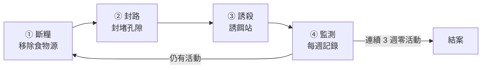

# 現況與時機

2026 年 9 月，後花園發現老鼠活動跡象，目前**尚未進入大樓內部**。

這是最容易處理的階段，但有時間壓力：**9 月中之後天氣轉涼，鼠群會開始往溫暖的室內移動，10–11 月是牠們從戶外轉進地下室與管道間的季節。** 現在處理是防守；等到住戶在梯廳或樓梯間看到，就變成清剿，成本與住戶觀感都完全不同。

# 核心原則：三件事要同時做

滅鼠若只放誘餌，族群會在數週內補回來。有效的順序是：

**斷糧是根本**。食物源沒斷，後面兩項都只是在延緩，而且會讓監測數字一直好不了。

---

# 一、本週立即處理

## 1.1 已淋濕的誘餌請直接丟棄

雨水淋濕的毒餌會發霉，老鼠不吃發霉的餌。更麻煩的是判讀會出錯——會誤以為「餌沒被吃＝沒有老鼠了」，實際上是「餌已經壞了」。

- 請**連同容器一起丟進一般垃圾**，不要曬乾後再使用，也不要進廚餘或露天堆置。
- 處理時請戴手套。

## 1.2 為什麼不建議用紙箱當誘餌容器

紙箱是很直覺的做法，但實務上有三個問題，都不只是美觀：

| 問題 | 影響 |
|---|---|
| 紙箱是老鼠的築巢材料 | 會被咬碎搬走當窩料，等於提供建材 |
| 不防水 | 淋雨後餌料發霉失效，監測數據失真 |
| 擋不住非目標對象 | 貓、鳥、小孩都可能翻開接觸到毒餌，是社區的安全風險 |

正確的做法是改用**專用誘餌站**（有蓋、可固定、內建餌棒的塑膠盒），規格見第五節。

---

# 二、斷糧：找出老鼠在吃什麼

老鼠在花園穩定出現，代表附近有固定食物源。請依下列順序查證，**並拍照回報主委**：

1. **83 號店面的廚餘與垃圾**——若有餐飲業，這通常是最主要來源。請查看後側與防火巷是否有未加蓋的垃圾桶、暫置廚餘桶、地面油污。
2. **社區垃圾集中點（環保室）**——桶蓋是否密合、垃圾是否直接落地、清運頻率是否足夠。
3. **餵食流浪貓或野鳥**——貓食殘料是最典型的養鼠來源。若有這個情形，請先回報，這件事要優先處理，否則其他措施效果都會打折。
4. **植栽的落果、堆肥、鬆軟土堆**。

> 查證結果請具體描述（哪個位置、什麼狀況、照片），不要只寫「已檢查」。主委需要依據實際狀況決定是否要與店家溝通、或是否需要發布住戶配合事項。

---

# 三、封路：不讓牠有洞可鑽

老鼠能通過的孔隙比一般想像的小，業界常用的判準是：**成鼠約 2 公分、幼鼠約 1.25 公分。** 巡查時請以「一根手指能不能伸進去」為粗略標準。

## 3.1 巡查重點位置

- **地下室通風百葉、機房開口**——格柵是否破損、孔徑是否過大
- **排水明溝與溝蓋**——蓋板間距、破損處
- **管線穿牆、穿樓的套管孔洞**——最常見的漏封點，尤其是後來加裝的線路
- **防火門與各出入口門底縫**——超過 1 公分建議加裝門底條
- **與鄰地交界的圍牆基腳、排水孔**
- **花園土壤中的鼠洞**——洞口直徑約 3–5 公分、洞緣光滑且無蛛網，代表使用中

## 3.2 封堵材料

| 可用 | 不可用 |
|---|---|
| 不鏽鋼絲絨填塞 ＋ 水泥或發泡填縫 | 單純矽利康 |
| 鍍鋅細目金屬網 | 泡棉、保麗龍 |
| 金屬門底條 | 木板、膠帶 |

右欄的材料老鼠都能啃穿，封了等於沒封。

封堵屬小額修繕，可請社區現有修繕廠商施作，**請先列出需封堵的位置清單與照片，報主委後再發包。**

---

# 四、環境整理（花園本身）

- 清除地面堆積物、閒置盆器、落葉堆——這些都是掩蔽所。
- 沿牆保留 **30–50 公分的淨空帶**。老鼠高度依賴沿牆移動，牆邊沒有遮蔽物，牠的活動範圍就受限。
- 草皮與灌木修低，減少地面遮蔽。
- 這幾項可納入園藝廠商的例行工作範圍，請於下次保養時一併交代。

---

# 五、誘餌站與餌料規格

## 5.1 容器：三種選擇

| 選項 | 成本（約略估算） | 說明 |
|---|---|---|
| **市售塑膠誘餌站**（捕鼠屋／鼠餌站） | 200–500 元／個 | 防水、可上鎖、內有固定餌棒，外觀低調。**建議採用** |
| 4 吋 PVC T 型管自製 | 100 元以內／個 | 防水、極低調，專業防治也常用；兩側開口即鼠道，中間豎管放餌後加蓋。無鎖 |
| 塑膠整理箱挖孔改造 | 100–200 元 | 容量大但體積明顯，較看得出來 |

> 上列價格是概估，實際請於五金行或網購平台查詢後回報。
>
> 建議直接採購市售誘餌站：單價兩三百元，為了省這筆錢自製，反而要多花工時，而且自製品在防雨與防貓誤觸這兩點上都比較弱。請選**深灰或黑色**款式。

## 5.2 餌料：室外一律用蠟塊型

- **使用蠟塊型毒餌**（蠟封磚塊狀）——防水防霉，本來就是為戶外設計的。
- **不要使用穀物顆粒型或粉狀**——那是室內用的，淋一次雨就報廢。
- 蠟塊要**以餌棒或鐵絲穿住固定在站內**。否則老鼠會整塊叼走藏起來，就無法從消耗量判斷牠到底有沒有吃。

## 5.3 不要在戶外使用黏鼠板

戶外的黏鼠板會黏到麻雀、蜥蜴、幼貓。除了動物本身，被住戶看到也會直接變成社區事件。**室外只用有蓋誘餌站，黏鼠板僅限室內且僅限隱蔽處。**

---

# 六、擺放位置與標示

- **貼牆擺放**，放在鼠徑上、灌木或設備後方。這同時解決效果與美觀——老鼠本來就不走空曠處，擺對位置自然也看不見。
- **固定在地面**（重物壓住或鎖定），不要讓誘餌站能被輕易搬動或踢翻。
- **在站體貼一張小標示**：「病媒防治誘餌・請勿移動・內含滅鼠藥劑」＋管理中心分機。住戶看到不明容器一定會詢問，先標示比事後解釋省事。
- 標示與位置清單請一併記錄在下節的監測表內。

---

# 七、監測：怎麼判斷有沒有效

請設 **3–5 個固定監測點**（例如：花園牆角、溝蓋旁、環保室旁、後巷側），**每週檢查一次並記錄**：

| 日期 | 監測點 | 鼠糞 | 啃咬痕 | 洞口活動 | 誘餌消耗 | 備註 |
|---|---|---|---|---|---|---|
|  | 1. |  |  |  |  |  |
|  | 2. |  |  |  |  |  |
|  | 3. |  |  |  |  |  |

判讀原則：

- **誘餌消耗多 ＝ 族群還在**，不是「藥有效」。要等消耗量逐週下降到零。
- **連續 3 週、所有監測點四項皆為零**，才算控制住，此時可撤除或改為每月巡檢。
- 若誘餌完全沒被碰過，先檢查是不是餌壞了或位置放錯（擺在空曠處），不要直接判定沒有老鼠。

紀錄請放入 Google Drive 的社區檔案，並於每月管委會議摘要回報。

---

# 八、什麼時候該委外

社區在每月保養排程中已有**消毒廠商**（見第二章 2.3 維護排程）。請先向該廠商確認：現行合約是否已包含鼠害防治、若要加做需要多少費用。

- **先做完第二、三節（斷糧與封路）再談委外。** 食物源沒斷的情況下簽定期防治合約，等於每月付費餵藥，數字不會改善。
- 若查證後發現食物源來自店面且短期難以改善，才需要考慮定期防治合約（一般為月費制，含定期換餌與紀錄）。
- 台北市各區清潔隊通常有配合的鼠患通報與藥劑發放機制，**但今年的實際作法我們尚未查證，請直接電洽大安區清潔隊確認**，並順便詢問是否可協助現場診斷。

---

# 九、社區有餵食流浪貓時的替代做法

若查證確認社區內或周邊有住戶餵食流浪貓，**請暫停使用毒餌**，改用下列方式，並回報主委：

- 使用**機械式捕鼠器（捕鼠夾或捕鼠籠）**，一樣裝在有蓋誘餌站內。防雨、防誤觸的效果相同。
- 優點是可直接看到捕獲數量，監測反而比毒餌更準確。
- 缺點是需要較頻繁地巡視與清理，請納入每週例行工作。

原因：毒餌有二次中毒的問題，吃到中毒老鼠的貓會一併受害。在有餵食行為的環境下，這個風險不宜承擔。

---

# 相關章節

- 第二章 2.3 Google 日曆（維護排程・消毒廠商）
- 第三章 4. 清潔 ／ 5. 垃圾清運與環保室管理
- 第六章 6.2 夏日防蚊措施（同屬病媒防治，作法可參照）
