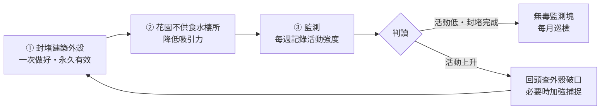

# 現況與時機

2026 年 9 月，後花園發現老鼠活動跡象，目前**尚未進入大樓內部**。

**食物源尚未確認**（說明見第二節）。後巷的餐飲業是可能來源之一，但目前只有鄰近性，沒有指向性證據。

這是最容易處理的階段，也是有時間壓力的：**天氣轉涼後鼠群會往溫暖的室內移動**，秋冬是牠們從戶外轉進地下室與管道間的時候。現在處理是防守；等到住戶在梯廳看到，就變成清剿，成本與住戶觀感都完全不同。

# 本案的目標是什麼（請先讀這一節）

**目標不是「抓到很多隻老鼠」，也不是「把老鼠清光」。**

**我們既無法確認外部食物源在哪，也無權處理鄰地。** 只要外部有食物——不論是哪一家、哪一處——族群就會被補回來。在這種條件下追求「零老鼠」沒有終點線，只會變成每月付費、永遠達不到的跑步機。

這也是本設計刻意做成**不依賴食物源身分**的原因：無論來源是誰，守住建築、降低花園吸引力、持續監測，這三件事都成立。

| | |
|---|---|
| **主要目標（可達成、可驗收）** | **建築物不被侵入——室內零鼠蹤** |
| **次要目標（維持性）** | 花園族群壓在低檔，降低牠們試探建築外殼的頻率 |
| **不是目標** | 清除老鼠、花園零老鼠、追求捕獲數 |

**捕獲數不是績效指標。** 真正要看的只有三項：

1. **封堵完成率**（第三節的清單補完了幾項）
2. **室內是否出現鼠蹤**（這是紅線，一旦出現就升級處理）
3. **花園活動指標是否維持低檔**（第七節的監測表）

## 防線畫在哪裡

| 區域 | 定位 | 我們做什麼 |
|---|---|---|
| **建築物外殼**（門窗、通風口、管線孔、門底縫） | **紅線・必守・可控** | 封堵到 6 公釐標準。**這一層不容妥協** |
| **後花園** | **緩衝區兼預警區・確定不可封閉** | 讓它不好住（不供食、不供水、不供掩蔽）＋ 監測預警。**不投資於周界封堵** |
| **後巷與鄰地** | **不可控** | 睦鄰溝通，但不投入防治資源 |

花園的監測，本質上是**建築物外殼的早期預警系統**——活動上升時，該做的第一件事是回頭檢查外殼有沒有新破口，而不是加強捕捉。

### 花園守不住，這一點已經確定

2026-09 現場確認：**花園周界的柵欄有大量孔洞**，加上**老鼠會攀爬**（見 §3.5），花園周界在物理上無法封閉。

巷子側外圍鐵門的門底楔形縫（§3.2）雖然是已觀察到的通行路徑，但在柵欄本身就處處可通的情況下，**它只是最明顯的一個入口，不是控制點**。

**因此本案的資源配置原則是：**

> **不要在花園周界投錢。** 補了鐵門，牠們走柵欄；補了柵欄，牠們爬牆。
> **錢和力氣全部集中在建築物外殼。**

這不是放棄花園，而是**認清花園的正確定位**：它是緩衝區與預警區。我們在花園做的事只有兩件——**降低它的吸引力**（不供食、不供水、不留掩蔽，見 §2.3 與第四節），以及**監測**（第七節）。這兩件都不需要封閉周界。

# 核心原則：三件事，但份量不同

| 支柱 | 內容 | 本案份量 |
|---|---|---|
| **① 阻絕入侵** | 封堵建築外殼孔隙 | **最高優先，唯一值得持續投錢的項目**（第三節） |
| **② 減少食物、水與棲所** | 花園不供食、不積水、不留掩蔽 | 社區範圍內確實做（第 2.3、四節） |
| **③ 監測為主、捕捉為輔** | 常態監測，必要時才加強捕捉 | 見下方「族群壓制的角色」 |

## 族群壓制的角色：過渡措施，不是常態

**壓制族群的目的是在封堵完成前爭取時間**，減少牠們在我們補洞期間找到縫隙的機會。**不是為了清空花園**——花園清不空。

**本案不使用毒餌。** 社區已確認有黑貓常態出沒（尤其夜間），而手上的漢他伏屬第二代抗凝血劑，二次中毒風險高，不適合本場域。完整理由見第九節。

| 階段 | 作法 |
|---|---|
| **第一階段（現在）** | **回收現場毒餌**（§1.1）→ 改用**機械式捕鼠夾**裝在防拆式站體內，同時全力進行封堵 |
| **第二階段（封堵完成、活動降低後）** | **改放無毒監測塊**，站體保留、巡檢降為每月 |
| **再升級的時機** | 監測塊出現齒痕、或室內發現鼠蹤時，恢復捕鼠夾與每週巡檢 |

捕鼠夾在本案其實有三個額外好處：**沒有二次中毒問題；捕獲數是直接可見的數據，比推估餌料消耗量準確；也沒有中毒鼠屍散落在外的問題。** 代價是需要較頻繁巡視。

---

# 一、本週立即處理

## 1.1 【最優先】戶外不要放毒餌

**社區已確認有黑貓常態出沒，尤其夜間。** 目前手上的漢他伏（伏滅鼠）屬**第二代抗凝血劑**，二次中毒風險高（見 §5.2）。因此：

> **請不要在戶外放置毒餌。若已經放了，請立即全部收回，不論有沒有受潮。**

（2026-09 主委了解總幹事應尚未實際擺放，此處兩種情況都涵蓋。）

若已放置，回收方式：

- 戴手套，將餌料與紙箱一併收起。
- **受潮失效的餌料屬環境用藥廢棄物，不要自行推定丟法。** 請先看包裝上的廢棄處置說明，依標示處理；**標示未載明時，請電洽大安區清潔隊或環保局確認後再處理**，在確認前先以雙層袋密封、置於管理中心妥善暫存。
- **未受潮、仍完整的餌料**請以原包裝密封，存放在管理中心上鎖或幼童無法取得之處，標示清楚。**不要曬乾後再使用受潮的餌。**
- 空的紙箱等**未直接盛裝藥劑**的外層容器，清潔後可依一般廢棄物處理。
- 回收後請**巡視周邊有無已中毒的鼠屍**（作法見 §6.3），若有請一併妥善清除——這是目前最可能造成貓受害的途徑。

**後續改用機械式捕鼠夾**，不再使用毒餌，理由與作法見第九節。

## 1.2 為什麼不用紙箱當誘餌容器

紙箱是很直覺的做法，貼上警示標語也確實解決了「住戶看到不明物品」的問題。但紙箱本身還有三個缺點無法靠標語解決：

| 問題 | 影響 |
|---|---|
| 紙箱是老鼠的築巢材料 | 會被咬碎搬走當窩料，等於提供建材 |
| 不防水 | 淋雨後餌料發霉失效，監測數據失真 |
| 擋不住非目標對象 | 幼童、貓、鳥都可能翻開接觸到毒餌 |

正確的做法是改用**防拆式誘餌站**，規格見第五節。

---

# 二、食物源：目前尚未確認

## 2.1 我們實際知道與不知道的

| | 內容 |
|---|---|
| **已知** | 花園有老鼠活動；影片顯示鼠隻出現位置距後巷餐飲業「夯飽排骨飯」不遠；入侵路徑為外圍鐵門門底楔形縫（§3.2）|
| **未知** | **食物源究竟在哪。** 鄰近不等於來源 |
| **尚未排除** | **社區自己也還沒真的查核過。** 「一樓周邊應該沒有食物源」目前是推測，不是查核結果 |

**請不要把「夯飽排骨飯是食物源」當成已確認的事實。** 總幹事前往溝通時對方的回應是「無從追究來處」，這個回應是合理的——我們手上的證據只有距離近，而後巷、鄰棟、其他店家、公共垃圾點都可能是來源。把最近的一家當成答案，風險是**停止尋找真正的來源，並在證據不足的情況下讓鄰居承擔懷疑**。

## 2.2 這對作法的影響：其實很小

食物源沒確認，會不會讓整套計畫無法執行？**不會。** 因為本案的設計刻意做成**不依賴食物源身分**：

- **封堵建築外殼**（第三節）——不論食物在哪都要做，而且這是唯一完全由我們控制的。
- **降低花園吸引力**（§2.3、第四節）——不論外面有沒有食物，我們自己這裡都不該供食供水。
- **監測導向控制**（第七節）——本來就是靠數據調整，不靠推論。

**會受影響的只有一件事：不要期待「跟鄰居談好就沒事了」。** 食物源未確認，代表斷糧這條路更不可靠，資源要更確定地壓在封堵上。

## 2.3 社區自己這一端，要實際查核而不是推測

外面有沒有來源還不知道，**我們自己這一端必須先查乾淨**——這不是次要項目，是與外部同等重要的一項。請實際走一遍並**拍照回報**，不要只回覆「已檢查」或「應該沒有」：

1. **環保室與垃圾集中點**——桶蓋是否密合、垃圾是否直接落地、清運頻率是否足夠、地面有無殘渣油污。
2. **有無住戶或鄰居餵食流浪貓、野鳥**——貓食殘料是最典型的養鼠來源。請實際問保全與清潔人員，他們最清楚。
3. **積水與長期潮濕處**——盆底積水、排水不良的低窪、滴漏的水龍頭。老鼠每天需要水，斷水與斷糧同等重要。
4. **植栽的落果、堆肥、鬆軟土堆**。
5. **騎樓、後巷我方側的堆置物**。

## 2.4 監測本身就能提供來源方向的線索

第七節的監測點不只告訴我們「有多少」，也能告訴我們「從哪來」——**不需要額外工作，只要在設點時留意涵蓋不同方向**：

- 各監測點的活動強度若長期呈現**梯度**（例如後巷側明顯高於其他側），高的那一側就是來源方向的線索。
- 鼠徑、足跡與牆面擦痕也有方向性，巡檢時順便記錄。
- 累積數週的資料後，比任何單次目擊或影片都更能支持判斷。

**在累積到指向性證據之前，對外一律以「來源不明、周邊共同防範」陳述**，不要指名。

## 2.5 與後巷店家的溝通（請先回報，不要自行前往交涉）

這屬於鄰里關係事務，**請先向主委回報，由主委決定進行方式與時機。**

可行方向由輕到重大致三層：

1. **睦鄰反映**——以「我們這邊發現鼠蹤，想跟您確認一下後巷垃圾的存放狀況」這種請教的方式開口。多數店家願意配合加蓋、調整清運時間。**這一層不需要證據，因為它本來就是共同防範，不是指控。**
2. **共同維護後巷**——後巷是雙方每天共用的通道，可提議分擔清潔，或由社區提供加蓋垃圾桶。
3. **主管機關**——**這一層必須先有指向性證據**（見 §2.4），且長期無改善才走。**受理單位與程序我們尚未查證，請先電洽大安區清潔隊確認後回報主委**，在確認並經主委決定之前，不要向店家提及這個途徑。

> 溝通目的是改善環境，不是究責。後巷是我們每天都要共用的空間，關係要留著。
> **在證據只有「距離近」的階段，任何指名都會傷害關係而換不到改善。**

**2026-09 執行紀錄**：總幹事已前往夯飽以「周邊共同防範」的框架溝通，並請對方一併找消毒廠商協助。對方表示無從追究來處——**這個回應合理，我方當時也確實沒有指向性證據**。此事到此為止，不再追問，後續依 §2.4 累積監測資料再判斷。

**若對方確實施作，請問到施作時程並與我方對齊。** 原因是**覆蓋率與食源競爭**：只有一側投藥時，老鼠仍有另一側的充足食物可吃，會優先吃廚餘而不碰我們的餌，防治效果被稀釋；兩側同時做才能把整個街廓的族群一起壓下來，也避免我方壓制後由鄰地回流補入。

---

# 三、阻絕入侵：封堵孔隙

## 3.1 判準：6 公釐

老鼠能通過的孔隙遠比一般想像的小：

| 種類 | 可通過的孔隙 |
|---|---|
| 溝鼠（成鼠） | 約 2 公分 |
| **小家鼠、幼鼠** | **約 0.6 公分（6 公釐）** |

**我們不知道現場是哪一種，所以一律以 6 公釐為標準**——2 公分是溝鼠的數字，用它當通用門檻等於放行所有小家鼠。

- **不要用「手指伸不伸得進去」判斷**，手指太粗，會漏掉絕大多數該補的縫。
- **也不要用原子筆或鉛筆目測**——一般原子筆筆桿與鉛筆多半比 6 公釐粗（約 7–9 公釐），拿它當量規會放過 6–8 公釐的縫。
- 現場請帶**一支 6 公釐鑽頭**（五金行數十元）當量規，或**直接用直尺實測**。**6 公釐塞得進去就要處理。**
- **門底縫也適用 6 公釐**，超過即加裝門底條。

## 3.2 第一優先：建築物本身的開口

**這一層是紅線，也是唯一值得投錢的地方。** 目前老鼠尚未進入室內，就是因為這條線還守著。

請依序檢查並列出清單（附照片與實測尺寸）：

1. **建築物後門的門底縫**——最可能的第一個破口，標準同樣是 **6 公釐**，超過即加裝**金屬**門底條。
2. **其他各出入口門底縫與門框縫**——大廳、側門、機房門、防火門。
3. **地下室通風百葉、機房開口**——格柵是否破損、孔徑是否過大。
4. **管線穿牆、穿樓的套管孔洞**——最常見的漏封點，尤其是後來加裝的線路。
5. **排水明溝與溝蓋**——蓋板間距、破損處。
6. **一至三樓的開窗、陽台與排氣口**——相對容易到達，一併目視檢查。
7. **上層與頂樓的通風口、管道間開口**——見 §3.5，老鼠會爬。

> **驗收一律用 6 公釐鑽頭或直尺實測，不要目視判定。** 完工後拍照存檔。

## 3.3 花園周界：不投入封堵資源

2026-09 現場確認：**花園柵欄有大量孔洞**，加上老鼠會攀爬，**周界在物理上無法封閉**。因此：

> **不要為了擋老鼠而單獨發包整修花園周界。** 補了這裡牠們走那裡，錢會一直花下去而看不到效果。

### 已觀察到的通行路徑（記錄用）

巷子側外圍鐵門的門底，因**地面傾斜、門扇下緣平直**而形成一道**楔形縫**。主委現場觀察：這道縫相當大，**老鼠不必走到最寬處，在偏窄的一段就能自由鑽進鑽出**。

這是目前已知最明顯的入口，但**在柵欄本身處處可通的情況下，它不是控制點**，因此不列為優先工程。

**若日後鐵門因其他原因（維修、更換、美觀）需要施工，請順便一併處理**，屆時的技術重點記錄如下：

- **一般門底條無效**——市售門底條假設地面與門下緣平行，裝在斜地面上只貼合窄端，寬端仍留開口。
- **橡膠條與毛刷條不可用**——會被啃穿或直接鑽過。
- **不要用水泥墊平地面**——斜度多半是為了排水，填平會積水，而積水本身就是老鼠要的水源。
- **建議作法**：依實測斜度裁切鍍鋅或不鏽鋼板，加焊或鎖固於門扇下緣，板隨門移動、不影響排水。深度沿門寬漸變，不可用等寬料。
- **驗收**：沿整條門縫每約 30 公分量一次（含兩端與中段），每一點都須小於 6 公釐。
- ⚠️ 後門通常是逃生動線，任何措施都不得妨礙門的正常開闔與人員通行。

## 3.4 封堵材料

| 可用 | 不可用 |
|---|---|
| **不鏽鋼**絲絨填塞 ＋ 外層水泥抹平 | 一般碳鋼絲絨（戶外數月即鏽蝕粉化） |
| 鍍鋅或不鏽鋼細目金屬網 | 單純矽利康 |
| 金屬門底條 | 泡棉、保麗龍、木板、膠帶 |

兩個常見錯誤：

- **鋼絲絨要指名「不鏽鋼」。** 一般碳鋼絲絨在戶外受潮幾個月就鏽蝕粉化，等於沒補。
- **發泡填縫劑只能當填縫與固定，不可裸露當成防鼠面層。** 老鼠照樣啃穿。正確作法是「不鏽鋼絲絨塞實阻擋 → 外層水泥或發泡固定 → 抹平」。

封堵屬共用部分修繕，**請先列出需封堵的位置清單與照片，報主委後再發包**，由社區現有修繕廠商施作。

---

## 3.5 老鼠會爬牆——建築外殼不只是地面那一圈

**這一節很重要，因為容易被忽略。**

家棲鼠都善於攀爬，其中**屋頂鼠是公認的攀登能手**：可直接沿**粗糙的垂直牆面**往上爬，也能沿**電線、水管、冷氣管線、樹枝藤蔓**移動，並具備一定的跳躍能力。**溝鼠**雖以地棲與挖洞為主，同樣具攀爬能力。

這代表**建築外殼是立體的，不是只有一樓那一圈**。閱大安有 15 層、一樓植栽與頂樓空中花園，上層開口同樣要納入。

### 3.5.1 切斷「攀爬橋樑」

| 橋樑 | 處理方式 |
|---|---|
| 貼牆或近牆的樹枝、爬藤 | 修剪，讓枝葉與外牆保持距離（**建議至少 1 公尺**）。請交代綠石園藝納入例行修剪 |
| 落水管、冷氣冷媒管、排氣管 | 檢查是否可沿管攀爬；必要時於管身加裝**防鼠擋板（rat guard）**——一片套在管上的金屬圓盤，讓牠爬不過去 |
| 外牆電纜、網路線 | 同上，或改以管槽收納並封住端口 |
| 堆放在牆邊的雜物、棧板、盆器 | 移除——它們是「第一階」，能讓老鼠跳上更高處 |

### 3.5.2 上層與頂樓的開口

- **各層通風口、排氣口、管道間開口**——加裝**金屬紗網罩**（金屬材質，不可用塑膠紗網）。
- **頂樓空中花園**——同樣比照花園處理：不供食、不積水、不留掩蔽，並檢查通往室內的門窗與開口。
- **低樓層陽台與開窗**——一樓至三樓相對容易到達，請一併目視檢查。

### 3.5.3 順便判斷是哪一種老鼠（會影響巡查重點）

| 觀察到的跡象 | 可能種類 | 巡查重點 |
|---|---|---|
| 花園土壤有鼠洞、地面鼠徑、沿牆基活動 | 偏向**溝鼠**（地棲、挖洞） | 地面孔隙、牆基、排水溝 |
| 管線上、樹枝上、高處有鼠糞或擦痕 | 偏向**屋頂鼠**（善攀爬） | 上層開口、管線、藤蔓 |

兩者可能同時存在。**判斷不出來就兩邊都做**——地面與攀爬路徑都處理，成本增加有限，漏掉的代價很高。

# 四、環境整理（花園本身）

- 清除地面堆積物、閒置盆器、落葉堆——這些都是掩蔽所。
- 沿牆保留 **30–50 公分的淨空帶**。老鼠高度依賴沿牆移動，牆邊沒有遮蔽物，牠的活動範圍就受限。
- 草皮與灌木修低，減少地面遮蔽。
- 清除積水容器、修復滴漏——斷水與斷糧同等重要。
- 這幾項可納入**綠石園藝**的例行工作範圍，請於下次施工時一併交代：修剪過密植栽、清除落葉枯枝與雜物。
- 清潔人員的日常工作也同步加強落葉與雜物清除。

---

# 五、器材：站體與捕鼠夾（本案不使用毒餌）

## 5.1 容器：用防拆式誘餌站

| 選項 | 成本（約略估算） | 說明 |
|---|---|---|
| **市售防拆式誘餌站**（捕鼠屋／鼠餌站） | 200–500 元／個 | 防水、可上鎖或卡扣、可固定於地面，內有餌棒。**建議採用** |
| 4 吋 PVC T 型管自製 | 100 元以內／個 | 防水、低調，但無防拆功能。**僅適用於幼童與寵物不會接近的位置** |

選購時請確認四件事：

1. **標示可用於室外**（有些款式只標示室內用）
2. **可鎖或卡扣**，幼童無法徒手打開
3. **內有餌棒或固定桿**，可把藥塊穿住——否則老鼠會整塊叼走藏起來，就無法從消耗量判斷牠有沒有吃
4. **內部空間可容納機械式捕鼠夾**——**本案這一項是必要條件，不是備用選項**（見第九節），選購前請先確認站體標示可容納捕鼠夾

先買兩到三個即可。建議選深灰或黑色，貼牆放在灌木後方，住戶基本上不會注意到。

## 5.2 關於手上的漢他伏：本案不使用，妥善保存

古莊里辦公室配發的是「**漢他伏**」，**50 公克餌劑**，有效成分 **伏滅鼠（Flocoumafen）0.005% w/w**。2026-09 總幹事已領取。

**本案決定不使用它。** 原因是社區已確認有黑貓常態出沒，而這支藥屬第二代抗凝血劑，二次中毒風險高（見第九節）。

| 項目 | 內容 |
|---|---|
| 作用機轉 | **抗凝血劑**（阻斷維生素 K 循環，導致內出血） |
| 世代 | **第二代**（SGAR） |
| 解毒劑 | **維生素 K1**（適用，見 §6.2 標示） |
| 致死時程 | 取食後約 3–7 天 |
| 二次中毒風險 | **明顯高於第一代**，處置要求見 §6.3 與第九節 |

**第二代抗凝血劑的三個關鍵特性**（記錄下來，供未來判斷用）：

1. **單次取食即可達致死量**——老鼠不必連續吃好幾天。
2. **在肝臟殘留期長**——吃到中毒鼠的貓、狗、猛禽受害風險比第一代高得多，且解毒治療期長（獸醫文獻對犬貓的維生素 K1 療程約需連續四週，不是打一針就好）。**這是本案不使用它的主因。**
3. **老鼠死亡前數日仍會持續取食**——中毒但尚未死亡的老鼠行動遲緩，**正是貓最容易捕獲的目標**。這使得「用防拆站體擋住貓直接接觸」並不足以防止二次中毒。

### 剩餘藥劑怎麼處理

- 以**原包裝密封**，存放於管理中心**上鎖或幼童無法取得**之處，外面標示品名與「未使用・勿棄置於戶外」。
- 亦可**洽古莊里辦公室詢問是否可退回**。
- 受潮失效的部分依 §1.1 的環境用藥廢棄物原則處理。
- **不要因為已經領了就覺得不用可惜。** 一隻貓的代價遠高於這批藥的價值。

### 未來若情況改變而需重新評估用藥

- 前提是**確認貓已不再出沒**，且經主委同意。
- 屆時仍須**核對包裝**：品名、有效成分、環境用藥許可證字號，並完全依標示的使用方法、劑量與適用場所施用。
- **若領到的不是抗凝血劑，中毒症狀、解毒方式與死亡時程都不同**，標示與巡檢方式都要重寫，請先回報主委。

### 第二步：確認劑型

現場快速判斷法：

- **手捏硬實、像肥皂塊** → 蠟塊型，較耐潮，適合戶外
- **搖起來沙沙作響** → 穀物顆粒型，是室內用的，戶外淋雨即失效

若領到的是顆粒型，**務必搭配防水誘餌站使用**，並縮短檢查與更換週期；或另向廠商索取蠟塊型。

> 蠟塊型較耐潮，但不是永久防霉。無論哪種劑型，發現餌料變色、發霉、長蟲或結塊就要更換。

## 5.3 捕鼠夾的設置與巡視

- **每個站體內裝一至二個快扣式捕鼠夾**，夾口朝向站體開口（老鼠沿站內通道前進時觸發）。
- **誘餌用食物即可**，不需藥劑——花生醬、花生、培根等油脂與蛋白質高的食物效果好，量少即可（黏稠的比顆粒好，老鼠不易一次叼走）。
- **設置與拆卸時請戴手套**，並小心夾具彈力。
- **每週至少巡視一次**；捕獲後立即清除、重新設置。捕獲物以雙層袋密封後丟一般垃圾。
- 站體仍須**固定於地面並上鎖或卡扣**，避免被搬動或幼童開啟。

**捕獲數就是直接的活動指標**，記在監測表，不必再估算餌料消耗比例。

## 5.4 不要在戶外使用黏鼠板

戶外的黏鼠板會黏到麻雀、蜥蜴、幼貓。除了動物本身，被住戶看到也會直接變成社區事件。**室外只用有蓋誘餌站，黏鼠板僅限室內且僅限隱蔽處。**

---

# 六、擺放、標示與鼠屍處理

## 6.1 擺放

- **貼牆擺放**，放在鼠徑上、灌木或設備後方。這同時解決效果與美觀——老鼠本來就不走空曠處，擺對位置自然也看不見。
- **固定在地面**（重物壓住或鎖定），不要讓誘餌站能被輕易搬動或踢翻。
- 避開幼童遊憩動線與住戶常走的路徑。

## 6.2 標示

站體內裝的是**機械式捕鼠夾、不含藥劑**，標示重點是防止住戶或幼童開啟時被夾傷：

> **病媒防治設備・請勿移動或開啟**
> 內含機械式捕鼠夾（**不含毒餌、無藥劑**）
> 開啟有夾傷風險，如需處理請洽管理中心
> 管理中心分機 ○○○

明寫「不含毒餌」有兩個好處：**住戶看到不會擔心自家寵物或小孩中毒**，也避免有人出於好意把它搬走。

> ⚠️ **若未來情況改變而改用毒餌**（前提見 §5.2），這張標示必須整個換掉，改為載明藥劑品名、有效成分、所屬世代與解毒劑，並註明「誤食請攜本標示立即就醫」。寫錯的解毒劑會誤導急診判斷，比不寫更糟——換藥前請先回報主委。

標示內容與各站位置請一併記錄在第七節的監測表。

## 6.3 捕獲物與鼠屍處理

改用捕鼠夾之後，**捕獲物是當場可見、可立即移除的**，這正是它相對毒餌的一大優點：不會有中毒的老鼠跑到別處才死、被貓吃掉。

- **每週巡視時清除捕獲物**，以雙層塑膠袋密封後丟一般垃圾，並重新設置夾具。
- **仍要順便巡視環境中有無自然死亡或來源不明的鼠屍**——花園、灌木下、設備後方、牆角。鼠屍會招來蒼蠅與異味，也可能來自鄰地的投藥。
- 發現位置請記入監測表，那通常就是鼠徑或巢穴附近。

- **每週巡檢時一併搜尋鼠屍**，不要等住戶聞到異味才處理。
- 處理時**戴手套**，以雙層塑膠袋密封後丟一般垃圾，接觸處消毒。
- **這項不分有沒有貓都要做**——鼠屍本身會招來蒼蠅與異味，也是二次中毒的來源（見第九節）。
- 發現位置請記進監測表，那通常就是鼠徑或巢穴附近。

---

# 七、監測：怎麼判讀

請設 **3–5 個固定監測點**（例如：花園牆角、溝蓋旁、環保室旁、後巷側），**每週檢查一次並記錄**。

> **監測點不等於誘餌站。** 誘餌站兩三個就夠（放在鼠徑上），其餘監測點是**純目視點**——不放餌，只固定去看有沒有鼠糞、啃咬痕與洞口活動。目視點不花錢，可以多設幾個，涵蓋面比只看誘餌站廣得多。

| 日期 | 監測點 | 新鮮鼠糞 | 啃咬痕 | 洞口活動 | 誘餌消耗 | 發現鼠屍 | 備註 |
|---|---|---|---|---|---|---|---|
|  | 1. |  |  |  |  |  |  |
|  | 2. |  |  |  |  |  |  |
|  | 3. |  |  |  |  |  |  |

## 7.1 兩個欄位的判準

非專業者最難判斷的是這兩欄，各有一個簡單作法：

**新鮮鼠糞怎麼分**

| | 新鮮（代表近日有活動） | 陳舊 |
|---|---|---|
| 顏色 | 深黑、有光澤 | 灰白、褪色 |
| 質地 | 偏軟，可壓變形 | 乾硬，一壓即碎成粉 |

實務作法：**第一次巡檢時把看到的鼠糞全部清掉**，之後每週看到的就一定是新的。這比分辨新舊可靠。

> ⚠️ **清理鼠糞的安全作法（請務必照做）**
>
> 鼠類排泄物乾燥後會形成含病原的粉塵，吸入有感染風險（漢他病毒即為其一）。
>
> - **戴手套與口罩。**
> - **先用稀釋漂白水或消毒液把鼠糞噴濕，靜置數分鐘**再處理。
> - 以濕紙巾或夾子撿拾，裝入雙層塑膠袋密封。
> - **絕對不要乾掃，也不要用吸塵器。** 兩者都會把粉塵揚到空氣中，是最危險的作法。
> - 處理完畢洗手。

**洞口活動怎麼判**

用**薄土覆蓋法**：巡檢時以少量鬆土或細沙輕輕覆住洞口（不要填實），下週再看——

- **被推開** → 該洞使用中，列為重點，誘餌站可移近
- **原封不動** → **只能暫列「疑似無活動」，不要立刻封填。** 老鼠會間歇使用洞穴，大雨或低溫也會讓牠幾天不出門。請重新覆土再觀察，**連續兩次以上都原封不動**才判定廢棄、予以封填。

同樣方法也適用於判斷孔隙有沒有在被使用。

## 7.2 三條判讀原則

**① 不要只看誘餌消耗量。** 消耗量下降不一定代表族群減少，也可能是：

- 餌料受潮變質，老鼠不吃了
- 餌站被移動或被雜物擋住
- 出現更好吃的替代食物（例如鄰地垃圾當天沒收）
- 新警戒性——老鼠對環境中新出現的物體會迴避數天到一兩週，剛擺站時吃得少是正常的

所以請**與新鮮鼠糞、啃咬痕、洞口活動三項一起判讀**，四項同步下降才有意義。

**② 消耗量大代表族群還在**，不是「藥有效」。要看到消耗量逐週下降。

**③ 完全沒被碰過**時，先檢查是不是餌壞了、位置放錯（擺在空曠處）、或還在新警戒期，不要直接判定沒有老鼠。

## 7.3 什麼時候從捕捉轉為純監測

**捕捉是過渡措施**（見「族群壓制的角色」一節）。同時滿足下列兩個條件時，就轉入常態監測：

1. **§3.2 的建築物開口清單已封堵完成並驗收**（這是主要條件）
2. **連續 3 週、所有監測點各項皆為零、且無捕獲**

轉換作法：

- **站體保留，不撤除**
- **把捕鼠夾撤下，改放無毒監測塊**（監測專用餌塊，不含藥劑，只看有沒有齒痕）
  - ⚠️ **里辦公處不配發這種監測塊**，需自行向五金行或網購採購，列社區修繕雜支。
- 巡檢頻率降為**每月一次**
- 撤下的夾具清潔後收存，之後要恢復時可直接裝回

**什麼時候恢復捕捉**：監測塊出現齒痕、或**室內發現任何鼠蹤**（後者屬紅線，同時要回頭查外殼破口）。

這樣做的理由：目標是壓低壓力、守住建築，不是清空花園（花園清不空）。既然如此，沒有必要長期維持捕捉作業的人力負擔——監測塊零成本、零風險，照樣看得出活動強度。

紀錄請放入 Google Drive 的社區檔案，並於每月管委會議摘要回報。

---

# 八、與潤泰維護的分工

社區每月保養排程中的**消毒，廠商就是潤泰維護**——也就是物業管理廠商本身（見第二章 2.3 維護排程）。

**總幹事這邊只需要做一件事**：把現場事實整理好——鼠蹤位置、監測紀錄、封堵清單、照片。

**現行合約的消毒範圍是否涵蓋鼠害防治、以及是否加做，由主委直接與潤泰洽談**，不需要總幹事向自己公司議價。

> 若未來改由外部廠商施作，請確認對方是**合法登記的病媒防治業**，並由專業技術人員督導。

---

# 九、為什麼本案不用毒餌

## 9.1 決定與理由

**2026-09 現場確認：社區有黑貓常態出沒，尤其夜間。** 據此決定**本案不使用毒餌，改用機械式捕鼠夾**。

理由是三個條件同時成立：

| 條件 | 內容 |
|---|---|
| **藥劑屬第二代抗凝血劑** | 漢他伏（伏滅鼠）在肝臟殘留期長，二次中毒風險明顯高於第一代 |
| **確認有貓，且在夜間** | 夜間正是老鼠活動、也是貓狩獵的時段 |
| **我們的目標不需要毒餌** | 目標是守住建築、壓低壓力，不是清除族群（見「本案的目標是什麼」）|

**關鍵在於：防拆式站體擋得住貓「直接吃到毒餌」，但擋不住牠「吃到中毒的老鼠」。**

抗凝血劑中毒的老鼠會有數日行動遲緩、反應變慢——**那正是貓最容易捕獲的目標**。所以只要投了毒餌，就等於在夜間替貓製造一批容易到手的獵物。這個風險無法靠容器設計消除，只能靠不投藥消除。

既然目標本來就不需要靠毒殺達成，**這個取捨很清楚：不值得為了多殺幾隻老鼠，冒讓一隻貓死掉的風險。** 那會是遠比鼠患更難處理的社區事件。

## 9.2 捕鼠夾的取捨

| | 毒餌 | 捕鼠夾 |
|---|---|---|
| 二次中毒 | **有**（本案的否決點） | 無 |
| 監測數據 | 推估餌料消耗，間接 | **捕獲數直接可見，準確** |
| 鼠屍 | 死在他處、不易尋獲 | 當場移除 |
| 巡視頻率 | 較低 | **較高**（每週至少一次） |
| 器材 | 站體＋藥劑 | 站體＋夾具（**站體要放得下夾子**）|

代價就是巡視頻率較高，請納入每週例行工作。設置方式見 §5.3。

## 9.3 這個決定什麼時候該重新評估

- **確認貓已長期不再出沒**，且經主委同意——此時可重新評估是否用藥。
- 或**室內出現鼠蹤**（紅線被跨過）——但即使如此，室內處理也應優先用捕鼠夾與封堵，室內用藥另有考量，請先回報主委。

# 相關章節

- 第二章 2.3 Google 日曆（維護排程・消毒廠商）
- 第三章 3.1 物業管理合約年度換約 SOP（消毒範圍在此合約內）
- 第三章 4. 清潔 ／ 5. 垃圾清運與環保室管理
- 第五章 2.2 後巷（羅斯福路二段 81 巷）臨時阻塞應變
- 第六章 6.2 夏日防蚊措施
