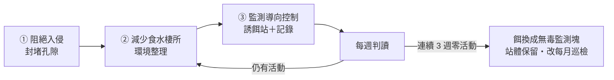

# 現況與時機

2026 年 9 月，後花園發現老鼠活動跡象，目前**尚未進入大樓內部**。

食物源已查明：**後巷（羅斯福路二段 81 巷）的「夯飽排骨飯」**。這一點決定了本案的處理方式，說明見第二節。

這是最容易處理的階段，也是有時間壓力的：**天氣轉涼後鼠群會往溫暖的室內移動**，秋冬是牠們從戶外轉進地下室與管道間的時候。現在處理是防守；等到住戶在梯廳看到，就變成清剿，成本與住戶觀感都完全不同。

# 核心原則：三件事要同時做

滅鼠若只放誘餌，族群會在數週內補回來。標準作法是三件事同時進行：

| 支柱 | 內容 | 本案狀況 |
|---|---|---|
| **① 阻絕入侵** | 封堵孔隙，不讓牠進入建築 | **優先序最高**（見第三節） |
| **② 減少食物、水與棲所** | 移除食物源、積水與掩蔽 | 社區內要做，但**主要食物源在鄰地、無權移除** |
| **③ 監測導向控制** | 誘餌站＋每週記錄，依數據調整 | 需長期維持，不設結案日 |

一般情況下 ② 是根本，食物源沒斷，其他兩項都只是在延緩。

**但本案的 ② 只能做一半**——主要食物源在鄰地餐飲業（見第二節），我們無權移除。因此 **① 阻絕入侵是唯一完全由我們控制的環節，優先序最高**；② 在社區範圍內仍要確實做（外面有食物不代表我們這裡可以有第二個）；③ 要長期維持、不設結案日。

---

# 一、本週立即處理

## 1.1 已淋濕的誘餌請停止使用並妥善暫存

雨水淋濕的毒餌會發霉，老鼠不吃發霉的餌。更麻煩的是判讀會出錯——會誤以為「餌沒被吃＝沒有老鼠」，實際上是「餌已經壞了」。

- 不要曬乾後再使用，也不要進廚餘或露天堆置。
- **受潮失效的餌料屬環境用藥廢棄物，不要自行推定丟法。** 請先看包裝上的廢棄處置說明，依標示處理；**標示未載明時，請電洽大安區清潔隊或環保局確認後再處理**，在確認前先以雙層袋密封、置於管理中心妥善暫存。
- 空的紙箱等**未直接盛裝藥劑**的外層容器，清潔後可依一般廢棄物處理。
- 處理時請戴手套。

## 1.2 為什麼不用紙箱當誘餌容器

紙箱是很直覺的做法，貼上警示標語也確實解決了「住戶看到不明物品」的問題。但紙箱本身還有三個缺點無法靠標語解決：

| 問題 | 影響 |
|---|---|
| 紙箱是老鼠的築巢材料 | 會被咬碎搬走當窩料，等於提供建材 |
| 不防水 | 淋雨後餌料發霉失效，監測數據失真 |
| 擋不住非目標對象 | 幼童、貓、鳥都可能翻開接觸到毒餌 |

正確的做法是改用**防拆式誘餌站**，規格見第五節。

---

# 二、食物源：已確認在鄰地，不在社區內

## 2.1 已確認的來源

**後巷（羅斯福路二段 81 巷）的「夯飽排骨飯」是主要食物源。**

**本社區 83 號店面沒有餐飲業，不是來源，已排除。** 請不要向 83 號店家查問，避免造成無謂困擾。

## 2.2 這一點改變了整件事的性質

食物源在鄰地，我們**無權也無法直接移除**。這使本案與一般鼠患處理有本質差異：

| | 一般情況 | 本案 |
|---|---|---|
| 食物源 | 在社區內，可自行移除 | 鄰地餐飲業，我們無權處理 |
| 防治性質 | 清剿，數週可結案 | **長期壓制，必須常態化** |
| 優先序最高的工作 | 斷糧 | **封堵孔隙**（唯一完全可控） |

因此有兩個判斷請記住：

- **第三節的封堵是本案優先序最高的工作。** 既然外面持續有食物，唯一百分之百由我們控制的，就是不讓牠進得來。
- **誘餌站不設結案日。** 監測數字歸零後，站體保留、把毒餌換成無毒監測塊、巡檢降為每月一次（作法見第七節），不要整組撤除——外部食物源還在，撤了就會反彈。

## 2.3 社區自己的食物、水源與棲所仍要清乾淨

外面有來源，不代表社區內可以有第二個。老鼠選擇待在我們的花園，通常是因為這裡另有掩蔽、水源或次要食物源。請查證並**拍照回報主委**：

1. **環保室與垃圾集中點**——桶蓋是否密合、垃圾是否直接落地、清運頻率是否足夠。
2. **有無住戶餵食流浪貓或野鳥**——貓食殘料是最典型的養鼠來源。若有，請優先回報。
3. **積水與長期潮濕處**——盆底積水、排水不良的低窪、滴漏的水龍頭。老鼠每天需要水。
4. **植栽的落果、堆肥、鬆軟土堆**。

> 回報請具體描述（哪個位置、什麼狀況、照片），不要只寫「已檢查」。

## 2.4 與後巷店家的溝通（請先回報，不要自行前往交涉）

這屬於鄰里關係事務，**請先向主委回報，由主委決定進行方式與時機。**

可行方向由輕到重大致三層：

1. **睦鄰反映**——以「我們這邊發現鼠蹤，想跟您確認一下後巷垃圾的存放狀況」這種請教的方式開口。多數店家願意配合加蓋、調整清運時間。
2. **共同維護後巷**——後巷是雙方每天共用的通道，可提議分擔清潔，或由社區提供加蓋垃圾桶。
3. **主管機關**——若長期無改善才走此途。**受理單位與程序我們尚未查證，請先電洽大安區清潔隊確認後回報主委**，在確認並經主委決定之前，不要向店家提及這個途徑。

> 溝通目的是改善環境，不是究責。後巷是我們每天都要共用的空間，關係要留著。

**2026-09 執行紀錄**：總幹事已前往夯飽溝通，以「周邊共同防範」為框架，並請對方一併找消毒廠商協助。對方未否認但無從追究來處，此結果合理，不需再追。

**若對方確實施作，請問到施作時程並與我方對齊。** 原因是**覆蓋率與食源競爭**：只有一側投藥時，老鼠仍有另一側的充足食物可吃，會優先吃廚餘而不碰我們的餌，防治效果被稀釋；兩側同時做才能把整個街廓的族群一起壓下來，也避免我方壓制後由鄰地回流補入。

---

# 三、阻絕入侵：封堵孔隙

## 3.1 判準：6 公釐

老鼠能通過的孔隙遠比一般想像的小：

| 種類 | 可通過的孔隙 |
|---|---|
| 溝鼠（成鼠） | 約 2 公分 |
| **小家鼠、幼鼠** | **約 0.6 公分（6 公釐）** |

**我們不知道現場是哪一種，所以一律以 6 公釐為標準**——2 公分是溝鼠的數字，用它當通用門檻等於放行所有小家鼠。

- **不要用「手指伸不伸得進去」判斷**，手指太粗，會漏掉絕大多數該補的縫。
- **也不要用原子筆或鉛筆目測**——一般原子筆筆桿與鉛筆多半比 6 公釐粗（約 7–9 公釐），拿它當量規會放過 6–8 公釐的縫。
- 現場請帶**一支 6 公釐鑽頭**（五金行數十元）當量規，或**直接用直尺實測**。**6 公釐塞得進去就要處理。**
- **門底縫也適用 6 公釐**，超過即加裝門底條。

## 3.2 巡查重點位置

- **地下室通風百葉、機房開口**——格柵是否破損、孔徑是否過大
- **排水明溝與溝蓋**——蓋板間距、破損處
- **管線穿牆、穿樓的套管孔洞**——最常見的漏封點，尤其是後來加裝的線路
- **各出入口與防火門的門底縫**
- **與鄰地交界的圍牆基腳、排水孔**
- **花園土壤中的鼠洞**——洞口直徑約 3–5 公分、洞緣光滑且無蛛網，代表使用中

> **發現鼠洞請拍照存檔。** 這些照片會成為社區自己的判讀範本，下次巡查或換人接手時，比任何文字描述都有用。

## 3.3 封堵材料

| 可用 | 不可用 |
|---|---|
| **不鏽鋼**絲絨填塞 ＋ 外層水泥抹平 | 一般碳鋼絲絨（戶外數月即鏽蝕粉化） |
| 鍍鋅或不鏽鋼細目金屬網 | 單純矽利康 |
| 金屬門底條 | 泡棉、保麗龍、木板、膠帶 |

兩個常見錯誤：

- **鋼絲絨要指名「不鏽鋼」。** 一般碳鋼絲絨在戶外受潮幾個月就鏽蝕粉化，等於沒補。
- **發泡填縫劑只能當填縫與固定，不可裸露當成防鼠面層。** 老鼠照樣啃穿。正確作法是「不鏽鋼絲絨塞實阻擋 → 外層水泥或發泡固定 → 抹平」。

封堵屬共用部分修繕，**請先列出需封堵的位置清單與照片，報主委後再發包**，由社區現有修繕廠商施作。

---

# 四、環境整理（花園本身）

- 清除地面堆積物、閒置盆器、落葉堆——這些都是掩蔽所。
- 沿牆保留 **30–50 公分的淨空帶**。老鼠高度依賴沿牆移動，牆邊沒有遮蔽物，牠的活動範圍就受限。
- 草皮與灌木修低，減少地面遮蔽。
- 清除積水容器、修復滴漏——斷水與斷糧同等重要。
- 這幾項可納入**綠石園藝**的例行工作範圍，請於下次施工時一併交代：修剪過密植栽、清除落葉枯枝與雜物。
- 清潔人員的日常工作也同步加強落葉與雜物清除。

---

# 五、誘餌站與藥劑

## 5.1 容器：用防拆式誘餌站

| 選項 | 成本（約略估算） | 說明 |
|---|---|---|
| **市售防拆式誘餌站**（捕鼠屋／鼠餌站） | 200–500 元／個 | 防水、可上鎖或卡扣、可固定於地面，內有餌棒。**建議採用** |
| 4 吋 PVC T 型管自製 | 100 元以內／個 | 防水、低調，但無防拆功能。**僅適用於幼童與寵物不會接近的位置** |

選購時請確認四件事：

1. **標示可用於室外**（有些款式只標示室內用）
2. **可鎖或卡扣**，幼童無法徒手打開
3. **內有餌棒或固定桿**，可把藥塊穿住——否則老鼠會整塊叼走藏起來，就無法從消耗量判斷牠有沒有吃
4. **內部空間可容納機械式捕鼠夾**——現在用不到，但萬一查出社區有人餵貓而必須停用毒餌（見第九節），同一批站體可直接改裝捕鼠夾，不必整批重買

先買兩到三個即可。建議選深灰或黑色，貼牆放在灌木後方，住戶基本上不會注意到。

## 5.2 藥劑：先確認有效成分（這一步不能跳）

**藥劑來源**：古莊里辦公室有發放滅鼠藥（2026-09 總幹事已領取），不必自購。

### 第一步：拍下包裝，確認「有效成分」與許可證字號

**請先拍下包裝正反面存檔，並把「有效成分」欄的名稱回報主委。** 這一步決定了後面的標示怎麼寫、鼠屍什麼時候會出現，不能憑印象假設。

- 包裝上**必須有環境用藥許可證字號**，使用時**完全依照標示的使用方法、劑量與適用場所**。
- **若成分是抗凝血劑類**（常見名稱：可滅鼠 warfarin、得伐鼠 diphacinone、伏滅鼠 brodifacoum、撲滅鼠 bromadiolone 等）——本 SOP 第 6.2 節的標示範例與 6.3 節的鼠屍時程都適用，可直接照做。
- **若成分不是抗凝血劑，或看不出來**——**請先暫停投藥並回報主委**。不同作用機轉的藥劑，中毒症狀、解毒方式與死亡時程都不一樣，標示寫錯比沒寫更危險。等確認後再依實際成分調整標示與巡檢方式。

### 第二步：確認劑型

現場快速判斷法：

- **手捏硬實、像肥皂塊** → 蠟塊型，較耐潮，適合戶外
- **搖起來沙沙作響** → 穀物顆粒型，是室內用的，戶外淋雨即失效

若領到的是顆粒型，**務必搭配防水誘餌站使用**，並縮短檢查與更換週期；或另向廠商索取蠟塊型。

> 蠟塊型較耐潮，但不是永久防霉。無論哪種劑型，發現餌料變色、發霉、長蟲或結塊就要更換。

## 5.3 放餌與補餌

- 每站初始放置的量**依產品標示**，通常 1–2 塊蠟塊即可，不要塞滿。
- 穿在餌棒上，不要散放。
- **每週檢查一次**，記錄消耗量後補足到原量。餌料變質即整批更換。

## 5.4 不要在戶外使用黏鼠板

戶外的黏鼠板會黏到麻雀、蜥蜴、幼貓。除了動物本身，被住戶看到也會直接變成社區事件。**室外只用有蓋誘餌站，黏鼠板僅限室內且僅限隱蔽處。**

---

# 六、擺放、標示與鼠屍處理

## 6.1 擺放

- **貼牆擺放**，放在鼠徑上、灌木或設備後方。這同時解決效果與美觀——老鼠本來就不走空曠處，擺對位置自然也看不見。
- **固定在地面**（重物壓住或鎖定），不要讓誘餌站能被輕易搬動或踢翻。
- 避開幼童遊憩動線與住戶常走的路徑。

## 6.2 標示

在站體貼一張小標示。**以下範例適用抗凝血劑類藥劑**（已依 §5.2 第一步確認成分者）：

> **病媒防治誘餌・請勿移動**
> 內含滅鼠藥劑（抗凝血劑），誤觸請立即洗手
> **解毒劑：維生素 K1**，誤食請攜本標示就醫
> 管理中心分機 ○○○

加註解毒劑名稱是為了萬一幼童或寵物誤觸時，就醫能少走冤枉路。

> ⚠️ **若 §5.2 確認的成分不是抗凝血劑，不可沿用上面這行解毒劑。** 寫錯的解毒劑會誤導急診判斷，比不寫更糟。請依包裝標示的成分名稱與急救指示改寫，不確定就先回報主委。

標示內容與各站位置請一併記錄在第七節的監測表。

## 6.3 鼠屍處理（一定要做）

**抗凝血劑類**毒餌是慢性藥，老鼠取食後約 3–7 天才死亡，屍體可能出現在花園、灌木下、設備後方或牆角。（其他作用機轉的藥劑時程不同，請依 §5.2 確認的成分調整巡檢節奏。）

- **每週巡檢時一併搜尋鼠屍**，不要等住戶聞到異味才處理。
- 處理時**戴手套**，以雙層塑膠袋密封後丟一般垃圾，接觸處消毒。
- **這項不分有沒有貓都要做**——鼠屍本身會招來蒼蠅與異味，也是二次中毒的來源（見第九節）。
- 發現位置請記進監測表，那通常就是鼠徑或巢穴附近。

---

# 七、監測：怎麼判讀

請設 **3–5 個固定監測點**（例如：花園牆角、溝蓋旁、環保室旁、後巷側），**每週檢查一次並記錄**。

> **監測點不等於誘餌站。** 誘餌站兩三個就夠（放在鼠徑上），其餘監測點是**純目視點**——不放餌，只固定去看有沒有鼠糞、啃咬痕與洞口活動。目視點不花錢，可以多設幾個，涵蓋面比只看誘餌站廣得多。

| 日期 | 監測點 | 新鮮鼠糞 | 啃咬痕 | 洞口活動 | 誘餌消耗 | 發現鼠屍 | 備註 |
|---|---|---|---|---|---|---|---|
|  | 1. |  |  |  |  |  |  |
|  | 2. |  |  |  |  |  |  |
|  | 3. |  |  |  |  |  |  |

## 7.1 兩個欄位的判準

非專業者最難判斷的是這兩欄，各有一個簡單作法：

**新鮮鼠糞怎麼分**

| | 新鮮（代表近日有活動） | 陳舊 |
|---|---|---|
| 顏色 | 深黑、有光澤 | 灰白、褪色 |
| 質地 | 偏軟，可壓變形 | 乾硬，一壓即碎成粉 |

實務作法：**第一次巡檢時把看到的鼠糞全部清掉**，之後每週看到的就一定是新的。這比分辨新舊可靠。

> ⚠️ **清理鼠糞的安全作法（請務必照做）**
>
> 鼠類排泄物乾燥後會形成含病原的粉塵，吸入有感染風險（漢他病毒即為其一）。
>
> - **戴手套與口罩。**
> - **先用稀釋漂白水或消毒液把鼠糞噴濕，靜置數分鐘**再處理。
> - 以濕紙巾或夾子撿拾，裝入雙層塑膠袋密封。
> - **絕對不要乾掃，也不要用吸塵器。** 兩者都會把粉塵揚到空氣中，是最危險的作法。
> - 處理完畢洗手。

**洞口活動怎麼判**

用**薄土覆蓋法**：巡檢時以少量鬆土或細沙輕輕覆住洞口（不要填實），下週再看——

- **被推開** → 該洞使用中，列為重點，誘餌站可移近
- **原封不動** → **只能暫列「疑似無活動」，不要立刻封填。** 老鼠會間歇使用洞穴，大雨或低溫也會讓牠幾天不出門。請重新覆土再觀察，**連續兩次以上都原封不動**才判定廢棄、予以封填。

同樣方法也適用於判斷孔隙有沒有在被使用。

## 7.2 三條判讀原則

**① 不要只看誘餌消耗量。** 消耗量下降不一定代表族群減少，也可能是：

- 餌料受潮變質，老鼠不吃了
- 餌站被移動或被雜物擋住
- 出現更好吃的替代食物（例如鄰地垃圾當天沒收）
- 新警戒性——老鼠對環境中新出現的物體會迴避數天到一兩週，剛擺站時吃得少是正常的

所以請**與新鮮鼠糞、啃咬痕、洞口活動三項一起判讀**，四項同步下降才有意義。

**② 消耗量大代表族群還在**，不是「藥有效」。要看到消耗量逐週下降。

**③ 完全沒被碰過**時，先檢查是不是餌壞了、位置放錯（擺在空曠處）、或還在新警戒期，不要直接判定沒有老鼠。

## 7.3 什麼時候可以放鬆

**連續 3 週、所有監測點各項皆為零**時：

- **站體保留，不撤除**
- **把毒餌換成無毒監測塊**（監測專用餌塊，不含藥劑，只看有沒有齒痕）
  - ⚠️ **里辦公處不配發這種監測塊**，需自行向五金行或網購採購，列社區修繕雜支。
- 巡檢頻率降為**每月一次**
- 若監測塊再度出現齒痕，換回毒餌並恢復每週巡檢

這樣做的理由：外部食物源還在，完全撤除必然反彈；但也不需要讓毒餌長期留在環境中。

紀錄請放入 Google Drive 的社區檔案，並於每月管委會議摘要回報。

---

# 八、與潤泰維護的分工

社區每月保養排程中的**消毒，廠商就是潤泰維護**——也就是物業管理廠商本身（見第二章 2.3 維護排程）。

**總幹事這邊只需要做一件事**：把現場事實整理好——鼠蹤位置、監測紀錄、封堵清單、照片。

**現行合約的消毒範圍是否涵蓋鼠害防治、以及是否加做，由主委直接與潤泰洽談**，不需要總幹事向自己公司議價。

> 若未來改由外部廠商施作，請確認對方是**合法登記的病媒防治業**，並由專業技術人員督導。

---

# 九、二次中毒的防範與非毒性替代

抗凝血劑毒餌有二次中毒的問題：吃到中毒老鼠的貓、狗或猛禽會一併受害。

**不論社區有沒有貓，第 6.3 節的鼠屍搜尋都要確實做**——這是降低二次中毒最有效的一件事。

**若查證確認社區內或周邊有住戶餵食流浪貓，請暫停使用毒餌**，改用下列方式並回報主委：

- 改用**機械式捕鼠夾**（快扣式 snap trap），裝在誘餌站內。
  - ⚠️ 請注意是**捕鼠夾**，不是捕鼠籠——一般誘餌站的內部空間放不下捕鼠籠。
  - 選購時要確認該誘餌站**標示可容納捕鼠夾**，不是所有款式都可以。
- 優點是可直接看到捕獲數量，監測比毒餌更準確，也沒有鼠屍散落的問題。
- 缺點是需要較頻繁地巡視與清理，請納入每週例行工作。

---

# 相關章節

- 第二章 2.3 Google 日曆（維護排程・消毒廠商）
- 第三章 3.1 物業管理合約年度換約 SOP（消毒範圍在此合約內）
- 第三章 4. 清潔 ／ 5. 垃圾清運與環保室管理
- 第五章 2.2 後巷（羅斯福路二段 81 巷）臨時阻塞應變
- 第六章 6.2 夏日防蚊措施
