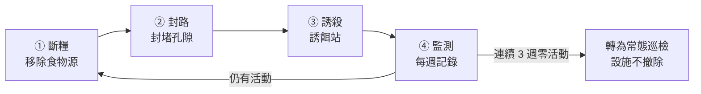

# 現況與時機

2026 年 9 月，後花園發現老鼠活動跡象，目前**尚未進入大樓內部**。

食物源已查明：**後巷（羅斯福路二段 81 巷）的「夯飽排骨飯」**。這一點決定了本案的處理方式，說明見第二節。

這是最容易處理的階段，但有時間壓力：**9 月中之後天氣轉涼，鼠群會開始往溫暖的室內移動，10–11 月是牠們從戶外轉進地下室與管道間的季節。** 現在處理是防守；等到住戶在梯廳或樓梯間看到，就變成清剿，成本與住戶觀感都完全不同。

# 核心原則：三件事要同時做

滅鼠若只放誘餌，族群會在數週內補回來。標準順序是：

一般情況下**斷糧是根本**，食物源沒斷，後面兩項都只是在延緩。

**但本案的斷糧只能做一半**——主要食物源在鄰地餐飲業（見第二節），我們無權移除。所以本案的重量全部壓在**② 封路**上，而且 ③ 誘殺與 ④ 監測要長期維持、不設結案日，只在數字穩定後降低巡檢頻率。

---

# 一、本週立即處理

## 1.1 已淋濕的誘餌請直接丟棄

雨水淋濕的毒餌會發霉，老鼠不吃發霉的餌。更麻煩的是判讀會出錯——會誤以為「餌沒被吃＝沒有老鼠了」，實際上是「餌已經壞了」。

- 請**連同容器一起丟進一般垃圾**，不要曬乾後再使用，也不要進廚餘或露天堆置。
- 處理時請戴手套。

## 1.2 為什麼不建議用紙箱當誘餌容器

紙箱是很直覺的做法，但實務上有三個問題，都不只是美觀：

| 問題 | 影響 |
|---|---|
| 紙箱是老鼠的築巢材料 | 會被咬碎搬走當窩料，等於提供建材 |
| 不防水 | 淋雨後餌料發霉失效，監測數據失真 |
| 擋不住非目標對象 | 貓、鳥、小孩都可能翻開接觸到毒餌，是社區的安全風險 |

正確的做法是改用**專用誘餌站**（有蓋、可固定、內建餌棒的塑膠盒），規格見第五節。

---

# 二、食物源：已確認在鄰地，不在社區內

## 2.1 已確認的來源

**後巷（羅斯福路二段 81 巷）的「夯飽排骨飯」是主要食物源。**

**本社區 83 號店面沒有餐飲業，不是來源，已排除。** 請不要向 83 號店家查問，避免造成無謂困擾。

## 2.2 這一點改變了整件事的性質

食物源在鄰地，我們**無權也無法直接移除**。這使本案與一般鼠患處理有本質差異：

| | 一般情況 | 本案 |
|---|---|---|
| 食物源 | 在社區內，可自行移除 | 鄰地餐飲業，我們無權處理 |
| 防治性質 | 清剿，數週可結案 | **長期壓制，必須常態化** |
| 工作重心 | 斷糧為主 | **封路與持續誘殺為主** |

因此有兩個判斷要請您記住：

- **第三節的「封路」是本案最關鍵的一環。** 既然外面持續有食物，唯一百分之百由我們控制的，就是不讓牠進得來。請優先執行、確實做完。
- **誘餌站不是放一次就收。** 要當成長期設施維持。監測數字變好也不要撤除——外部食物源還在，一撤就會反彈。

## 2.3 社區自己的次要食物源仍要排除

外面有來源，不代表社區內就沒有。老鼠會待在我們的花園，通常是因為這裡另有掩蔽、水源或第二食物源。請仍然查證並**拍照回報主委**：

1. **環保室與垃圾集中點**——桶蓋是否密合、垃圾是否直接落地、清運頻率是否足夠。
2. **有無住戶餵食流浪貓或野鳥**——貓食殘料是最典型的養鼠來源。若有，請優先回報，這會影響第九節的用藥選擇。
3. **植栽的落果、堆肥、鬆軟土堆**。

> 回報請具體描述（哪個位置、什麼狀況、照片），不要只寫「已檢查」。

## 2.4 與後巷店家的溝通（請先回報，不要自行前往交涉）

這屬於鄰里關係事務，**請先向主委回報，由主委決定進行方式與時機。**

可行方向由輕到重大致三層：

1. **睦鄰反映**——以「我們這邊發現鼠蹤，想跟您確認一下後巷垃圾的存放狀況」這種請教的方式開口。多數店家願意配合加蓋、調整清運時間。
2. **共同維護後巷**——後巷是雙方每天共用的通道，可提議分擔清潔，或由社區提供加蓋垃圾桶。
3. **主管機關**——若長期無改善才走此途。**受理單位與程序我們尚未查證，請先電洽大安區清潔隊或台北市環保局確認後回報主委**，在確認並經主委決定之前，不要向店家提及這個途徑。

> 溝通目的是改善環境，不是究責。後巷是我們每天都要共用的空間，關係要留著。

**2026-09 執行紀錄**：總幹事已前往夯飽溝通，以「周邊共同防範」為框架，並請對方一併找消毒廠商協助。對方未否認但無從追究來處，此結果合理，不需再追。

**若對方確實施作，請問到他們的施作時程並與我方對齊。** 兩邊不同時施作的話，老鼠只是從投藥的一側移到另一側，過段時間再回流，雙方都看不到效果。

---

# 三、封路：不讓牠有洞可鑽

老鼠能通過的孔隙比一般想像的小，業界常用的判準是：**成鼠約 2 公分、幼鼠約 1.25 公分。** 巡查時請以「一根手指能不能伸進去」為粗略標準。

## 3.1 巡查重點位置

- **地下室通風百葉、機房開口**——格柵是否破損、孔徑是否過大
- **排水明溝與溝蓋**——蓋板間距、破損處
- **管線穿牆、穿樓的套管孔洞**——最常見的漏封點，尤其是後來加裝的線路
- **防火門與各出入口門底縫**——超過 1 公分建議加裝門底條
- **與鄰地交界的圍牆基腳、排水孔**
- **花園土壤中的鼠洞**——洞口直徑約 3–5 公分、洞緣光滑且無蛛網，代表使用中

## 3.2 封堵材料

| 可用 | 不可用 |
|---|---|
| 不鏽鋼絲絨填塞 ＋ 水泥或發泡填縫 | 單純矽利康 |
| 鍍鋅細目金屬網 | 泡棉、保麗龍 |
| 金屬門底條 | 木板、膠帶 |

右欄的材料老鼠都能啃穿，封了等於沒封。

封堵屬小額修繕，可請社區現有修繕廠商施作，**請先列出需封堵的位置清單與照片，報主委後再發包。**

---

# 四、環境整理（花園本身）

- 清除地面堆積物、閒置盆器、落葉堆——這些都是掩蔽所。
- 沿牆保留 **30–50 公分的淨空帶**。老鼠高度依賴沿牆移動，牆邊沒有遮蔽物，牠的活動範圍就受限。
- 草皮與灌木修低，減少地面遮蔽。
- 這幾項可納入**綠石園藝**的例行工作範圍，請於下次施工時一併交代：修剪過密植栽、清除落葉枯枝與雜物。
- 清潔人員的日常工作也同步加強落葉與雜物清除。

---

# 五、誘餌站與餌料規格

## 5.1 容器：三種選擇

| 選項 | 成本（約略估算） | 說明 |
|---|---|---|
| **市售塑膠誘餌站**（捕鼠屋／鼠餌站） | 200–500 元／個 | 防水、可上鎖、內有固定餌棒，外觀低調。**建議採用** |
| 4 吋 PVC T 型管自製 | 100 元以內／個 | 防水、極低調，專業防治也常用；兩側開口即鼠道，中間豎管放餌後加蓋。無鎖 |
| 塑膠整理箱挖孔改造 | 100–200 元 | 容量大但體積明顯，較看得出來 |

> 上列價格是概估，實際請於五金行或網購平台查詢後回報。
>
> 建議直接採購市售誘餌站：單價兩三百元，為了省這筆錢自製，反而要多花工時，而且自製品在防雨與防貓誤觸這兩點上都比較弱。請選**深灰或黑色**款式。

## 5.2 餌料：室外一律用蠟塊型

- **使用蠟塊型毒餌**（蠟封磚塊狀）——防水防霉，本來就是為戶外設計的。
- **藥劑來源**：古莊里辦公室有發放滅鼠藥（2026-09 總幹事已領取），不必自購。但**領到後請先確認劑型並拍下包裝**：若是穀物顆粒型或粉狀，戶外淋雨即失效，務必搭配防水誘餌站使用，或改向廠商索取蠟塊型。
- **不要使用穀物顆粒型或粉狀**——那是室內用的，淋一次雨就報廢。
- 蠟塊要**以餌棒或鐵絲穿住固定在站內**。否則老鼠會整塊叼走藏起來，就無法從消耗量判斷牠到底有沒有吃。

## 5.3 不要在戶外使用黏鼠板

戶外的黏鼠板會黏到麻雀、蜥蜴、幼貓。除了動物本身，被住戶看到也會直接變成社區事件。**室外只用有蓋誘餌站，黏鼠板僅限室內且僅限隱蔽處。**

---

# 六、擺放位置與標示

- **貼牆擺放**，放在鼠徑上、灌木或設備後方。這同時解決效果與美觀——老鼠本來就不走空曠處，擺對位置自然也看不見。
- **固定在地面**（重物壓住或鎖定），不要讓誘餌站能被輕易搬動或踢翻。
- **在站體貼一張小標示**：「病媒防治誘餌・請勿移動・內含滅鼠藥劑」＋管理中心分機。住戶看到不明容器一定會詢問，先標示比事後解釋省事。
- 標示與位置清單請一併記錄在下節的監測表內。

---

# 七、監測：怎麼判斷有沒有效

請設 **3–5 個固定監測點**（例如：花園牆角、溝蓋旁、環保室旁、後巷側），**每週檢查一次並記錄**：

| 日期 | 監測點 | 鼠糞 | 啃咬痕 | 洞口活動 | 誘餌消耗 | 備註 |
|---|---|---|---|---|---|---|
|  | 1. |  |  |  |  |  |
|  | 2. |  |  |  |  |  |
|  | 3. |  |  |  |  |  |

判讀原則：

- **誘餌消耗多 ＝ 族群還在**，不是「藥有效」。要等消耗量逐週下降到零。
- **連續 3 週、所有監測點四項皆為零**，才算控制住，此時可撤除或改為每月巡檢。
- 若誘餌完全沒被碰過，先檢查是不是餌壞了或位置放錯（擺在空曠處），不要直接判定沒有老鼠。

紀錄請放入 Google Drive 的社區檔案，並於每月管委會議摘要回報。

---

# 八、防治要不要納入合約

## 8.1 消毒本來就在物業管理合約內

社區每月保養排程中的**消毒，廠商就是潤泰維護**——也就是物業管理廠商本身（見第二章 2.3 維護排程）。所以這件事不是「要不要找新廠商」，而是：

> **現行物業管理合約的消毒服務範圍，有沒有涵蓋鼠害防治？如果沒有，加做的條件與費用是什麼？**

**這一項由主委直接向潤泰維護確認合約範圍**，不需要總幹事去向自己公司議價。總幹事請負責提供現場事實（鼠蹤位置、監測紀錄、照片），作為主委洽談的依據。

## 8.2 本案傾向需要常態防治，而非一次性處理

理由在第二節：食物源在鄰地、不在我們可控範圍。自行放餌會產生「每次都要有人記得換餌、記得巡查」的持續性負擔，而這類工作最容易在人員異動時斷掉。納入合約的價值不在藥劑本身，在於**有人固定來、有紀錄、不會忘記**。

## 8.3 時機：今年換約正好在談

物業管理合約**每年 12 月 31 日到期，9 月啟動續約或招標流程**（見第三章 3.1）。本案發生的時間點剛好可以把**鼠害防治的服務範圍與巡檢頻率，在這次換約時一併寫明確**，不必另立合約。

建議順序：

1. **總幹事**：完成第三節封路清單與第七節監測紀錄（這是自己做、一次做完長期有效的部分）
2. **主委**：向潤泰維護確認現行消毒範圍，取得加做鼠害防治的條件
3. **管委會**：於第三季會議一併討論換約方向與防治範圍

> **藥劑取得已有管道**：古莊里辦公室有發放滅鼠藥，2026-09 總幹事已領取。
>
> 仍待查證的是**鄰地餐飲業的環境衛生該循哪個管道反映**，以及區清潔隊是否可協助現場診斷。請於下次領藥或洽公時一併詢問里辦公室或所屬區清潔隊，答覆請回填本節。

---

# 九、社區有餵食流浪貓時的替代做法

若查證確認社區內或周邊有住戶餵食流浪貓，**請暫停使用毒餌**，改用下列方式，並回報主委：

- 使用**機械式捕鼠器（捕鼠夾或捕鼠籠）**，一樣裝在有蓋誘餌站內。防雨、防誤觸的效果相同。
- 優點是可直接看到捕獲數量，監測反而比毒餌更準確。
- 缺點是需要較頻繁地巡視與清理，請納入每週例行工作。

原因：毒餌有二次中毒的問題，吃到中毒老鼠的貓會一併受害。在有餵食行為的環境下，這個風險不宜承擔。

---

# 相關章節

- 第二章 2.3 Google 日曆（維護排程・消毒廠商）
- 第三章 3.1 物業管理合約年度換約 SOP（消毒範圍在此合約內）
- 第三章 4. 清潔 ／ 5. 垃圾清運與環保室管理
- 第五章 2.2 後巷（羅斯福路二段 81 巷）臨時阻塞應變
- 第六章 6.2 夏日防蚊措施（同屬病媒防治，作法可參照）
